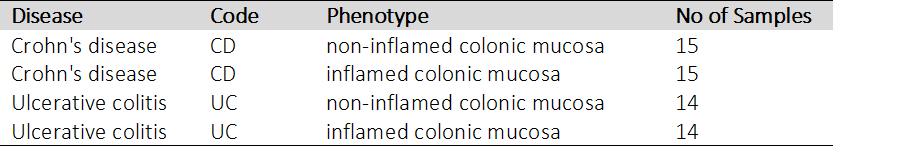

```{r,child="assets/header-lab.Rmd"}
```

```{r, include=FALSE}
knitr::opts_chunk$set(chunk.title = TRUE, engine.opts = list(bash = "-l"), fig.align = "center")
```

```{r, include = FALSE}
library(maEndToEnd)
library(rmarkdown)
```


# Introduction

In this hands-on, we walk through an end-to-end Affymetrix microarray differential expression workflow using Bioconductor packages.
The data analyzed here is a typical clinical microarray data set that compares inflamed and non-inflamed colon tissue in two disease subtypes. For each disease, the differential gene expression between inflamed- and non-inflamed colon tissue will be analyzed. We will start from the raw data CEL files, show how to import them into a Bioconductor ExpressionSet, perform quality control and normalization and finally differential gene expression (DE) analysis, followed by some enrichment analysis.


# System set-up

The workflow and all the necessary tools are wrapped in a Bioconductor package called maEndToEnd (https://www.bioconductor.org/packages/release/workflows/html/maEndToEnd.html)

To install the package:


```{r}
if (!require("BiocManager", quietly = TRUE))
    install.packages("BiocManager")

BiocManager::install("maEndToEnd")

library("maEndToEnd")
```

# Getting the raw data

The data set we are going to use comes from a study (Palmieri et al., 2015), which explore the differences in gene expression in inflamed and non-inflamed tissue. 14 patients suffering from Ulcerative colitis (UC) and 15 patients with Crohn’s disease (CD) were tested, and from each patient inflamed and non-inflamed colonic mucosa tissue was obtained via a biopsy (See table below schema). This is a typical clinical data set consisting of 58 arrays in total. Our aim is to analyze differential expression (DE) between the tissues.
<br/><br/>

```{r, echo=FALSE, message=FALSE, out.width = '100%'}

```


<br/><br/>


The first step of the analysis is to download the raw data CEL files. These files are produced by the array scanner software and contain the measured probe intensities. The data we use have been deposited at [ArrayExpress](https://www.ebi.ac.uk/biostudies/arrayexpress) and have the accession code E-MTAB-2967


```{r}

# Make a working directory

raw_data_dir <- tempdir()

if (!dir.exists(raw_data_dir)) {
    dir.create(raw_data_dir)
}
```

```{r, eval=FALSE}
# Get data with getAE function
anno_AE <- getAE("E-MTAB-2967", path = raw_data_dir, type = "raw") 

```

```{r}
# if getAE function does not work, please manually download the data from ArrayExpress at this link https://www.ebi.ac.uk/biostudies/arrayexpress/studies/E-MTAB-2967
raw_data_dir <- "data/microarray/E-MTAB-2967"

```

## Import of annotation data and microarray expression data as “ExpressionSet”

We import the SDRF file with the read.delim function from the raw data folder in order to obtain the sample annotation.

The sample names are given in the column Array.Data.File of the SDRF data table and will be used as rownames for the SDRF file.

We turn the SDRF table into an AnnotatedDataFrame from the Biobase package that we will need later to create an ExpressionSet for our data (ref3).

```{r}
sdrf_location <- file.path(raw_data_dir, "E-MTAB-2967.sdrf.txt")
SDRF <- read.delim(sdrf_location)
rownames(SDRF) <- SDRF$Array.Data.File
SDRF <- AnnotatedDataFrame(SDRF)
```

Then we need to read the CEL files and create an ExpressionSet.

```{r}
# We use the function read.celfiles from the oligo package4 to import the files:
raw_data <- oligo::read.celfiles(filenames = file.path(raw_data_dir,
                                                      SDRF$Array.Data.File),
                                         verbose = FALSE, phenoData = SDRF)

```

The columns of interest for us are the following:

identifiers of the individuals, “Source.Name”, “Characteristics.individual.”

disease of the individual, “Factor.Value.disease.”

mucosa type, “Factor.Value.phenotype.”

```{r}
# subselect those columns  and have a look at the pheno data using pData function (Biobase package)

Biobase::pData(raw_data) <- Biobase::pData(raw_data)[, c("Source.Name",
                                          "Characteristics.individual.",
                                          "Factor.Value.disease.",
                                          "Factor.Value.phenotype.")]
head(Biobase::pData(raw_data)) 

```


# Quality control of the raw data

The first step after the initial data import is the quality control of the data. Here we check for outlaiers and we check whether the data clusters are as expected, e.g. grouped by the experimental conditions. The expression intensity values are in the assayData sub-object “exprs” and can be accessed by the exprs(raw_data) function (Biobase package). 

```{r}
# Access raw data
Biobase::exprs(raw_data)[1:5, 1:5]

# Make a boxplot
oligo::boxplot(raw_data, target = "core", main = "Boxplot of log2-intensitites for the raw data")

# Make a histogram
oligo::hist(raw_data, target = "core", main = "Hist of log2-intensitites for the raw data")

# Perform PCA analysis (on log transformed data) and plot it
exp_raw <- log2(Biobase::exprs(raw_data))
PCA_raw <- prcomp(t(exp_raw), scale. = FALSE)

dataGG <- data.frame(PC1 = PCA_raw$x[,1], PC2 = PCA_raw$x[,2],
                     Disease = pData(raw_data)$Factor.Value.disease.,
                     Phenotype = pData(raw_data)$Factor.Value.phenotype.,
                     Individual = pData(raw_data)$Characteristics.individual.)

ggplot(dataGG, aes(PC1, PC2, colour = Phenotype)) +
  geom_point(size = 3) +
  stat_ellipse()

ggplot(dataGG, aes(PC1, PC2, colour = Disease)) +
  geom_point(size = 3) +
  stat_ellipse()

```

```{r, eval=FALSE}
# Optional step
# Array Quality Metrics stats (comprehensive quality metrics analysis. Useful to identify outlaiers)
# It takes about 10 minutes (take a break)

dir.create("E-MTAB-2967/QualiMetrics")

arrayQualityMetrics(expressionset = raw_data,
                    outdir = "E-MTAB-2967/QualiMetrics/",
                    force = TRUE, do.logtransform = TRUE,
                    intgroup = c("Factor.Value.disease.", "Factor.Value.phenotype."))

# Open the index.html file in the folder and inspect the plots
[index]("data/microarray/E-MTAB-2967/QualiMetrics/index.html")

```


# Background adjustment, calibration, summarization and annotation

Now, we can apply the RMA algorithm to our data in order to background-correct, normalize and summarize:

```{r}
# Just one command to perform Background correcting, Normalization, Expression

norm_data <- oligo::rma(raw_data, target = "core")
```

## Quality control/assessment of the calibrated data

Let's re-evaluate the data after normalization. 

```{r}
# Make a boxplot
oligo::boxplot(norm_data, target = "core", main = "Boxplot of log2-intensitites for the norm data")

# Make a histogram
oligo::hist(norm_data, target = "core", main = "Hist of log2-intensitites for the norm data")

### PCA plot
exp_norm_data<- Biobase::exprs(norm_data)
PCA <- prcomp(t(exp_norm_data), scale = FALSE)

dataGG_norm <- data.frame(PC1 = PCA$x[,1], PC2 = PCA$x[,2],
                     Disease = pData(norm_data)$Factor.Value.disease.,
                     Phenotype = pData(norm_data)$Factor.Value.phenotype.,
                     Individual = pData(norm_data)$Characteristics.individual.)

ggplot(dataGG_norm, aes(PC1, PC2, colour = Phenotype)) +
  geom_point(size = 3) +
  stat_ellipse()

ggplot(dataGG_norm, aes(PC1, PC2, colour = Disease)) +
  geom_point(size = 3) +
  stat_ellipse()

# Heat-map hierarchical clustering (Optional)

dists <- as.matrix(dist(t(exp_norm_data), method = "manhattan"))
rownames(dists) <- row.names(pData(norm_data))
diag(dists) <- NA
pheatmap(dists, legend = TRUE,
         treeheight_row = 0,
         legend_breaks = c(min(dists, na.rm = TRUE),
                           max(dists, na.rm = TRUE)),
         legend_labels = (c("small distance", "large distance")),
         main = "Clustering heatmap for the calibrated samples")

```


## Filtering based on intensity

We now filter out lowly expressed genes. Microarray data commonly show a large number of probes in the background intensity range. These probes also do not change much across arrays. Hence they combine a low variance with a low intensity. Thus, they could end up being detected as differentially expressed although they are barely above the “detection” limit and are not very informative in general.

We will perform a “soft” intensity based filtering here, since this is recommended by the limma user guide (a package we will use below for the differential expression analysis).


```{r}
data_norm_medians <- rowMedians(Biobase::exprs(norm_data))

hist_res <- hist(data_norm_medians, 100, freq = FALSE,
                 main = "Histogram of the median intensities",
                 xlab = "Median intensities")

# Set a cutoff
man_threshold <- 4
abline(v = man_threshold, col = "coral4", lwd = 2)

samples_cutoff <- 14
idx_man_threshold <- apply(Biobase::exprs(norm_data), 1,
                           function(x){
                             sum(x > man_threshold) >= samples_cutoff})
table(idx_man_threshold)


data_manfiltered <- subset(norm_data, idx_man_threshold)

```


# Differential expression analysis

In order to analyse which genes are differentially expressed between inflamed and non-inflamed tissue, we have to fit a linear model to our expression data. Linear models are the “workhorse” for the analysis of experimental data. They can be used to analyse complex designs.


## Linear model design

```{r}
individual <- as.character(Biobase::pData(data_manfiltered)$Characteristics.individual.)

tissue <- str_replace_all(Biobase::pData(data_manfiltered)$Factor.Value.phenotype., " ", "_")

tissue <- ifelse(tissue == "non-inflamed_colonic_mucosa","nI", "I")

disease <- str_replace_all(Biobase::pData(data_manfiltered)$Factor.Value.disease.," ", "_")

disease <-   ifelse(str_detect(Biobase::pData(data_manfiltered)$Factor.Value.disease., "Crohn"), "CD", "UC")

# Let consider only "CD" for simplicity 

i_CD <- individual[disease == "CD"]
design_palmieri_CD <- model.matrix(~ 0 + tissue[disease == "CD"] + i_CD)
colnames(design_palmieri_CD)[1:2] <- c("I", "nI")
rownames(design_palmieri_CD) <- i_CD

```

## Contrasts and hypotheses tests

```{r}
contrast_matrix_CD <- makeContrasts(I-nI, levels = design_palmieri_CD)

palmieri_fit_CD <- eBayes(contrasts.fit(lmFit(data_manfiltered[,disease == "CD"],
                                              design = design_palmieri_CD),
                                        contrast_matrix_CD))

table_CD <- topTable(palmieri_fit_CD, number = Inf)
head(table_CD)


hist(table_CD$P.Value, col = brewer.pal(3, name = "Set2")[1],
     main = "inflamed vs non-inflamed - Crohn’s disease", xlab = "p-values")

nrow(subset(table_CD, P.Value < 0.001))
volcanoplot(palmieri_fit_CD, coef = 1L, style = "p-value", highlight = 20,
            xlab = "Log2 Fold Change", ylab = NULL, pch=16, cex=0.35)
```


# Annotation of the transcript clusters

Before we continue with functional analysis we need to add annotation information to the transcript cluster identifiers stored in the featureData of our ExpressionSet.


```{r}
# We use the function select from AnnotationDbi to query the gene symbols and associated short descriptions for the transcript clusters.
anno_data <- AnnotationDbi::select(hugene10sttranscriptcluster.db,
                                       keys = (featureNames(data_manfiltered)),
                                       columns = c("SYMBOL", "GENENAME"),
                                       keytype = "PROBEID")

# we filtered out the probes that do not map to a gene, i.e. that do not have a gene symbol assigned.
anno_data <- subset(anno_data, !is.na(SYMBOL))
```


# Running pathway enrichemnt analysis

When we have a large list of genes of interest, such as a list of differentially expressed genes, how do we extract biological meaning from it?

One way to do so is to perform functional enrichment analysis. This method consists of applying statistical tests to verify if genes of interest are more often associated with certain biological functions than what would be expected in a random set of genes. 
To perform functional enrichment analysis, we need to have:
* A set with all the genes to consider in the analysis: universe set (which must contain the study set)
* A set of genes of interest (e.g., differentially expressed genes): study set


```{r}
# Get the universe set and remove duplicated entries
universe <- anno_data[!duplicated(anno_data$SYMBOL), 2]

# Get a set of genes of interest, Differentially expressed with p.val < 0.1. Then annotate and remove duplicates
DE_genes_CD <- subset(table_CD, adj.P.Val < 0.1)

anno_DE_genes_CD <- AnnotationDbi::select(hugene10sttranscriptcluster.db,
                                       keys = (rownames(DE_genes_CD)),
                                       columns = c("SYMBOL", "GENENAME"),
                                       keytype = "PROBEID")

anno_DE_genes_CD <- subset(anno_DE_genes_CD, !is.na(SYMBOL))


symb <- anno_DE_genes_CD[!duplicated(anno_DE_genes_CD$SYMBOL), 2]


ego <- enrichGO(gene          = symb,
                universe      = universe,
                OrgDb         = org.Hs.eg.db,
                keyType = "SYMBOL",
                ont           = "CC",
                pAdjustMethod = "BH",
                pvalueCutoff  = 0.01,
                qvalueCutoff  = 0.05,
                readable      = TRUE)
goplot(ego)

barplot(ego, showCategory=20)

dotplot(ego, showCategory=20)


```


### Session information

As the last part of this document, we call the function sessionInfo, which reports the version numbers of R and all the packages used in this session. It is good practice to always keep such a record of this as it will help to trace down what has happened in case an R script ceases to work or gives different results because the functions have been changed in a newer version of one of your packages. By including it at the bottom of a script, your reports will become more reproducible.

```{r}
sessionInfo()
```


# References

Below a list of references and articles.

.... to complete


```{r,child="assets/footer-lab.Rmd"}
```