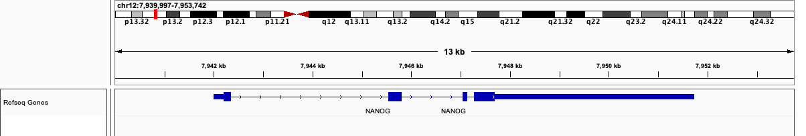
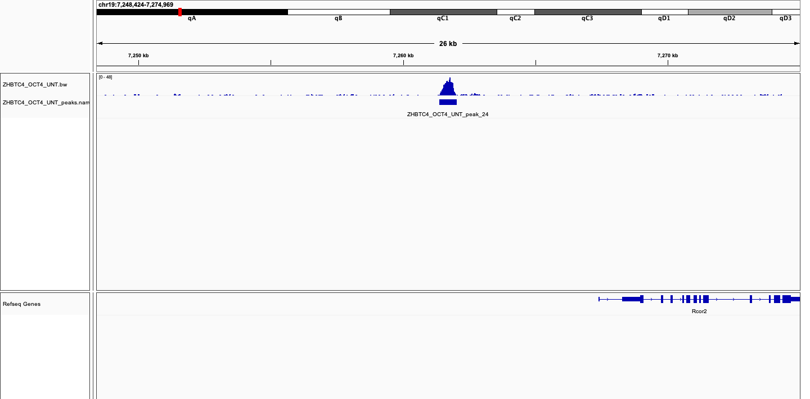
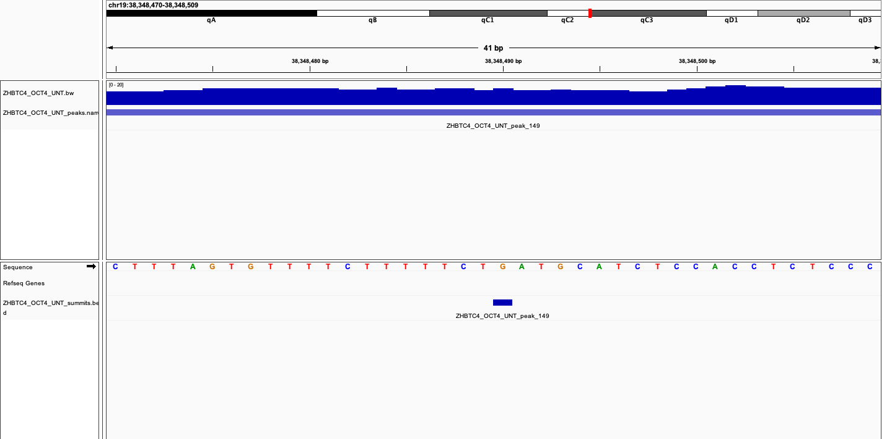
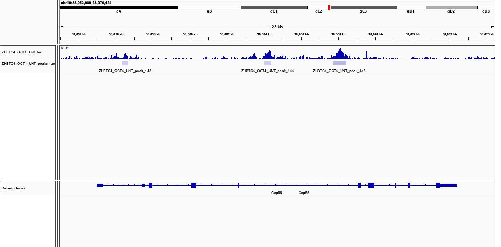
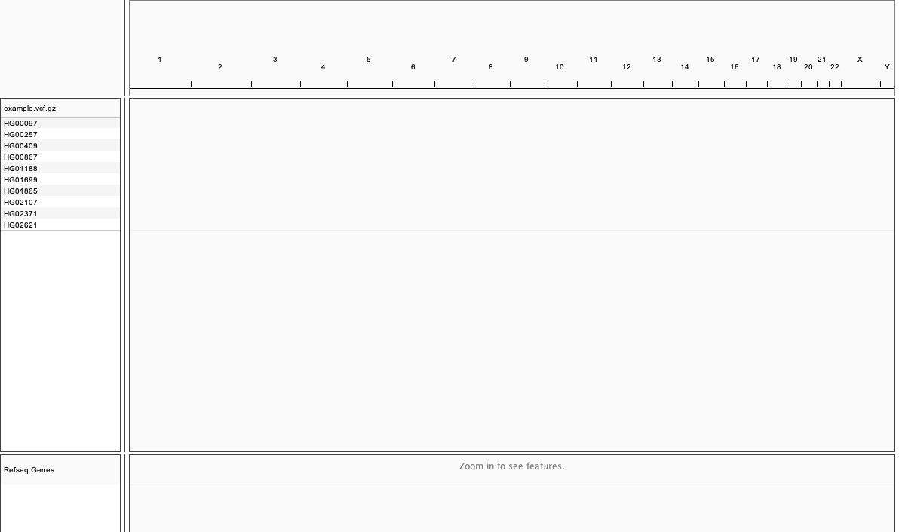
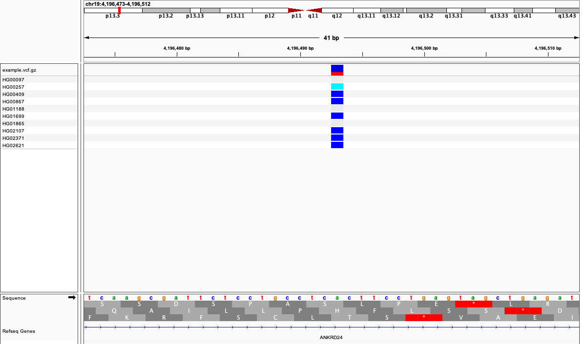
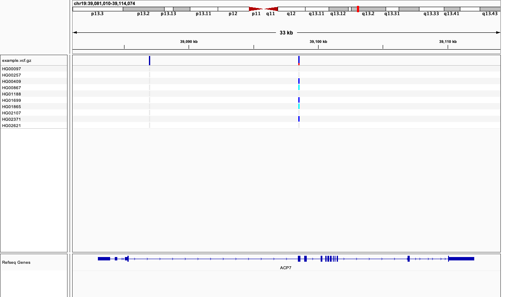
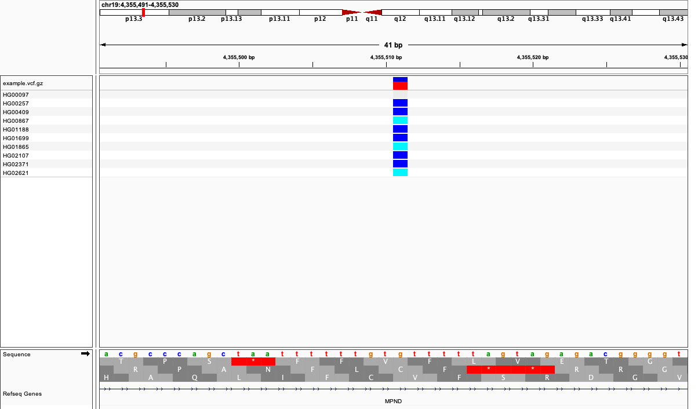
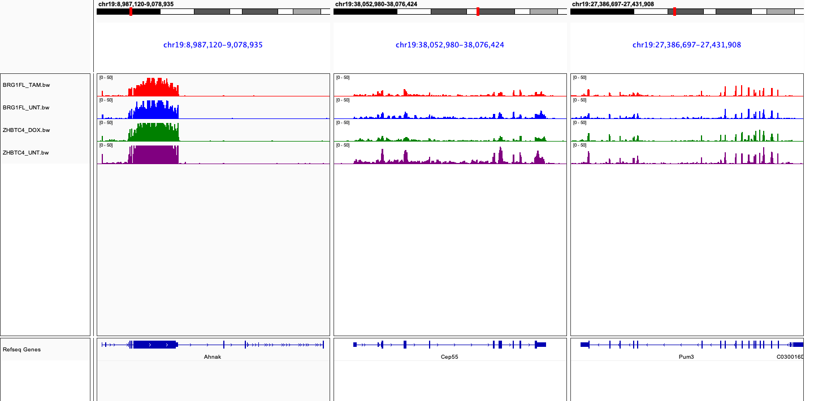

```{r,child="assets/header-lab.Rmd"}
```

```{r, include = FALSE}
knitr::opts_chunk$set(engine.opts = list(bash = "-l"), chunk.title = TRUE, out.width = "100%", fig.align = "center")
```

# Introduction

- Data visualization is an essential component of genomic data analysis. However, the size and diversity of the data sets produced by today’s sequencing and array-based profiling methods present major challenges to visualization tools.

- The Integrative Genomics Viewer (IGV) is a high-performance viewer that efficiently handles large heterogeneous data sets, while providing a smooth and intuitive user experience at all levels of genome resolution.

- A key characteristic of IGV is its focus on the integrative nature of genomic studies, with support for both array-based and next-generation sequencing data, and the integration of clinical and phenotypic data. 

- Although IGV is often used to view genomic data from public sources, its primary emphasis is to support researchers who wish to visualize and explore their own data sets or those from colleagues.

- IGV supports flexible loading of local and remote data sets, and is optimized to provide high-performance data visualization and exploration on standard desktop systems.

- IGV is freely available for [download](http://www.broadinstitute.org/igv) under a GNU LGPL open-source license.

# Objectives

- [Install IGV]
- [IGV videos]
- [Batch commands]
- [Reference sheet]

# Tutorial

In this tutorial we are going to learn how to use IGV to visualize genomic data. The first thing to do is create a directory to store all the tutorial data. It is good practice to create a new directory for each project you work on, this ensures files do not get mixed up and all the results are self-contained.

Create a 'tutorial' directory to store output files:

```{bash, echo = -1}
rm -rf tutorial
mkdir tutorial
```

Download the tutorial and exercise data:

```{bash}
curl https://raw.githubusercontent.com/zifornd/bioinformatics-workshop/main/data/visualization/data.tar.gz --output tutorial/data.tar.gz
```

Extract the archive file into the tutorial directory:

```{bash}
tar xf tutorial/data.tar.gz --directory=tutorial
```

## Install IGV

The software we are going to use in this tutorial can be installed using the conda package manager. Please refer to the previous conda workshop for details on installing software and creating conda environments.

Create a new environment with IGV installed:

```{bash}
conda create --yes --name igvtools igv
```

<!-- On macOS, the IGV launcher requires the coreutils version of readlink. After installing the conda environment, manually change the path to the readlink command used: /opt/homebrew/opt/coreutils/libexec/gnubin/readlink -->

```{bash, include = FALSE}
sed -i '' 's|readlink|/opt/homebrew/opt/coreutils/libexec/gnubin/readlink|g' /opt/miniconda3/envs/igvtools/bin/igv
```

Activate the new environment to use it:

```{bash}
conda activate igvtools
```

Test that the `igv` command is available:

```{bash, echo = -1, error = TRUE}
conda activate igvtools
which igv
```

## IGV videos

The developers of IGV have produced a number of tutorial videos which describe the layout and functionality of the browser. Each video is roughly 5 minutes long and contains a lot of useful information. Instead of needlessly creating a new tutorial, we suggest you watch each of the videos instead.

### Data navigation

This video demonstrates how to navigate the browser:

```{r, echo = FALSE}
vembedr::embed_youtube("YpNg0hNUuo8", height = 467)
```

### Sequencing data

This video demonstrates how to load sequencing data:

```{r, echo = FALSE, chunk.title = FALSE}
vembedr::embed_youtube("E_G8z_2gTYM", height = 467)
```

### Genomic variation

This video demonstrates how SNPs and indels are displayed:

```{r, echo = FALSE}
vembedr::embed_youtube("eZUI6lcIX3I", height = 467)
```

### RNA sequencing

This video demonstrates how RNA-seq data is displayed:

```{r, echo = FALSE}
vembedr::embed_youtube("awGN-rpLYas", height = 467)
```

### Variation calling

This video demonstrates how variant calls are displayed:

```{r, echo = FALSE}
vembedr::embed_youtube("EpD2ZHM7Q8Q", height = 467)
```

## Batch commands

In some cases it is useful to control IGV programmatically, rather than interactively. This is handy when you want to perform lots of tasks in the session without having to manually load and navigate the browser. Tasks are issued using a batch script, a text file containing commands which the browser understands. The commands are run sequentially and appear on separate lines.

Below is an example of a batch script. The script starts by creating a new session, performing some tasks, and then exiting the session:

```{bash}
cat tutorial/data/example/script.txt
```

The script is run by passing it to the IGV launcher with the batch parameter:

```{bash, echo = -1, error = TRUE}
conda activate igvtools
igv --batch tutorial/data/example/script.txt
```

The browser outputs a picture of the Nanog locus in the human genome:

```{r, echo = FALSE, out.width = "100%"}

```

This example is fairly simple, but more complicated tasks can be achieved with additional commands. The full list of batch commands is displayed below.

## Reference sheet

```{r, echo = FALSE}
tab <- read.delim("data/visualization/commands.txt")
knitr::kable(tab)
```

# Exercises

The exercises below are designed to strengthen your knowledge of using IGV and writing batch commands. The solution to each problem is blurred, only after attempting to solve the problem yourself should you look at the solution. Should you need any help, please ask one of the instructors.

## Protein-DNA binding

> ChIP-sequencing, also known as ChIP-seq, is a method used to analyze protein interactions with DNA. ChIP-seq combines chromatin immunoprecipitation (ChIP) with massively parallel DNA sequencing to identify the binding sites of DNA-associated proteins. It can be used to map global binding sites precisely for any protein of interest.

In the `chipseq` directory are a set of files generated from the analysis of a ChIP-seq experiment:

- ZHBTC4_OCT4_UNT.bw - Coverage track for the DNA-binding protein OCT4
- ZHBTC4_Input_UNT.bw - Coverage track for the input genomic DNA
- ZHBTC4_OCT4_UNT_peaks.narrowPeak - Peak regions detected by MACS2 peak caller
- ZHBTC4_OCT4_UNT_summits.bed - Summit regions detected by MACS2 peak caller

All of the data files are compatible with the **mm10** mouse reference genome.

Using both the IGV browser and the command line, answer the following questions:

1. Which peak has the highest score? Type `man sort` for help sorting.

```{bash, blur = TRUE}
# ZHBTC4_OCT4_UNT_peak_24
sort -k5,5nr tutorial/data/chipseq/ZHBTC4_OCT4_UNT_peaks.narrowPeak | head -n 1
```

2. What gene is nearest to the highest scoring peak?

```{r, blur = TRUE, echo = -2}
# Rcor2

```

3. Which peak is the longest? Type `man awk` for help calculating.

```{bash, blur = TRUE}
# ZHBTC4_OCT4_UNT_peak_149
awk '{print $1, $2, $3, $4, $3 - $2}' tutorial/data/chipseq/ZHBTC4_OCT4_UNT_peaks.narrowPeak | sort -k5,5nr | head -n 1
```

4. What base is covered by the summit of the longest peak?

```{r, blur = TRUE, echo = -2}
# G

```

5. How many peaks are located inside the Cep55 gene?

```{r, blur = TRUE, echo = -2}
# 3

```

## Genomic variation

> Exome sequencing, also known as whole exome sequencing (WES), is a genomic technique for sequencing all of the protein-coding regions of genes in a genome (known as the exome). It consists of two steps: the first step is to select only the subset of DNA that encodes proteins. These regions are known as exons. The second step is to sequence the exonic DNA using any high-throughput DNA sequencing technology.

In the `exome` directory is a VCF file generated from the analysis of a whole-exome sequencing (WES) experiment. The file is called `1KGP.vcf` and contains variant calling information from a number of samples from the [1000 Genomes Project](https://www.internationalgenome.org) data portal. The VCF file is compatible with the **hg39** human reference genome.

Load the VCF file in the IGV browser and answer the following questions:

1. How many samples are represented in the VCF file?

```{r, blur = TRUE, echo = -2}
# 10

```

2. What is the reference and alternate allele at position chr19:4196493

```{r, blur = TRUE, echo = -3}
# Reference: A
# Alternate: G

```

3. How many SNPs are present in the ACP7 gene?

```{r, blur = TRUE, echo = -3}
# 1
# The first SNP is homozygous reference

```

4. What two positions show homozygous variants in all 10 samples?

```{r, blur = TRUE, echo = -3}
# chr19:9387798
# chr19:55999276
knitr::include_graphics("data/visualization/chunks/exome/q4.png")
```

5. How many of the following alleles are present at position chr19:4355511

- Homozygous reference
- Homozygous variant
- Heterozygous variant

```{r, blur = TRUE, echo = -4}
# Homozygous reference: 1
# Homozygous variant: 3
# Heterozygous variant: 6

```

## Gene expression

> RNA-Seq (named as an abbreviation of RNA sequencing) is a sequencing technique which uses next-generation sequencing (NGS) to reveal the presence and quantity of RNA in a biological sample at a given moment, analyzing the continuously changing cellular transcriptome.

In the `rnaseq` directory are a set of coverage tracks generated from the analysis of an RNA-seq experiment. All of the data files are compatible with the **mm10** mouse reference genome. Write a batch script to recreate the snapshot shown below:

```{r, echo = FALSE, out.width = "100%"}

```

Click the bash chunk to reveal the solution:

```{verbatim, blur = TRUE}
new

genome mm10

goto chr19:8,987,120-9,078,935 chr19:38,052,980-38,076,424 chr19:27,386,697-27,431,908

load tutorial/data/rnaseq/BRG1FL_TAM.bw
setColor #FF0000 BRG1FL_TAM.bw

load tutorial/data/rnaseq/BRG1FL_UNT.bw
setColor #0000FF BRG1FL_UNT.bw

load tutorial/data/rnaseq/ZHBTC4_DOX.bw
setColor #008000 ZHBTC4_DOX.bw

load tutorial/data/rnaseq/ZHBTC4_UNT.bw
setColor #800080 ZHBTC4_UNT.bw

setDataRange 0,50

snapshot exercises/expression/snapshot.png

exit
```

<!-- Clean up conda and files -->

```{bash, include = FALSE}
rm -rf tutorial
conda remove --name igvtools --all --yes
```

```{r,child="assets/footer-lab.Rmd"}
```