```{r, echo=FALSE, child="assets/header-slide.Rmd"}
```

```{r,echo=FALSE,message=FALSE,warning=FALSE}
knitr::opts_chunk$set(echo = FALSE, fig.align = "center")
```

```{r,echo=FALSE,message=FALSE,warning=FALSE}
library(kableExtra)
```

# Why Single‑Cell?

* Bulk RNA‑seq masks differences between cells
* Averages hide rare or subtle cell states
* Single‑cell RNA‑seq reveals:
  - Cellular heterogeneity
  - Rare populations
  - Transcriptional dynamics
  
Across human tissues there is an incredible diversity of cell types, states, and interactions. To better understand these tissues and the cell types present, single-cell RNA-seq (scRNA-seq) offers a glimpse into what genes are being expressed at the level of individual cells.
```{r, fig.cap="Single-cell RNA sequencing workflow", out.width="60%"}
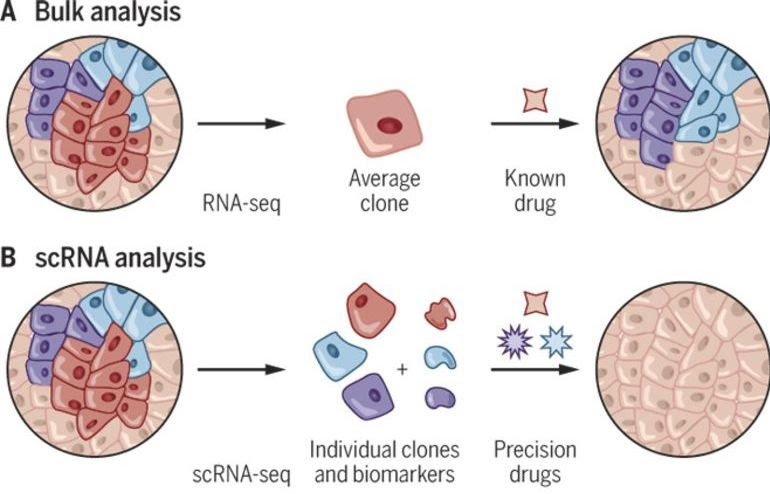
```

---

# What scRNA‑seq Enables

* Identify distinct **cell types**
* Characterize **cell states**
* Detect **rare populations**
* Reconstruct **trajectories** and **lineages**
* Gain deeper insights than bulk RNA‑seq

```{r, fig.cap="Single-cell RNA sequencing workflow", out.width="70%"}
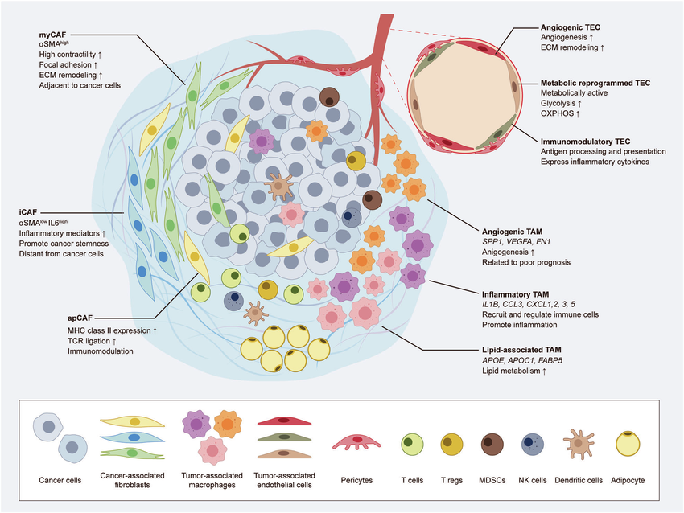
```

---

# Technology Overview

```{r, fig.cap="Single-cell RNA sequencing workflow", out.width="70%"}
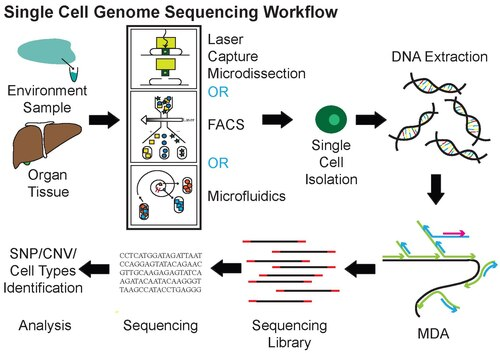
```

* Single‑cell isolation with microfluidics or droplets
* Each cell receives: Barcodes and UMIs

---

# Workflow Overview (Wet Lab)

```{r, fig.cap="Single-cell RNA-seq library workflow", out.width="80%"}
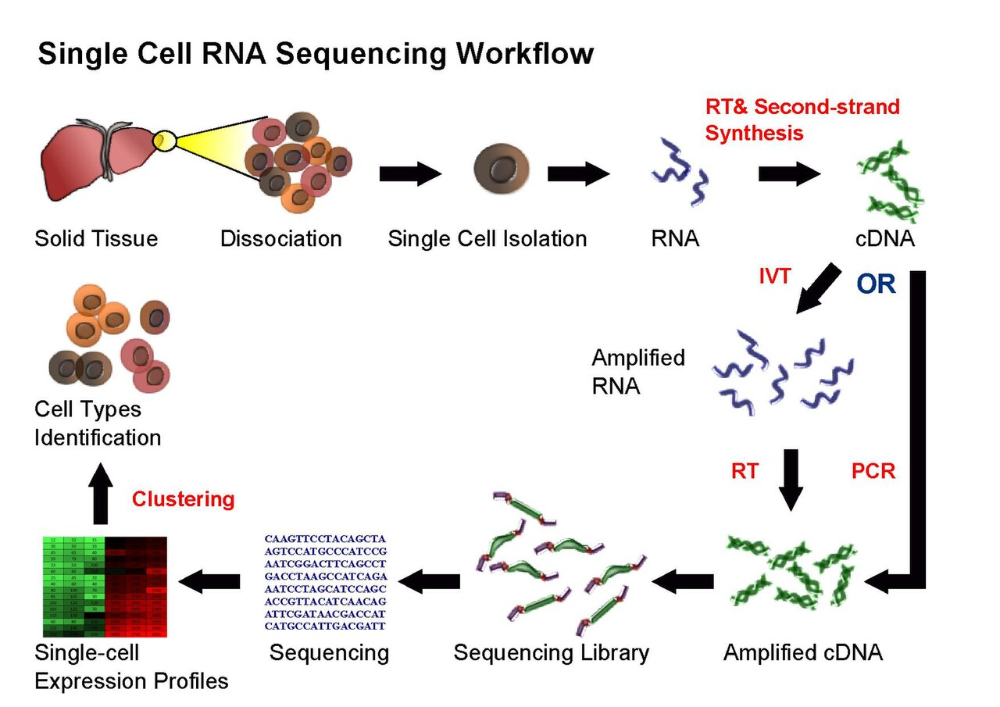
```

* Dissociation → Isolation → RT → Amplification → Sequencing

---

# Analysis Overview (Seurat)

.pull-left-50[
* Quality Control (QC)
* Normalization
* Highly Variable Genes (HVGs)
* PCA
* UMAP/t‑SNE
* Graph‑based clustering
* Marker detection & annotation
]


```{r, fig.cap="Clustering concept", out.width="80%"}
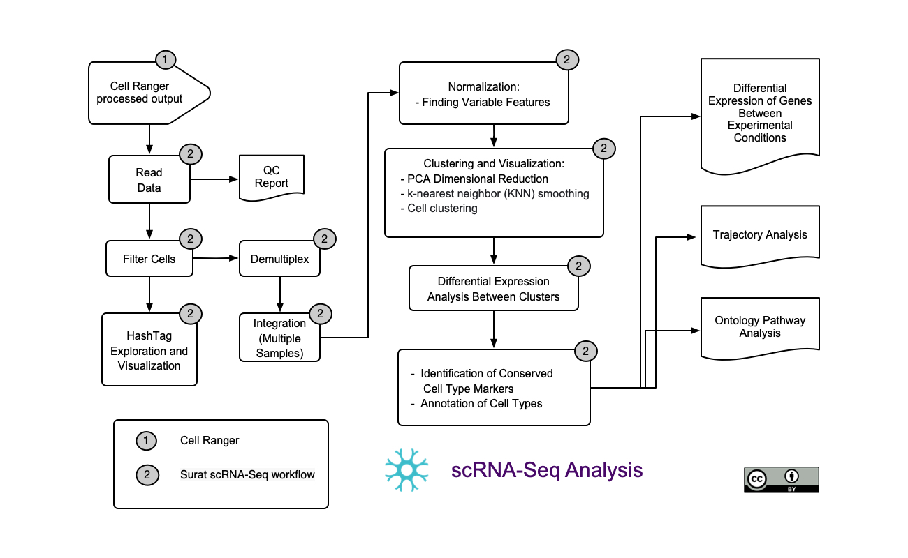
```


---

# Clustering Concepts


.pull-left-50[
##UMAP 
* UMAP preserves neighborhood structure
* Each color represents a cell cluster
* Non‑linear manifold learning
* Preserves local structure and global topology
* Creates intuitive 2D/3D embeddings of cells

</br>
</br>
</br>


##PCA (Principal Component Analysis)

* Linear dimensionality reduction
* Captures directions of maximum variance
* Projects cells into a low‑dimensional space
]

.pull-right-50[
```{r, out.width="60%"}
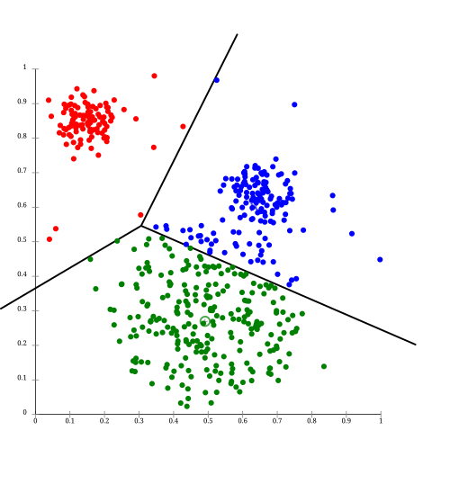
```

```{r, out.width="100%"}
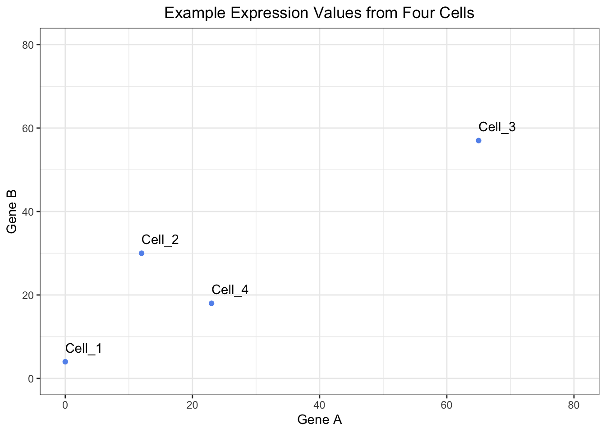
```
]
---
# Clustering Concepts


.pull-left-50[
##t‑SNE (t‑distributed Stochastic Neighbor Embedding)

* Focuses on preserving local similarities
* Cells close in high‑dimensional space stay close in 2D
* Visualizing cellular heterogeneity
* Distances between clusters are not globally meaningful
]

.pull-right-50[
```{r, out.width="65%"}
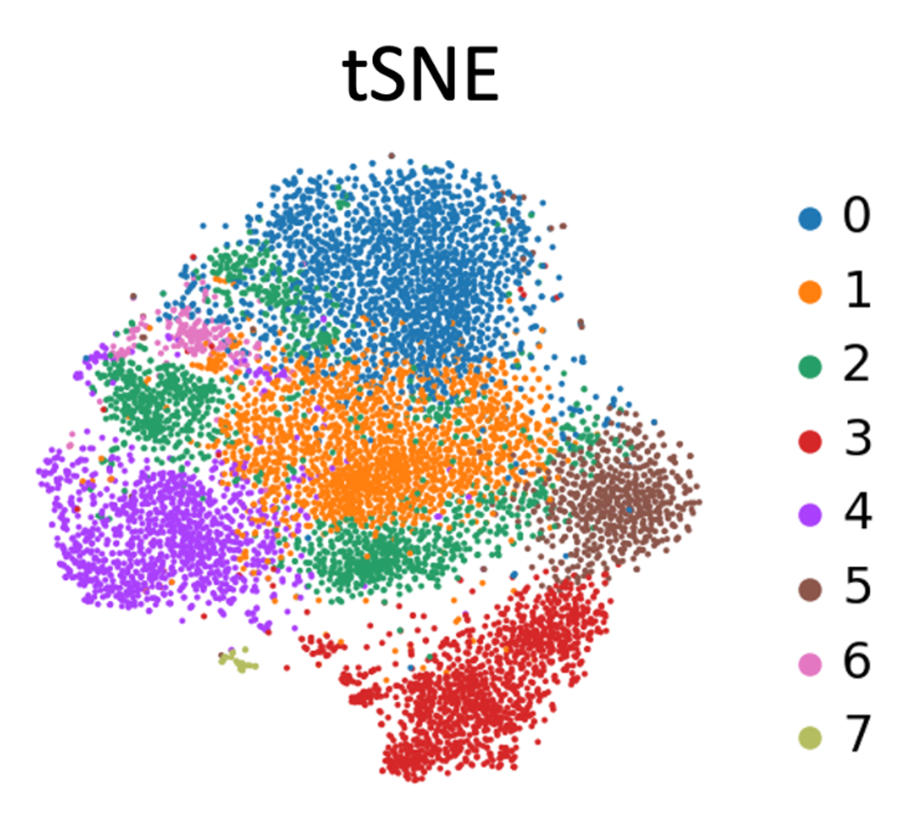
```
]
<br style="clear: both">
## UMAP vs t‑SNE vs PCA (scRNA‑seq)

| Aspect (scRNA‑seq) | PCA | t‑SNE | UMAP |
|------------------|-----|-------|------|
| Method type | Linear | Non‑linear | Non‑linear |
| Structure preserved | Global variance | Local neighborhoods | Local + global |
| Main role | Preprocessing & clustering | Visualization | Visualization (default) |
| Scalability | Very fast | Slow on large data | Fast & scalable |
| Interpretation | Overlapping clusters | Local separation | Intuitive layout |


---
# Marker Genes & Cell Types

* Marker genes define clusters
* Used for annotation
* Examples:
  - CD3D → T cells
  - MS4A1 → B cells
  - NKG7 → NK cells

```{r, out.width="80%"}
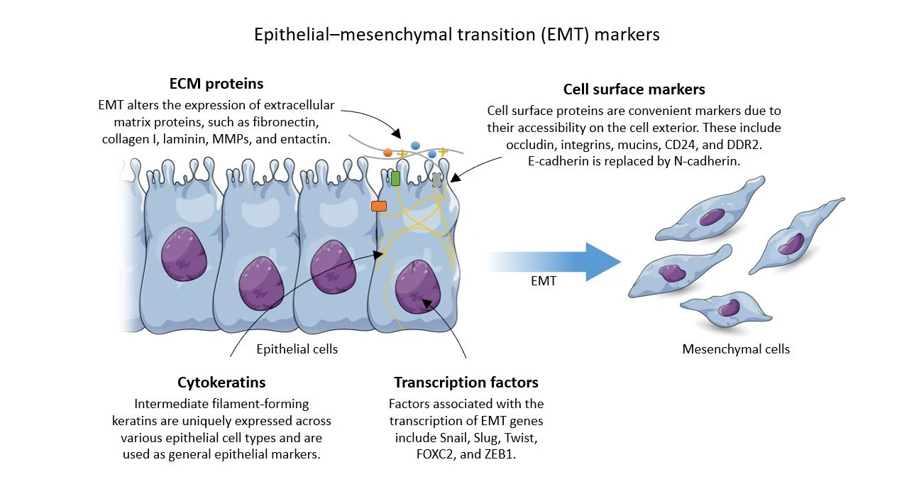
```

---

# Trajectory Concepts

* Many systems follow continuous transcriptional transitions
* Examples:
  - Differentiation
  - Activation
  - Stem‑cell development

```{r, out.width="85%"}
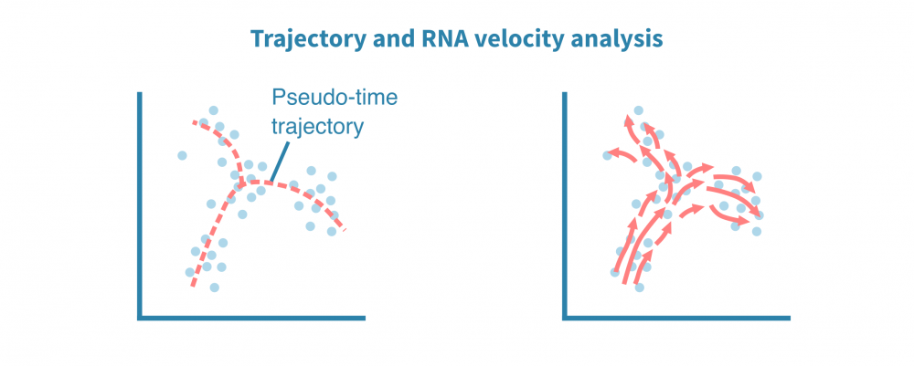
```
---

# Applications of scRNA‑seq

* **Immunology** — T‑cell states, immune infiltration
* **Cancer** — Tumor microenvironment
* **Development** — Lineage tracing
* **Regenerative medicine** — Stem‑cell profiling
* **Disease** — Cellular‑level dysfunction

</br>
</br>
```{r, out.width="85%"}
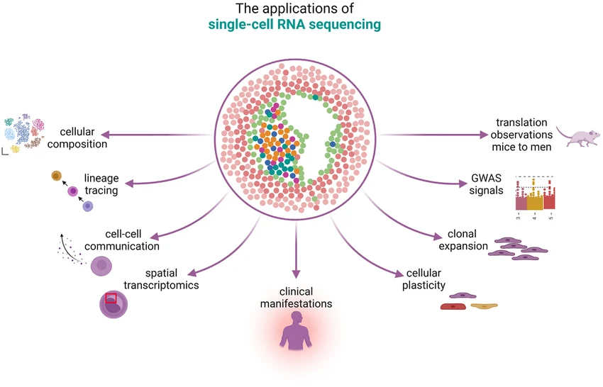
```
---
name: end_slide
class: end-slide, middle
count: false

# Thank you. Questions?

```{r,echo=FALSE,child="assets/footer-slide.Rmd"}
```
