exclude: true
count: false

```{r, echo=FALSE}
```

<!-- ------------ Only edit title, subtitle & author above this ------------ -->

```{r setup, include=FALSE}
knitr::opts_chunk$set(
  echo = FALSE, 
  engine.opts = list(bash = "-l"), 
  fig.align = "center"
)
```
```{r, include = FALSE}
library(knitr)
library(kableExtra)
```
---

## What is epidemiology
<br>
“The study of the distribution and determinants of disease in health-related states and events in defined populations, and the application of this study to the control of health problems”
<br><br>
Last J. Dictionary of epidemiology, OUP, 2001
<br><br><br><br>
```{r, out.width = "70%"}

```

---

## Epidemiological studies

<br>
```{r, out.width = "70%"}
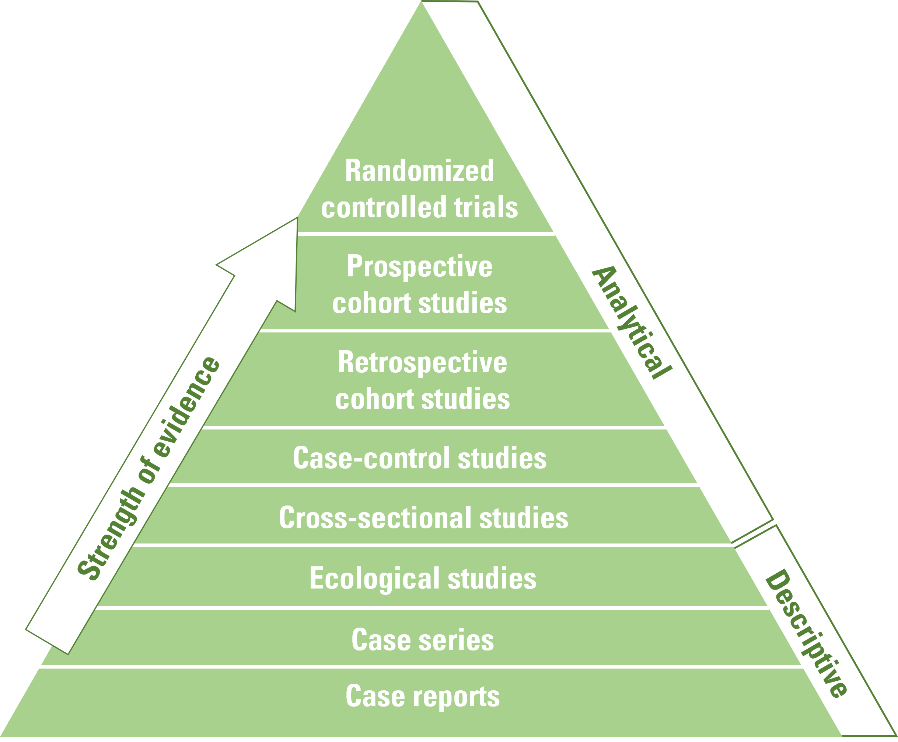
```


---

## Evaluating rates of disease

* Incidence 
<br>
  + The rate at which **new** cases occur in a population during a specified period.
<br>

* Prevalence
<br>
  + The proportion of **existing** cases in a population at one point in time.
<br>

* Attributable proportion
<br>
  + The proportion of a disease in a group that is exposed to a **particular factor** which can be attributed to their exposure to that factor. 
<br>
* Risk ratio
<br>
  + Ratio of the probability of an event occurring in the **exposed** population to the probability of it occurring in the **unexposed** population
<br>
* Incidence rate ratio
<br>
  + Ratio of the incidence rate of disease in the **exposed** population compared to that in the **unexposed** population
<br>

* Odds ratio
<br>
  + Odds of an event is the probability that an individual **experiences the event** divided by the probability that **they do not**. 


---

## Calculating odds and risk ratios

<br>
```{r, out.width = "70%"}
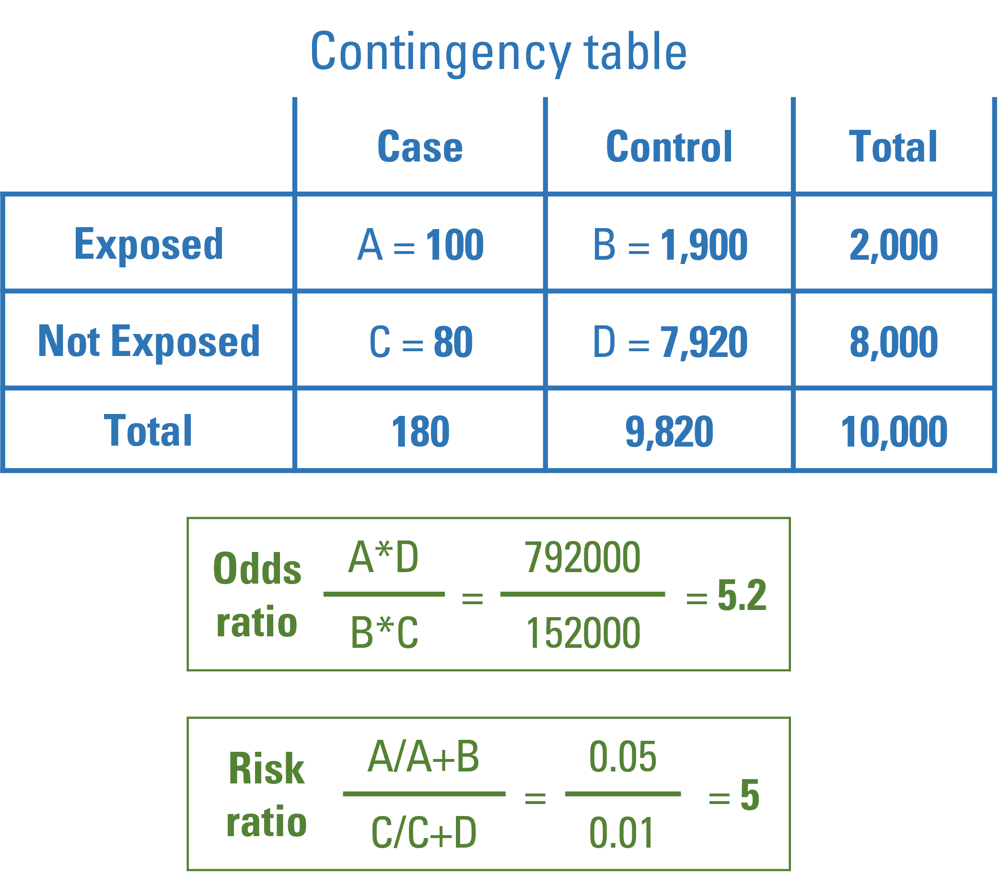
```

---

## Diagnostic tests

* The **sensitivity** of a test is the proportion of people who test **positive** among all those who **actually have the disease**.
<br><br>
* The **specificity** of a test is the proportion of people who test **negative** among all those who **actually do not have that disease**.
<br><br>
* The **positive predictive value** is the **probability** that following a **positive** test result, that individual will **truly have that disease**.
<br><br>
* The **negative predictive value** is the **probability** that following a **negative** test result, that individual will **truly not have that disease**.
<br><br>
```{r, out.width = "60%"}
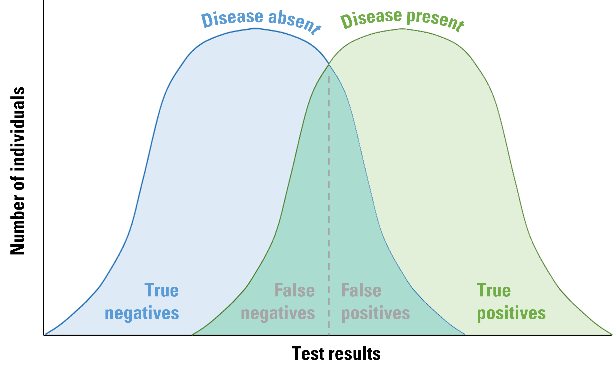
```


---

## Measurement error and bias

* Selection bias
<br><br>
* Information bias
<br> 
  + Recall bias
<br><br>
  + Observer bias
<br><br>
* Consequences of information bias
<br>
  + Non-differential misclassifcation
<br><br>
  + Differential misclassification
<br>

---

## Confounding/mediation
<br><br><br><br>
```{r, out.width = "80%"}
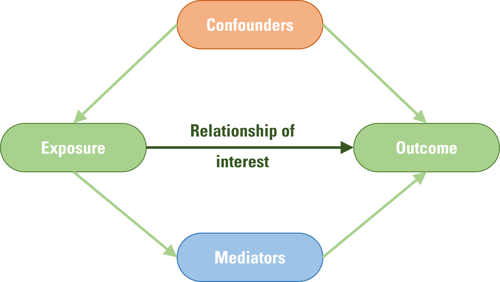
```
<br><br><br><br>
---

## Confounding
<br>
* A **confounder** is a variable that influences both the exposure and outcome, causing a spurious association
<br><br><br><br><br><br>
```{r, out.width = "80%"}
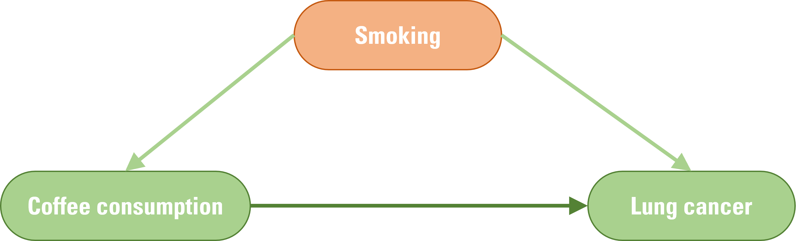
```
<br>

---

## Mediation
<br>
* A **mediator** is a variable that is influenced by the exposure and in turn influences the outcome.
<br><br><br><br><br><br><br>
```{r, out.width = "80%"}
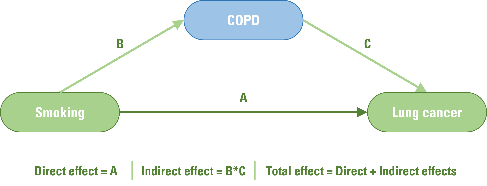
```
<br>

---

## Genetic epidemiology
<br><br>
* Understanding how genetic factors influence traits and disease.
<br><br><br>
* Twin studies
<br><br>
* Linkage analysis
<br><br>
* Association
<br><br><br><br><br><br><br><br><br><br><br><br><br><br><br><br>

--- 

## Twin studies

* Comparison of monozygotic and dizygotic twins
<br><br><br><br><br><br>
```{r, out.width = "100%"}
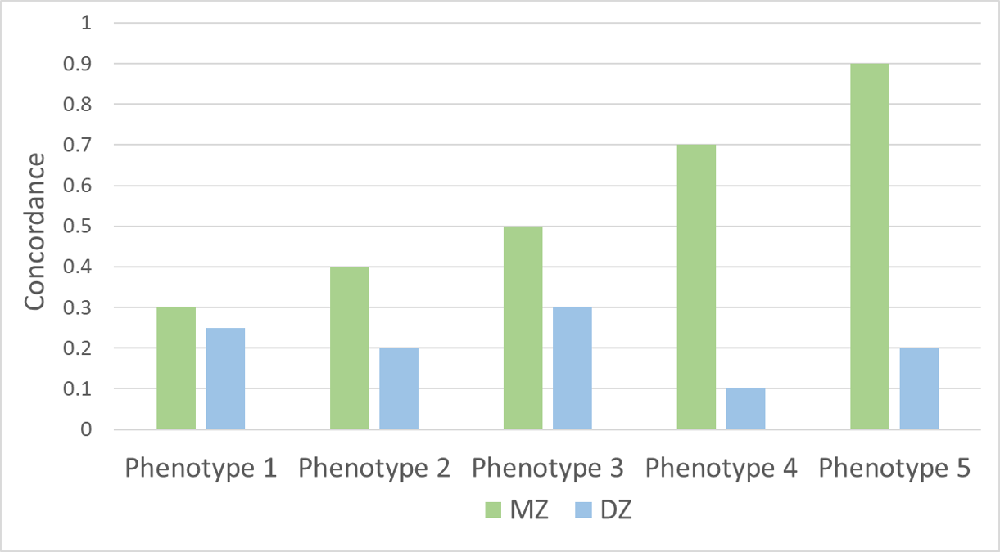
```
<br>

---

## Linkage analysis

* Within family analysis used to identify **rare variants** that influence rare disease.
<br><br><br><br><br>
```{r, out.width = "90%"}
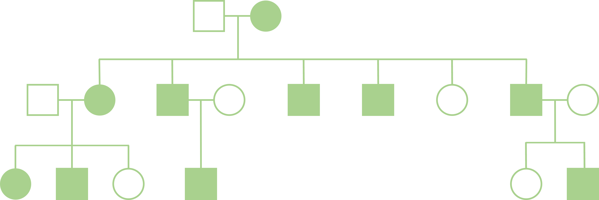
```
<br>

---
## Genome wide association studies
<br>
* Test associations between **genetic variants** and a specific trait and disease
<br><br>
* In GWAS' the most tested genetic variants are **single-nucleotide polymorphisms** (SNPs)
<br><br><br>
```{r, out.width = "50%"}
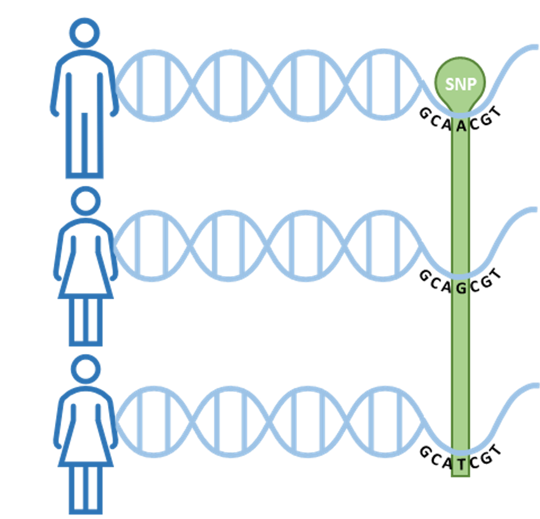
```
<br>

---
## GWAS quality control
<br><br><br><br><br>
```{r, out.width = "100%"}
include_graphics("data/epidemiology/gwasqc.png")
```
<br>

---
## GWAS steps
<br>
```{r, out.width = "70%"}
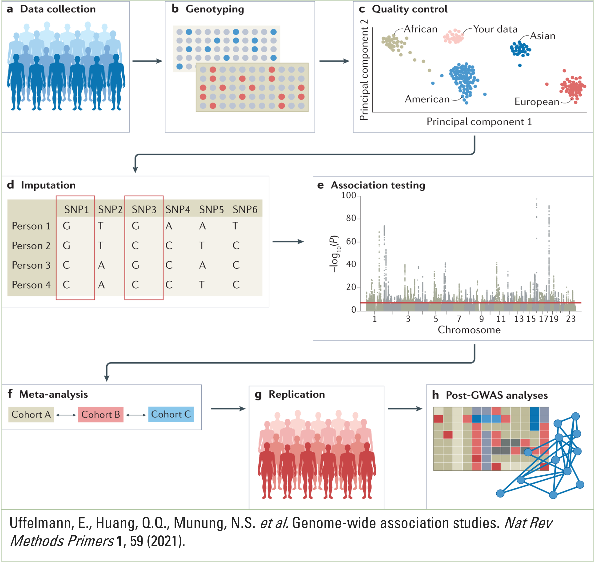
```
<br>

---
## Current GWAS limitations
<br>
* Most published GWAS’ are performed in individuals of European descent
<br><br><br>
* Variants identified for a specific complex trait or disease only account for a **small proportion** of the estimated heritability
<br><br><br>
* Doesn’t necessarily identify **causal** variants and genes
<br><br><br>
* Limited clinical predictive value

---
## Beyond GWAS
<br>
* Statistical fine-mapping
<br><br><br>
* SNP enrichment
<br><br><br>
* Quantitative trait loci mapping
<br><br><br>
* Colocalization
<br><br><br>
* Functional studies
<br><br><br>
* Clinical significance
```{r, out.width = "60%", out.extra='style= "float:right;position: relative; top: -420px;"'}
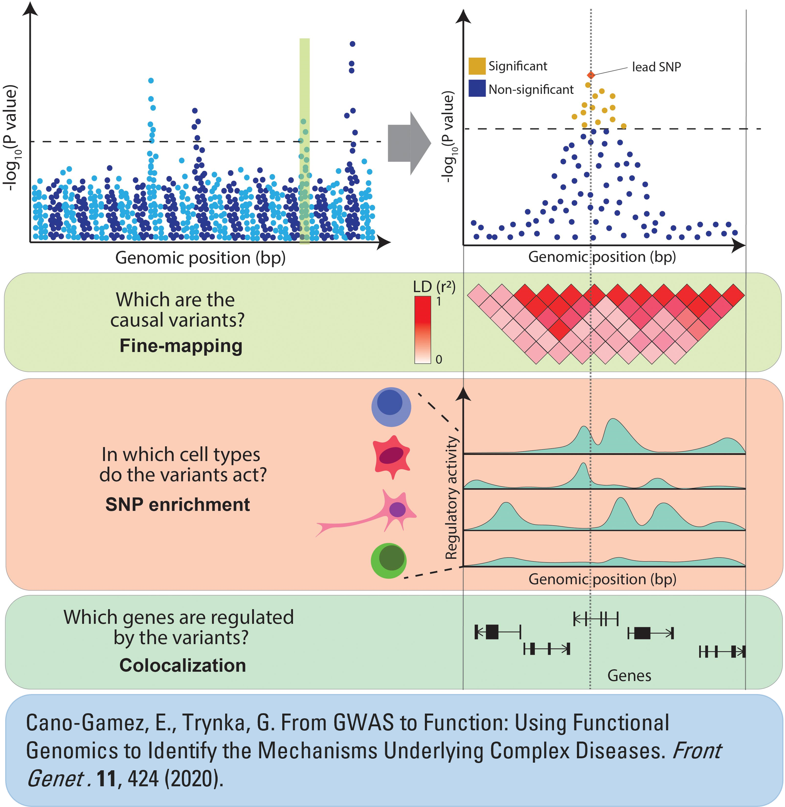
```
---
## Other 'omics
<br><br><br><br>
```{r, out.width = "70%"}
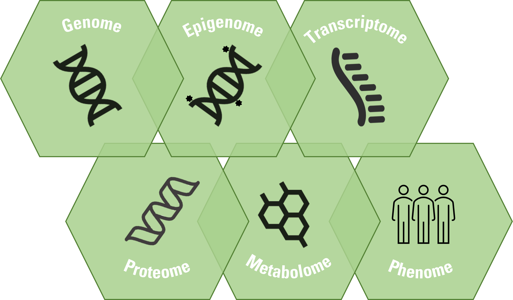
```
<br>

---
## Epigenome
<br><br>
```{r, out.width = "80%"}
include_graphics("data/epidemiology/epigenome.png")
```
<br>

---
## Transcriptome wide association studies

* A gene-based association approach that investigates associations between **genetically regulated gene expression** and complex diseases or traits.
<br><br><br>
```{r, out.width = "90%"}
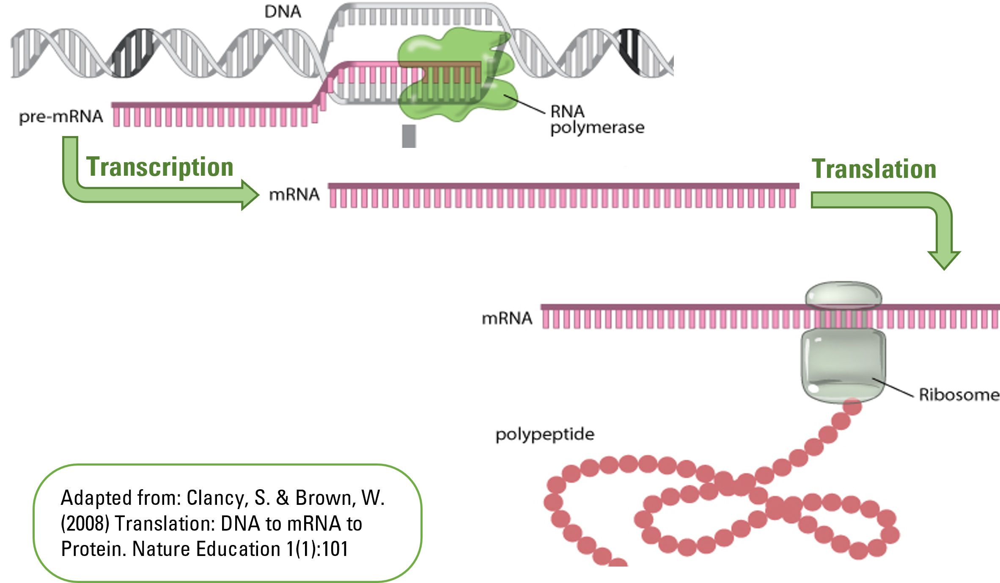
```
<br>
<br>

---
## Mendelian randomization

* A method that uses genetic variants as instrumental variables to explore causal effects of risk factors on outcomes in observational epidemiological studies.

<br><br><br>
```{r, out.width = "90%"}
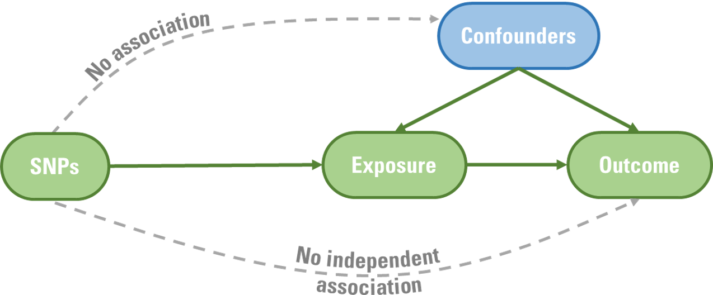
```
<br>

---
## Mendelian randomization


<br><br><br>
```{r, out.width = "100%"}
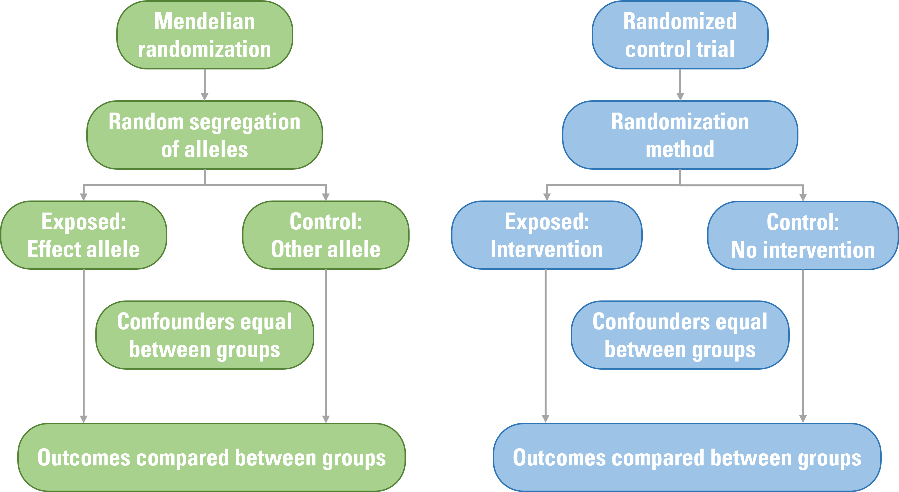
```
<br>

---

## Summary

* Epidemiology is “The study of the distribution and determinants of disease in health-related states and events in defined populations, and the application of this study to the control of health problems”
<br><br>
* Genetic epidemiology allow us to understand the genetic risk factors for health traits and disease
<br><br>
* There are methods that utilise GWAS findings to prioritize variants for further study which may lead to clinical significance
<br><br>
* Other 'omics such as the epigenome and transcriptome can be studies to aid in the understanding of disease in populations
<br><br>
* Mendelian randomization uses GWAS with the aim to isolate causal effects by avoiding confoundings and reverse causation. 


---

## Further reading
* Epidemiology for the uninitiated. From: https://www.bmj.com/about-bmj/resources-readers/publications/epidemiology-uninitiated
* Paternoster L, Tilling K, Davey Smith G. Genetic epidemiology and Mendelian randomization for informing disease therapeutics: Conceptual and methodological challenges. PLoS Genet. 2017 Oct 5;13(10):e1006944.
* Tam V, Patel N, Turcotte M, Bossé Y, Paré G, Meyre D. Benefits and limitations of genome-wide association studies. Nat Rev Genet. 2019 Aug;20(8):467-484. 
* Peterson RE, Kuchenbaecker K, Walters RK, Chen CY, Popejoy AB, Periyasamy S, et al. Genome-wide Association Studies in Ancestrally Diverse Populations: Opportunities, Methods, Pitfalls, and Recommendations. Cell. 2019 Oct 17;179(3):589-603.
* Cano-Gamez E, Trynka G. From GWAS to Function: Using Functional Genomics to Identify the Mechanisms Underlying Complex Diseases. Front Genet. 2020 May 13;11:424. * Schaid DJ, Chen W, Larson NB. From genome-wide associations to candidate causal variants by statistical fine-mapping. Nat Rev Genet. 2018 Aug;19(8):491-504. 
* Lichou F, Trynka G. Functional studies of GWAS variants are gaining momentum. Nat Commun. 2020 Dec 8;11(1):6283.
* Rakyan VK, Down TA, Balding DJ, Beck S. Epigenome-wide association studies for common human diseases. Nat Rev Genet. 2011 Jul 12;12(8):529-41. 
* Li B, Ritchie MD. From GWAS to Gene: Transcriptome-Wide Association Studies and Other Methods to Functionally Understand GWAS Discoveries. Front Genet. 2021 Sep 30;12:713230. 
* Davey Smith G, Hemani G. Mendelian randomization: genetic anchors for causal inference in epidemiological studies. Hum Mol Genet. 2014 Sep 15;23(R1):R89-98.
<!-- --------------------- Do not edit this and below --------------------- -->

---
name: end_slide
class: end-slide, middle
count: false

# Thank you. Questions?

```{r,echo=FALSE,child="assets/footer-slide.Rmd"}
```

```{r,include=FALSE,eval=FALSE}
# manually run this to render this document to HTML
rmarkdown::render("slide.Rmd")
# manually run this to convert HTML to PDF
#pagedown::chrome_print("slide_sample.html",output="slide_sample.pdf")
```