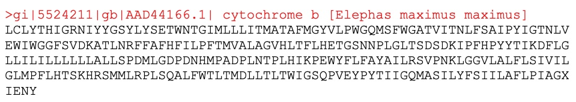
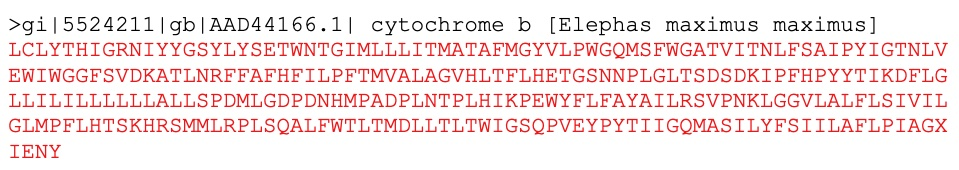
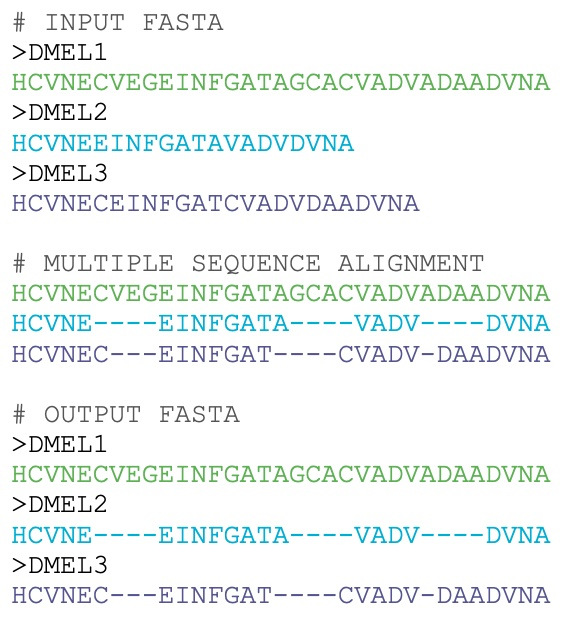
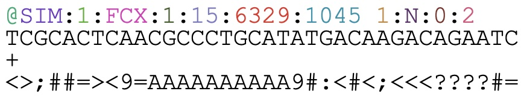
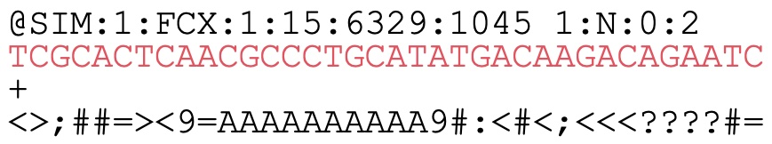
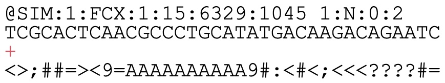
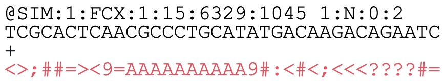
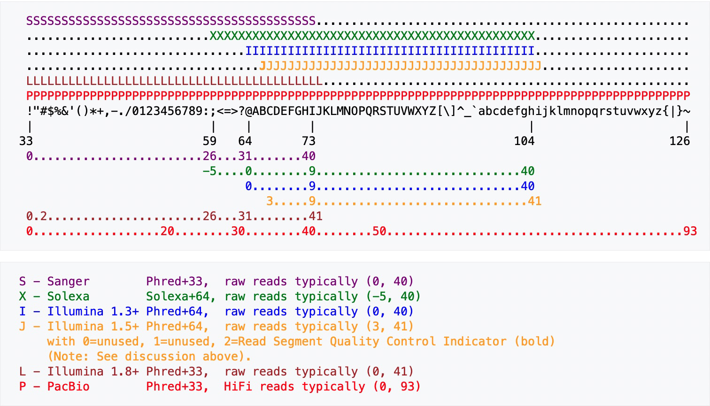

exclude: true
count: false

```{r,echo=FALSE,child="assets/header-slide.Rmd"}
```

<!-- ------------ Only edit title, subtitle & author above this ------------ -->

```{r setup, include=FALSE}
knitr::opts_chunk$set(
  echo = FALSE, 
  engine.opts = list(bash = "-l"), 
  fig.align = "center"
)
```

```{r, include = FALSE}
library(knitr)
library(kableExtra)
```

```{r, include = FALSE}
library(reticulate)
use_python("/opt/miniconda3/bin/python")
```

---

## Introduction

* One of the hardest things in bioinformatics is developing a **good** file format

* It might seem trivial, but a lot of effort is put into developing file formats that are **efficient** yet can be **quickly** and **easily** parsed

* Around the storage of primary sequences, FASTA/Q have become the de-facto standard

* Many have tried to come up with *better* formats, but none have prevailed

<br>

```{r, out.width = "50%", fig.cap = "xkcd: Standards"}
knitr::include_graphics("data/formats/xkcd-standards.png")
```

---

## FASTA

### Overview

* Text-based format for representing either nucleotide or amino acid sequences

* Nucleotides or amino acids are represented using single-letter codes:

  * IUPAC ambiguous DNA: `GATCRYWSMKHBVDN`
  * IUPAC protein alphabet of the **20** standard amino acids: `ACDEFGHIKLMNPQRSTVWY`

* A FASTA file uses two or more lines per record:

  * The header line begins with `>` and gives a unique identifier for the sequence
  * The sequence line(s) contain the actual sequence and are wrapped every **80** characters

* Filename extensions: `.fasta` `.fa`

```{embed, file = "data/formats/example.fasta", echo = TRUE}
```

---

## FASTA

### Header line

<br>

```{r, out.width = "85%"}

```

<br>

* The header line begins with `>` and gives a unique identifier for the sequence

* The header line may also contain additional information:

    * NCBI Identifiers:
    
        * GenInfo integrated database `gi|integer`
        * GenBank `gb|accession`
        * Definition `text`
        * Organism `[organism]`

---

## FASTA

### Sequence lines(s)

<br>

```{r, out.width = "85%"}

```

<br>

* The sequence line(s) contain the actual sequence and are wrapped every **80** characters

* Expected to be represented in the standard IUB/IUPAC amino acid and nucleic acid codes

* In genome assembly sequences, repeat regions are sometimes masked:

  * Sort mask: `atatatatatat`
  
  * Hard mask: `NNNNNNNNNNNN`
  
* *Warning! Always check the wrapping on your sequences and the validation performed by the bioinformatics software - some poorly written software will only read the first 80 characters, skipping any which appear afterward!*

---

## FASTA

### Alignment representation

.pull-left-50[

* The FASTA format can also be used to store multiple sequence alignment output

* Sequences are padded using the `-` character to represent insertions and deletions 

* The FASTA format was originally designed as a protein sequence similarity searching format (FASTP) in the 1980's

* Over time the need grew for a simple and flexible way to query DNA and protein sequences against entire databases

]

.pull-right-50[

```{r, out.width = "100%"}

```

]

---

## Sequencing

*A quick refresher before the next section...*

```{r}
vembedr::embed_youtube("fCd6B5HRaZ8", height = 475)
```

---

## FASTQ

### Overview

.pull-left-55[

* An extension of FASTA format to handle base quality metrics from sequencing machines

* Each sequence is represented by 4 lines:

  1. Identifier of the sequence starting with `@`
  2. Actual sequence
  3. Optional identifier starting with `+`
  4. Quality scores for each base
  
* FASTQ files are created and compressed with extension `.fastq.gz`

* For each sample per flow cell lane:

  * Single-end: `.fastq.gz`
  * Paired-end: `_1.fastq.gz` `_2.fastq.gz`
  
]

.pull-right-45[

```{embed, echo = TRUE}
"data/formats/example.fastq"
```

]

---

## FASTQ

### Sequence identifier

<br>

```{r, out.width = "60%"}

```

<br>

.pull-left-45[

* Contains information about the sequencing run and the cluster

* Contents vary based on the BCL to FASTQ software version

* Record starts with the `@` character

* Line contains 11 elements separated by the `:` character

]

.pull-right-50[

```{r}
dat <- read.csv("data/formats/FASTQ.csv")

kbl <- kable(dat[, 1:2], "html", align = "l")

for (i in 1:12) {

  kbl <- row_spec(kbl, i, color = dat$Colour[i])

}

kbl <- scroll_box(kbl, height = "300px")

kbl
```

]

---

## FASTQ

### Sequence

<br>

```{r, out.width = "60%"}

```

<br>

* Contains the **base calls** for the sequenced read

* Read length refers to the number of base calls: `36`

* The base calls are limited to `ACGTN`

* An `N` means the software was not able to make a call for this base

* Multiple `N` base calls may indicate a problem with the sequencing

---

## FASTQ

### Optional identifier

<br>

```{r, out.width = "60%"}

```

<br>

* Contains **optional** identifier or description

* Begins with a `+` character

* Somtimes contains a copy of the sequence identifier

---

## FASTQ

### Quality scores

<br>

```{r, out.width = "60%"}

```

<br>

.pull-left-50[

* A quality score is an integer mapping of the probability of an **incorrect** base call

* Use ASCII characters to represent the numerical probability

* Phred quality score calculation: $Q=-10\log_{{10}}P$

]

.pull-right-45[

```{r}
dat <- read.delim("data/formats/PHRED.tsv", check.names = FALSE)

kbl <- kable(dat, "html", align = "r") %>% kable_styling(font_size = 15)

kbl
```

]

---

## FASTQ

### Quality encoding

* Different sequencing manufacturers use different quality encoding schemes

* Encodings are limited to the **printable** ASCII characters (33-126)

* Most data you will encounter will use **Phred+33** encoding - *but always check!*

```{r, out.width = "75%", fig.cap = "Phred quality score encoding (Wikipedia)"}

```

---

## Processing FASTA/Q

* There are multiple libraries and tools available to process FASTA/Q files

* Because FASTA/Q files can be very large, there has been a lot of effort devoted to developing faster and faster algorithms for reading such files

* See this [blog post](http://lh3.github.io/2020/05/17/fast-high-level-programming-languages) by Heng Li if you are *algorithimically inclined*

* Examples of some popular libraries:

  * [Biopython](https://biopython.org)
  
  * [Biostrings](https://bioconductor.org/packages/release/bioc/html/Biostrings.html) and [ShortRead](https://bioconductor.org/packages/release/bioc/html/ShortRead.html) from [Bioconductor](https://www.bioconductor.org) 

* Examples of some popular tools:

  * [Seqkit](https://bioinf.shenwei.me/seqkit/)
  
  * [seqtk](https://github.com/lh3/seqtk)

---

## Biopython

### Overview

```{r, fig.align = "right", out.width = "20%"}
knitr::include_graphics("data/formats/biopython-logo.png")
```

* Biopython is a set of freely available tools for biological computation written in Python by an international team of developers

* It is a distributed collaborative effort to develop Python libraries and applications which address the needs of current and future work in bioinformatics

* It contains classes to represent biological sequences and sequence annotations, and it is able to read and write to a variety of file formats

* It also allows for a programmatic means of accessing online databases of biological information, such as those at NCBI

* Separate modules extend Biopython's capabilities to sequence alignment, protein structure, population genetics, phylogenetics, sequence motifs, and machine learning

---

## Biopython

### Tour

```{r, out.width = "100%"}
knitr::include_url("https://biopython.org", height = "500px")
```

---

## Biopython

### Parsing FASTA

```{python, echo = TRUE}
from Bio import SeqIO

for record in SeqIO.parse("data/formats/virus.fasta", "fasta"):

  print("Header:", record.id)
  
  print("Sequence :", repr(record.seq))

  print("Length:", len(record))
  
  print("---")
```

---

## Biopython

### Parsing FASTQ

```{python, echo = TRUE}
from Bio import SeqIO

total = 0

count = 0

for record in SeqIO.parse("data/formats/reads.fastq", "fastq"):
  
  total += 1
  
  min_phred_quality = min(record.letter_annotations["phred_quality"])
  
  if min_phred_quality >= 20:
    
    count += 1

print("Total:", total)

print("Passed:", count)

print("Percent:", count / total)
```

---

## Bioconductor

### Overview

```{r, fig.align = "right", out.width = "30%"}

```

* Bioconductor is a free, open source and open development software project for the analysis and comprehension of genomic data generated by wet lab experiments in molecular biology

* Bioconductor is based primarily on the statistical R programming language, but does contain contributions in other programming languages

* Most Bioconductor components are distributed as R packages, which are add-on modules for R

* The **Biostrings** and **ShortRead** packages can be used for FASTA/Q processing

---

## Bioconductor

### Tour

```{r, out.width = "100%"}
knitr::include_url("https://bioconductor.org", height = "500px")
```

---

## Bioconductor

### Parsing FASTA

```{r, echo = TRUE, warning = FALSE}
library(Biostrings)

records <- readDNAStringSet("data/formats/virus.fasta", format = "fasta")

print(records)

print(paste("Total:", length(records)))

print(paste("Length(s):", paste(width(records), collapse = ",")))

print("Alphabet Frequency Table:")

alphabetFrequency(records)
```

---

## Bioconductor

### Parsing FASTQ

```{r, echo = TRUE, warning = FALSE}
library(ShortRead)

records <- readFastq("data/formats/reads.fastq", format = "fastq")

print(records)

print(quality(records))
```

---

## SeqKit

### Overview

* SeqKit is a cross-platform ultrafast comprehensive toolkit for FASTA/Q processing

* SeqKit provides executable binary files for all major operating systems, including Windows, Linux, and Mac OSX

* Seqkit can be used to process FASTA/FASTQ files in the following ways:

  * [Transform](https://bioinf.shenwei.me/seqkit/usage/#seq) sequences (extract ID, filter by length, remove gaps...)

  * [Statistics](https://bioinf.shenwei.me/seqkit/usage/#stats) (seqs, min/max_len, N50, Q20%, Q30%…)

  * [Search](https://bioinf.shenwei.me/seqkit/usage/#grep) sequences by identifier, name, sequence, and sequence motifs

  * [Locate](https://bioinf.shenwei.me/seqkit/usage/#locate) sub-sequences and motifs

---

## SeqKit

### Tour

```{r, out.width = "100%"}
knitr::include_url("https://bioinf.shenwei.me/seqkit/", height = "500px")
```

---

## SeqKit

### Examples

* Produce an overview of FASTA/Q files:

```{bash, echo = -1}
conda activate seqkit
seqkit stats data/formats/virus.fasta data/formats/reads.fastq
```

* Get GC content of every sequence in FASTA/Q file:

```{bash, echo = -1}
conda activate seqkit
seqkit fx2tab --name --only-id --gc data/formats/virus.fasta
```

* Locate motif in FASTA/Q sequences:

```{bash, echo = -1}
conda activate seqkit
seqkit locate --pattern "AACGCA" data/formats/reads.fastq
```

---

## Summary

* FASTA is used  store sequence information from DNA, RNA or protein sequences

* FASTQ is used to store DNA output from sequencing machines

* FASTQ file format is an extension of FASTA containing quality scores for the base calls

* FAST/Q file formats can be processed using a variety of libraries and tools

* Biopython/Bioconductor can be used to access and manipulate FASTA/Q files

* Seqkit/seqtk have many useful functions (parse, edit, search, convert) to process FASTA/Q files

---

## Resources

- [FASTA & FASTQ file formats](https://compgenomr.github.io/book/fasta-and-fastq-formats.html)

- [Interpreting quality scores from FASTQ files](https://support.illumina.com/help/BaseSpace_OLH_009008/Content/Source/Informatics/BS/QualityScoreEncoding_swBS.htm)

<!-- --------------------- Do not edit this and below --------------------- -->

---
name: end_slide
class: end-slide, middle
count: false

# Thank you. Questions?

```{r,echo=FALSE,child="assets/footer-slide.Rmd"}
```

```{r,include=FALSE,eval=FALSE}
# manually run this to render this document to HTML
rmarkdown::render("slide.Rmd")
# manually run this to convert HTML to PDF
#pagedown::chrome_print("slide_sample.html",output="slide_sample.pdf")
```