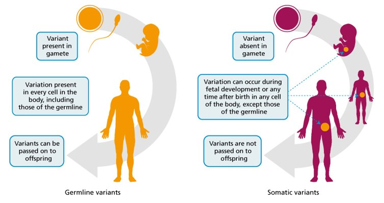
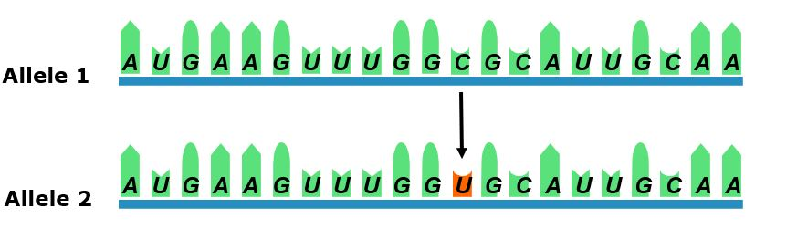
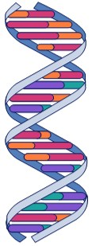
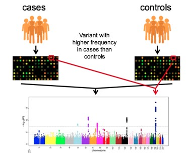
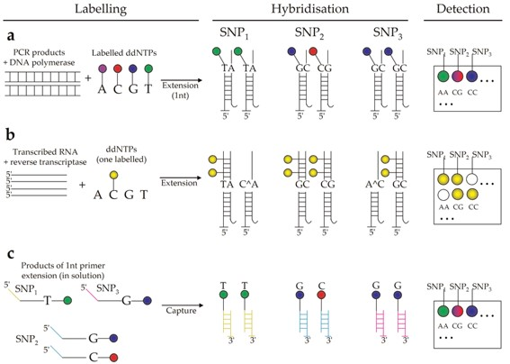
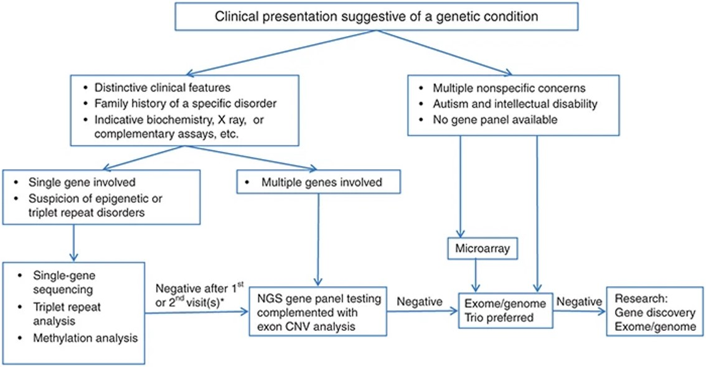
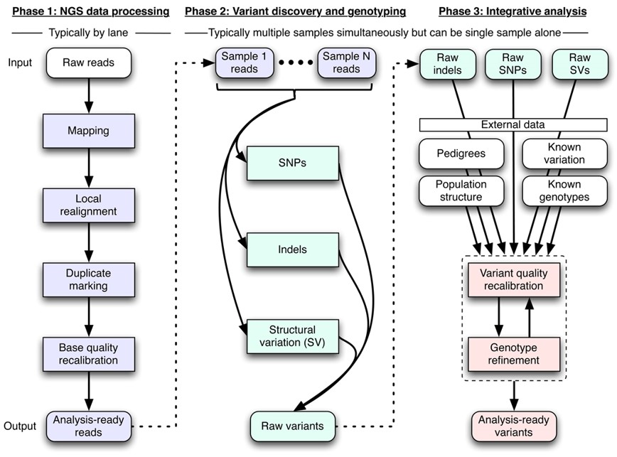
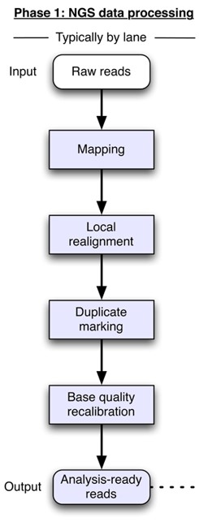
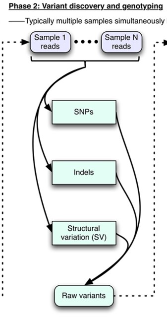
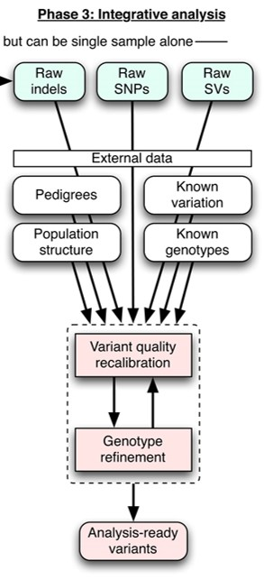

exclude: true
count: false

```{r,echo=FALSE,child="assets/header-slide.Rmd"}
```

<!-- ------------ Only edit title, subtitle & author above this ------------ -->

```{r setup, include=FALSE}
knitr::opts_chunk$set(
  echo = FALSE, 
  engine.opts = list(bash = "-l"), 
  fig.align = "center"
)
```

```{r, include = FALSE}
library(knitr)
library(kableExtra)
```

```{r, include = FALSE}
library(reticulate)
use_python("/opt/miniconda3/bin/python")
```

---

## Topics covered

* What is genetic variation? 

* Types of genetic variation studies

* Variant identification and analysis

---

## Genetic variation

### Germline vs Somatic Variants

<br>

```{r, out.width = "85%"}

```

---

## Genetic variation

### What makes us unique?

<br>

```{r, out.width = "85%"}
include_graphics("data/genvar/Picture2.jpg")
```

---

## Genetic variation

### Types of variation

* **RFLP: Restriction Fragment Length Polymorphism**

* **VNTR: Variable Number of Tandem Repeats**
    * or minisatellite
    * ~10-100 bp core unit

* **SSR : Simple Sequence Repeat** 
    * or STR (simple tandem repeat) 
    * or microsatellite
    * ~1-5 bp core unit
  
* **SNP: Single Nucleotide Polymorphism**
  * Commonly used to also include rare variants (SNVs)
  
* **Insertions or deletions**
  * INDEL – small (few nucleotides) insertion or deletion

* **Rearrangement** (inversion, duplication, complex rearrangement)
  * CNV: **C**opy **N**umber **V**ariation

---

## Genetic variation

### Single Nucleotide Polymorphishm and Mutation

* **Genetic Polymorphism**
    * Common variation in the population:
       * Phenotype (eye color, height, etc.)
       * Genotype (DNA sequence polymorphism)
    * Frequency of minor allele(s) >= 1%
* **DNA sequence variation**
    * Most common <= 0.99 (Polymorphism)
    * Minor allele >= 1%
    * Rare variant < 0.01%
* **DNA mutation – any change in DNA sequence**
    * Silent vs. amino acid substitution vs. other
    * Neutral vs. disease-causing
    * 1X10-8/bp/generation (~70 new mutations/individual)
* **Common but incorrect usage**
    * “Mutation” vs. ”Polymorphism”

---

## Genetic variation

### Mutation

.pull-left-60[

* A mutation is a change in the “normal” base pair sequence
* Can be:
  * A single base pair substitution
  * A deletion or insertions of 1 or more base pairs (indel)
  * A larger deletion/insertion or rearrangement
  
<br>

```{r, out.width = "50%"}

```
  
]

.pull-right-40[

```{r, out.width = "30%"}

```

]

---

## Genetic variaion

### Silent Sequence Change (Synonymous SNP)

<br>

```{r, out.width = "85%"}
include_graphics("data/genvar/Picture5.jpg")
```

---

##  Genetic variaion

### Missense Mutation (Non-Synonymous SNP)

<br>

```{r, out.width = "85%"}
include_graphics("data/genvar/Picture6.jpg")
```

---

## Genetic variaion

### Nonsense Mutation (Non-Synonymous SNP)

<br>

```{r, out.width = "85%"}
include_graphics("data/genvar/Picture7.jpg")
```

---

## Genetic variation

### Frameshift Mutation (Non-Synonymous SNP)

<br>

```{r, out.width = "85%"}
include_graphics("data/genvar/Picture8.jpg")
```

---

## Genetic variation

### Splice Site Mutation

<br>

```{r, out.width = "85%"}
include_graphics("data/genvar/Picture9.jpg")
```


---

## Genetic variation

### Other Variant Types

<br>

```{r, out.width = "85%"}
include_graphics("data/genvar/Picture10.jpg")
```

---

## Genetic variation

### Size Spectrum of Human Sequence Variation

<br>

```{r, out.width = "85%"}
include_graphics("data/genvar/Picture11.jpg")
```

---

## Genetic Variation Studies

### Genome Wide Association Studies (GWAS) 

.pull-left-60[

* Genotyping individuals at common variants across
  the genome using genome wide SNP arrays.
* Variants associated with trait, or within the
  same haplotype as a variant associated with a
  trait, will be found at a higher frequency in cases
  than controls.
* Statistical analysis is carried out to indicate how
  likely a variant is to be associated with a trait.
  The p-value of the association indicates how likely
  the variant is to be associated with the trait.
]

.pull-right-40[

```{r, out.width = "30%"}

```

]

---

## Genetic Variation Studies

### Functional Genetic Variation Studies

* **Aim:** understand the molecular mechanisms and pathways that link genotype to
  phenotype.
* Simple variants that alter the translated protein sequence, such as, missense, splice site 
  variant, stop gained, stop lost variants, can cause functional consequences by:
 * Altering ligand and/or co-factor binding sites
 * Alter the natural protein structure by:
   * Removing or adding additional cysteine reduces that can alter disulfide bond 
     patterns
   * Alter normal formation of secondary structure elements or their interaction
     (sickle cell anemia is an example of this)
   * Disrupt the normal interactions between proteins’ tertiary protein complexes or
     other cellular components
 * Remove or add post-translational modification sites.
* Personalize medicine, precision medicine, ACMG guidelines

---

## Genetic Variation Studies

### Population Genetics

* Study of variation within populations of individuals.
* Data from genome-scale population genetics studies has been used to:

<br>

```{r, out.width = "60%"}
include_graphics("data/genvar/Picture13.jpg")
```


---

## Variant Identification and Analysis

### Technologies

* SNP Array
* Next Generation Sequencing
   * Gene Panel Sequencing 
   * Whole Exome Sequencing (WES)
   * Whole Genome Sequencing (WGS)
   
---

## Variant Identification and Analysis

### Microarray

.pull-left-55[

* Microscopic slide usually made of glass, silicon chip or
  nylon membrane.
* Surface provided with thousands of minute pores in
  defined positions.
* Able researchers analyze thousands of genes in a
  single reaction.
* Various types:
   * DNA microarrays, MMChips, Protein microarrays,
     Peptide microarrays, Tissue microarrays, Cellular
     microarrays, Chemical compound microarrays,
     Antibody microarrays, Carbohydrate microarrays,
     Phenotype microarrays, Reverse phase protein
     microarrays, Interferometric reflectance imaging
     sensor or IRIS.
]

.pull-right-45[

```{r, out.width = "35%"}
include_graphics("data/genvar/Picture14.jpg")
```

]
---

## Variant Identification and Analysis

### DNA microarray

* Types: cDNA microarrays, oligo DNA microarrays, BAC microarrays and SNP microarrays.
* SNP microarray works on the principle of DNA hybridization in which a single base change
can be detected through fluorescence chemistry.
* Application:
   * Haplotype and gene mapping
   * Cancer research
   * Personalized genetic research
   * Genetic medicine research
   * Genome-wide association studies
* SNP array completes in three common steps:
   * Immobilization oligonucleotides/probes (make a chip)
   * Fragmentation and labelling nucleic acid
   * Hybridization
   
---

## Variant Identification and Analysis

### Major Techniques for Detection of SNPs Using Microarrays

<br>

```{r, out.width = "85%"}

```


---

## Variant Identification and Analysis

### SNP Array Process Flow

<br>

```{r, out.width = "85%"}
include_graphics("data/genvar/Picture16.jpg")
```

---

## Variant Identification and Analysis

### Raw Intensity File to VCF (Illumina)

<br>

```{r, out.width = "85%"}
include_graphics("data/genvar/Picture17.jpg")
```

---

## Variant Identification and Analysis

### Raw Intensity File to VCF (Illumina & Affymetrix)

<br>

```{r, out.width = "85%"}
include_graphics("data/genvar/Picture18.jpg")
```

---

## Variant Identification and Analysis

### Next Generation Sequencing (NGS)

<br>

```{r, out.width = "85%"}

```

---

## Variant Identification and Analysis

### Framework for Variant Discovery (NGS)

<br>

```{r, out.width = "85%"}

```

---

## Variant Identification and Analysis

### Mapping (NGS)

.pull-left-65[

* Place reads with an initial alignment on the reference genome using 
  mapping algorithms.
* Refine initial alignments
   * local realignment around indels
   * molecular duplicates are eliminated
* Generate the technology-independent SAM/BAM alignment map 
  format.
  
    **Accurate mapping crucial for variation discovery**
]

.pull-right-35[

```{r, out.width = "30%"}

```

]

---


## Variant Identification and Analysis

### Discovery of Raw Variants

.pull-left-55[

* Analysis-ready SAM/BAM files are analyzed to 
  discover all sites with statistical evidence for 
  an alternate allele present among the 
  samples.
* SNPs, SNVs, short indels, and SVs.
]

.pull-right-45[

```{r, out.width = "40%"}

```

]

---

## Variant Identification and Analysis

### Discovery of Analysis Ready Variants

.pull-left-60[

* Technical covariates, known sites of variation,
  genotypes for individuals, linkage
  disequilibrium, and family and population
  structure are integrated with the raw variant
  calls from Phase 2 to separate true
  polymorphic sites from machine artifacts.
* At these sites high-quality genotypes are 
  determined for all samples.
]

.pull-right-40[

```{r, out.width = "35%"}

```

]

---

## Variant Identification and Analysis

### Variant Call Format (VCF)

<br>

```{r, out.width = "85%"}
include_graphics("data/genvar/Picture24.jpg")
```


---

## Variant Identification and Analysis

### Header Line

* The header line names the 8 fixed, mandatory columns;

```{r, out.width = "40%"}
include_graphics("data/genvar/Picture25.jpg")
```

* If genotype data is present in the file, these are followed by a FORMAT column header, 
then an arbitrary number of sample IDs. 
* The header line is tab-delimited. 

---

## Variant Identification and Analysis

### Array vs NGS

<br>
```{r}
dat <- read.csv("data/genvar/genvar.csv")

kbl <- kable(dat[, 1:4], "html", align = "l")

kbl
```
---

## Variant Identification and Analysis

### Tasks (NGS)

* Article reading and discuss
   * [DePristo, M.A. et al. A framework for variation discovery and genotyping using 
     next-generation DNA sequencing data. Nat Genet. 43(5):491-8. PMID: 21478889 
     (2011).](https://www.ncbi.nlm.nih.gov/pmc/articles/PMC3083463/)
   * [Narendra M. et al. A Bioinformatics Pipeline for Whole Exome Sequencing: 
     Overview of the Processing and Steps from Raw Data to Downstream Analysis 
     .BioRxiv (2017).](https://www.biorxiv.org/content/10.1101/201145v1.full)
* Hands on “Disease causing mutation” (NGS)

---
### Terminologies

* **Variation:** any difference between individuals of a particular species.
* **Mutation:** alteration in the nucleotide sequence of a gene.
* **Alleles:** Different versions of the same variant.
* **Reference allele:** to the base that is found in the reference genome.
* **Alternative allele:** any base, other than the reference allele found at that locus
  (position).
* **Major allele:** most common allele for a given SNP.
* **Minor allele:** less common allele for a given SNP. MAF (Minor Allele Frequency)
* **Genotype:** genetic make-up of an individual.
* **Phenotype:** physical traits and characteristics of an individual and are influenced by
  their genotype and the environment


<!-- --------------------- Do not edit this and below --------------------- -->

---
name: end_slide
class: end-slide, middle
count: false

# Thank you. Questions?

```{r,echo=FALSE,child="assets/footer-slide.Rmd"}
```

```{r,include=FALSE,eval=FALSE}
# manually run this to render this document to HTML
rmarkdown::render("slide.Rmd")
# manually run this to convert HTML to PDF
#pagedown::chrome_print("slide_sample.html",output="slide_sample.pdf")
```