exclude: true
count: false

```{r,echo=FALSE,child="assets/header-slide.Rmd"}
```

<!-- ------------ Only edit title, subtitle & author above this ------------ -->

---

## What is bioinformatics?

According to the National Human Genome Research Institute:

> Bioinformatics is a subdiscipline of biology and computer science concerned with the acquisition, storage, analysis, and dissemination of biological data, most often DNA and amino acid sequences. Bioinformatics uses computer programs for a variety of applications, including determining gene and protein functions, establishing evolutionary relationships, and predicting the three-dimensional shapes of proteins.

Let's break down that definition into the important phrases:

* Sub-discipline of biology and computer science

* Acquisition, storage, analysis, and dissemination of biological data

* Use computer programs for a variety of applications

---

## What is a bioinformatician?

Generally we like to define a bioinformatician as someone who:

> Combines **BIOLOGY, STATISTICS, and PROGRAMMING** skills to develop software or perform analysis which solves a biological problem

However, some prefer to distinguish between those who develop software and those who use software for analysis only:

> **COMPUTATIONAL BIOLOGY** uses algorithms to mathematically (statistically) analyze biological problems and tries to build a model to infer solutions using a computational approach. On the other hand, **ANALYTICAL BIOINFORMATICS** uses bioinformatics tools to conduct analyses in a biological context

In our opinion, definitions often do more harm than good.

What matters is whether the person has the right skills to tackle the problem.

---

## What is a bioinformatician?

* Bioinformaticians taken on multiple roles:

  * Biologist
  * Statistician
  * Computer programmer

* It is very difficult to be fully versed in each of these roles

* An effective bioinformatician knows just enough in each area

```{r, echo = FALSE, out.width = "45%", fig.align='center'}
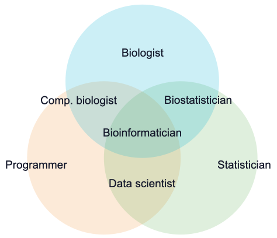
```

---

## What is genomics?

Before starting your training, it is necessary to have a good understanding of genomics

> Genomics is the study of the body’s **GENES**, their **FUNCTIONS** and their **INFLUENCE** on the growth, development and working of the body

Without a good understanding of genomics it would be very difficult to understand the output from almost all bioinformatics software

In the following slides we will learn:

  * What is DNA?
  * What is RNA?
  * What is protein?

**Buckle up and we'll get started!**

---

## What is DNA?

.pull-left-50[

* DNA stands for **D**eoxyribo**N**ucleic **A**cid

* Molecule that stores genetic *instructions*

* Double-stranded (two DNA molecules)

* Forms a 'double-helix' structure

]

.pull-right-50[

```{r, out.width = 400, echo = FALSE, fig.cap = "The structure of the DNA double helix"}
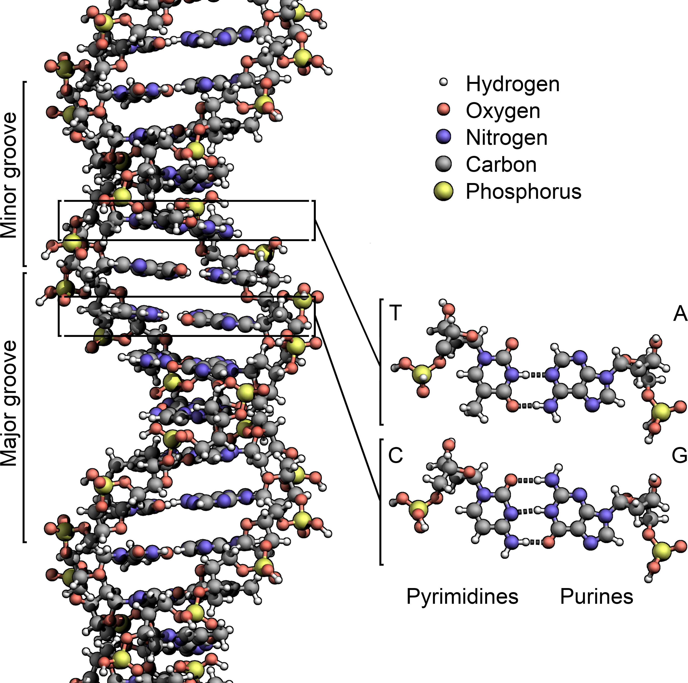
```

]

---

## The building blocks of DNA

.pull-left-50[

* DNA is made of repeating units

* Units are called nucleotide bases

* There are four types of base:

  * Adenine (A)
  * Cytosine (C)
  * Guanine (G)
  * Thymine (T)

* A nucleotide base consists of:

  * Phosphate group
  * Sugar
  * Nitrogenous base

]

.pull-right-50[

```{r, out.width = 300, echo = FALSE, fig.cap = "The composition of nucleotide bases"}
knitr::include_graphics("data/introduction/nucleotide-bases.jpeg")
```

]

---

## The helical structure of DNA

.pull-left-50[


* Double-stranded (two DNA molecules)

* DNA is like a ladder:

  * Each pole of the ladder is a separate DNA molecule
  
  * Each rung of the ladder is a base pair

* Nucleotide bases joined by sugar-phosphate bonds

* Base pairs joined by hydrogen bonds

* Complementary base pairing:

  * A with T
  * C with G

]

.pull-right-50[

```{r, out.width = 300, echo = FALSE, fig.cap = "The structure of the DNA double helix"}
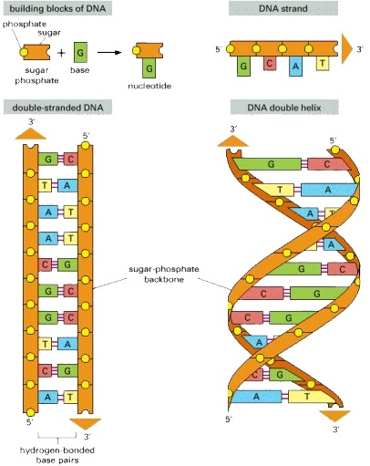
```

]

---

## The directionality of DNA

.pull-left-50[

* DNA consists of two strands:

  * Forward strand (Sense)
  * Reverse strand (Antisense)

* Each strand has a beginning and an end:

  * Five prime (5')
  * Three prime (3')

* Strands run in opposite directions:

  * Forward strand is 5' to 3'
  * Reverse strand is 3' to 5'

* The choice is arbitrary but consistent

]

.pull-right-50[
  
```{r, out.width="100%", echo = FALSE, fig.align = "center", fig.cap = "Directionality of DNA molecule"}
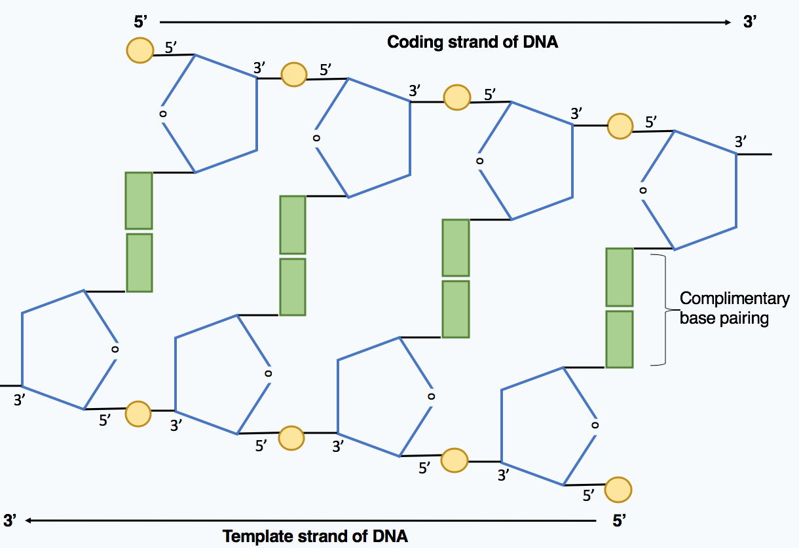
```

]

---

## What is a genome?

.pull-left-55[

* The total genetic information of an organism

* In plants and animals, the genome is arranged in thread-like structures called chromosomes:

  1. Single length of DNA

  2. Wrapped to form nucleosomes
  
  3. Nucleosomes coil to create chromatin loops
  
  4. Chromatin loops packed into chromosomes
  
* Genomes can contain multiple chromosomes:

  * Humans (46)
  
  * Mice (40)
  
  * Earthworms (36)
  
  * Blackberry (308)

]

.pull-right-45[

```{r, out.width="75%", echo = FALSE, fig.align = "center", fig.cap = "The major structures "}
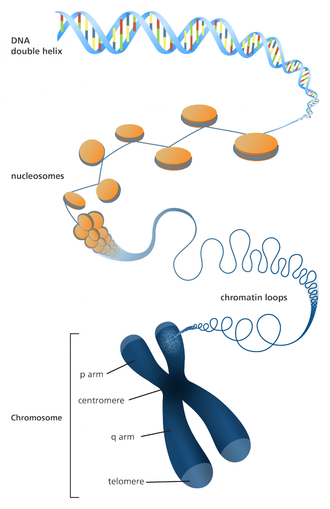
```

]

---

## The purpose of a genome

* A genome contains all of the genetic information for an organism

* The genome provides *instructions* needed to develop and direct the organism

* Each instruction is encoded in a region of DNA called a **gene**

* Genes are the basic physical and functional unit of heredity (eg. eye colour)

<br>

```{r, out.width="75%", echo = FALSE, fig.align = "center"}
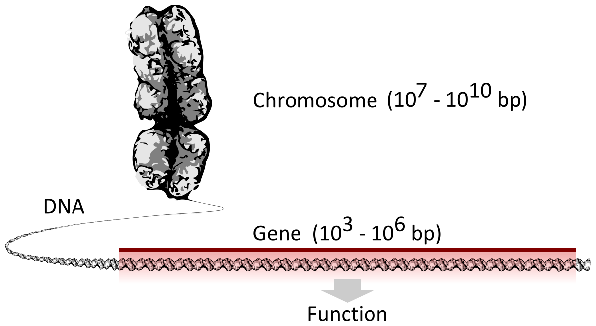
```

---

## The human genome

.pull-left-55[

* The Human Genome Project (HGP)

  * Determine DNA of the human genome
  
  * International research effort
  
  * First draft completed in 2003 (92%)
  
  * Fully finished in [2021](https://www.theatlantic.com/science/archive/2021/06/the-human-genome-is-finally-complete/619172/)

* Humans have 46 chromosomes:

    * Get 23 from each parent:
        
        * 1 sex chromosome (X or Y)
  
        * 22 numbered chromosomes (1-22)
    
    * Total size is around 3 billion bases
    
    * Contains around 20 thousands genes

]

.pull-right-45[

```{r, out.width="100%", echo = FALSE, fig.align = "center", fig.cap = "An image of the 46 chromosomes making up the diploid genome of a human male"}
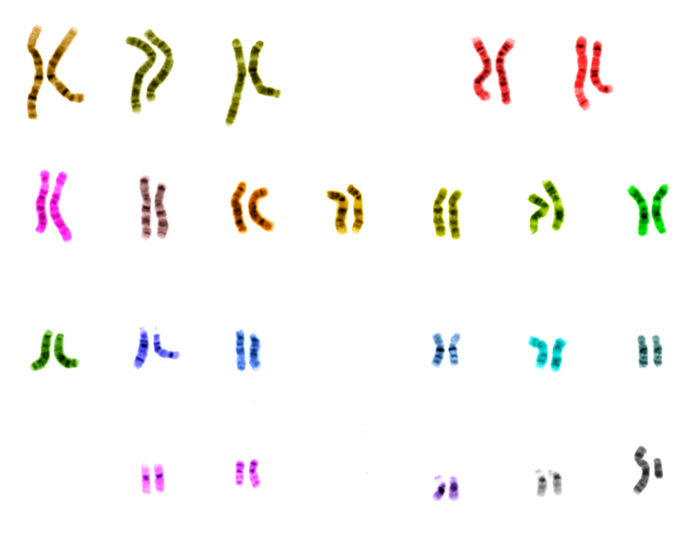
```

]

---

## Alleles and inheritence

.pull-left-55[

* Chromosomes contain genes for given traits

* Humans chromosomes are paired (23)

* Humans therefore have 2 copies of each gene

* Each copy of a gene is referred to as an allele:

    * Alleles are dominant or recessive
    
    * Dominant alleles are evident
    
    * For example, eye colour

* Zygosity is the combination of alleles: 

  * Alleles are the same (Homozygous)

  * Alleles are different (Heterozygous)

  *  Only one allele (Hemizygous)
  
]

.pull-right-45[

```{r, out.width="80%", echo = FALSE, fig.align = "center", fig.cap = "Example of allele inheritence for eye colour"}
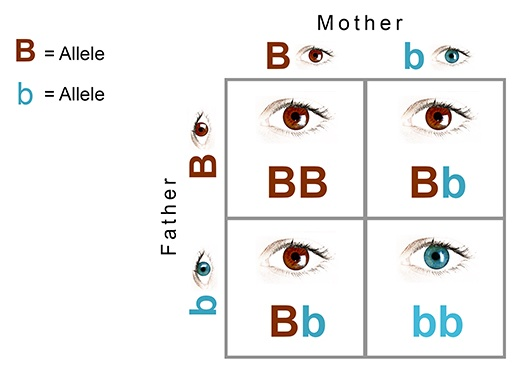
```

```{r, out.width="90%", echo = FALSE, fig.align = "center", fig.cap = "Types of zygosity in humans"}
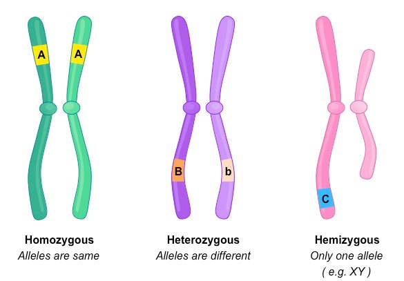
```

]

---

## Gene structure

* The structure of a gene consists of many functional elements

* There are three main functional units: the *promoter*, the *terminator*, and the *coding* region

* The promoter controls **when** and in **what** tissue it is expressed

* The coding region specifies the **structure of the protein**

* The terminator region marks the **end of a gene**

<br>

```{r, out.width = "85%", echo = FALSE, fig.align = "center", fig.cap = "The structure of a eukaryotic protein-coding gene"}
knitr::include_graphics("data/introduction/gene-structure-simple.jpeg")
```

---

## What is RNA?

* In many cases, the functional product of a gene is a protein

* How exactly does DNA direct the construction of a protein?

* The gene instructions are first copied into a *message*

* This message is written as an RNA molecule (or messenger RNA)

<br>

```{r, out.width="60%", echo = FALSE, fig.align = "center", fig.cap = "The difference between DNA and RNA"}
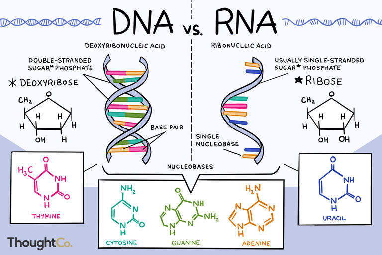
```

---

## DNA Transcription

* Transcription is the process of copying DNA into RNA

* Transcription proceeds in the following general steps:

  1. RNA polymerase binds to a segment on DNA
  
  2. RNA polymerase separates the two strands of DNA
  
  3. RNA polymerase adds RNA nucleotides (complementary to the DNA strand)
  
  4. RNA polymerase stops and releases the RNA molecule

```{r, out.width = "65%", echo = FALSE, fig.align = "center"}
knitr::include_graphics("data/introduction/transcription-diagram.png")
```

---

## DNA Transcription (Video)

<br>

<center>

```{r, echo = FALSE, fig.align = "center"}
vembedr::embed_youtube("5MfSYnItYvg", height = 475)
```

</center>

---

## Gene expression

* How does the promoter exert spatial and temporal control?

    * Specific nucleotide sequences in the promoter region **(cis-acting factors)**
    * Proteins that interact with promoter DNA and RNA polymerase II **(trans-acting factors)**

* The coding region undergoes post-transcription modification:

    1. Splice together exons (remove introns)
    2. Adding a cap to the 5′ end
    3. Adding a poly-A tail to the 3′ end

```{r, out.width = "75%", echo = FALSE, fig.align = "center"}
knitr::include_graphics("data/introduction/gene-structure-advanced.svg")
```

---

## What is a protein?

.pull-left-50[

* Proteins are large molecules made up of multiple amino acids

* Proteins have a vast array of functions:

  * Responding to stimuli
  * Providing structure to cells
  * Transporting molecules
  
* There are 20 amino acids in the human body:

  * Essential (9)
  * Non-essential (11)

* Amino acids differ in their side chains:

  * Structure
  * Electrical charge
  * Polarity

* The amino acid chain folds to make the final shape of the protein

* The shape of the protein dictates what it can do in the cell

]

.pull-right-50[

```{r, out.width="80%", echo = FALSE, fig.align = "center", fig.cap = "The 20 different amino acids"}
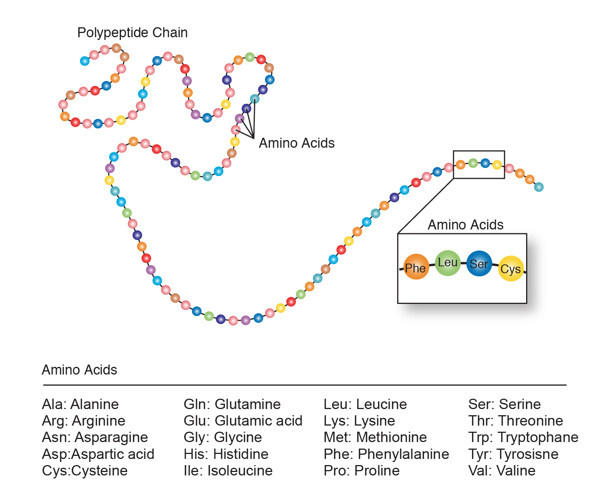
```

<br>

```{r, out.width="50%", echo = FALSE, fig.align = "center", fig.cap = "The structure of amino acids"}
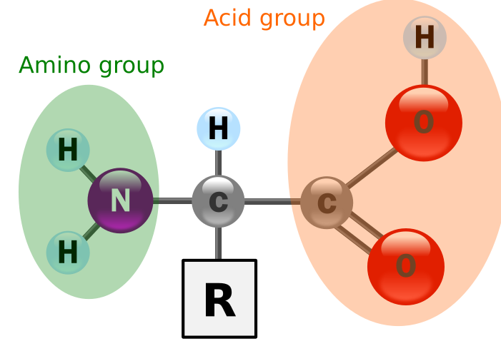
```

]

---

```{r, out.width="95%", echo = FALSE, fig.align = "center"}
knitr::include_graphics("data/introduction/common-amino-acids.png")
```

---

## RNA Translation

.pull-left-45[

* Translation is the process of creating proteins from messenger RNA

* Ribosomes link amino acids together in the order specified by the mRNA

* The mRNA is read by the ribosome in groups of three (codons)

* Each codon specifies a particular amino acid (see codon usage table)

* Translation proceeds in three general phases:

  1. Initiation - The ribosome assembles around the mRNA
  
  2. Elongation - The ribosome moves along the mRNA adding amino acids from tRNA molecules
  
  3. Termination - The ribosome releases the amino acid chain

]

.pull-right-55[

```{r, out.width = "55%", echo = FALSE, fig.align = "center", fig.cap = "The codon usage table"}
knitr::include_graphics("data/introduction/codon-table.png")
```

```{r, out.width = "100%", echo = FALSE, fig.align = "center", fig.cap = "A cartoon of translation"}
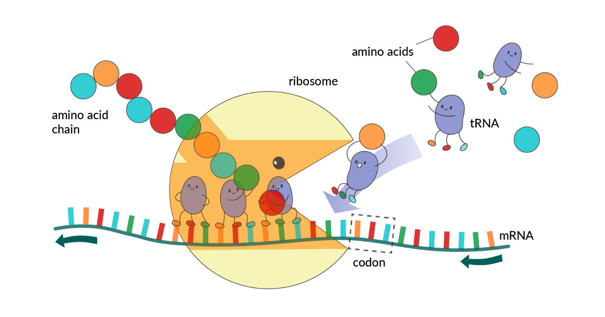
```

]

---

## RNA Translation (Video)

<br>

<center>

```{r, echo = FALSE, fig.align = "center"}
vembedr::embed_youtube("8dsTvBaUMvw", height = 475)
```

</center>

---

## Protein structure

.pull-left-55[

* The shape and structure of the protein dictates its function within the cell

* The protein's structure can be characterized at different levels:

  * Linear amino acid sequence (Primary)
  
  * Formation of substructures (Secondary)
  
      * Alpha helix
      * Beta sheet
  
  * 3D structure of the protein (Tertiary)
  
  * Interaction between proteins (Quaternary)
  
* Proteins range in size from tens to several thousand amino acids

* Titin is the largest protein in the human body (27,000 amino acids)

]


.pull-right-45[

```{r, out.width = "90%", echo = FALSE, fig.align = "center", fig.cap = "The structure of proteins"}
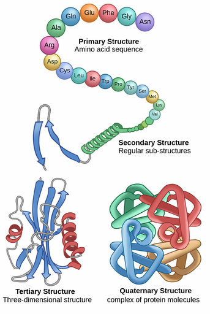
```

]

---

## Summary

* Bioinformatics is a sub-discipline of biology and computer science concerned with the acquisition, storage, analysis, and dissemination of biological data

* Bioinformaticians use their biology, statistics, and programming skills to develop software or perform analysis which solves a biological problem

* The central dogma of molecular biology is an explanation of the flow of genetic information within a biological system: *"DNA makes RNA, and RNA makes protein"*

* Genomes contain all the genetic information of an organism and are organised into thread-like structures called chromosomes

* Genes are the basic physical and functional unit of heredity (eg. eye colour)

* The main functional units of a gene are the promoter, terminator, and coding region

* Transcription is the process by which the information in a strand of DNA is copied into messenger RNA

* Translation is the process of translating the messenger RNA into a sequence of amino acids for protein synthesis

* Proteins have at least three structures: primary, secondary, and tertiary structure.

---

## Resources

### Websites

  * [YourGenome Education](https://www.yourgenome.org)
  
  * [Khan Academy Biology](https://www.khanacademy.org/science/ap-biology)

### Videos

  * [Crash Course Biology](https://youtu.be/gMOoMcsGTO4)

  * [Ninja Nerd Cell Biology](https://youtu.be/LUDws4JrIiI)

### Books

  * [Molecular Biology of the Cell](https://www.molbiolcell.org)


<!-- --------------------- Do not edit this and below --------------------- -->

---
name: end_slide
class: end-slide, middle
count: false

# Thank you. Questions?

```{r,echo=FALSE,child="assets/footer-slide.Rmd"}
```

```{r,include=FALSE,eval=FALSE}
# manually run this to render this document to HTML
rmarkdown::render("slide_sample.Rmd")
# manually run this to convert HTML to PDF
#pagedown::chrome_print("slide_sample.html",output="slide_sample.pdf")
```
