exclude: true
count: false

```{r,echo=FALSE,child="assets/header-slide.Rmd"}
```

<!-- ------------ Only edit title, subtitle & author above this ------------ -->

```{r,echo=FALSE,message=FALSE,warning=FALSE}
knitr::opts_chunk$set(echo = FALSE, fig.align = "center")
```

---

# Introduction

* The advent of DNA sequencers that could rapidly and inexpensively sequence billions of bases has transformed genomic science

* For example, production-scale Illumina machines can sequence up to 20 billion reads within just 44 hours

* These sequences are the technology of choice for whole-genome sequencing and a variety of sequencing-based assays

* The traditional algorithms used to align sequences (e.g., BLAST or BLAT) are not suitable for such large volumes of data

```{r, out.width = "100%", fig.cap = "Benchtop and Production-scale Sequencers"}
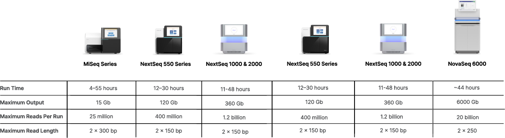
```

---

# Read mapping

* A challenge presented by this sequencing technology is the so-called 'read mapping' problem

* Sequencing machines produce short sequences of 25-100 base pairs called 'reads'

* To make sense of the reads, their positions with the reference sequence must be determined

* This process is known as aligning or ‘mapping’ the read to the reference

```{r, out.width = "65%", fig.cap = "Illustration of the mapping process"}
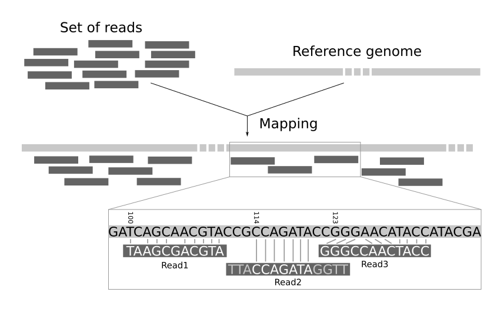
```

---

# Challenges of mapping short reads

*A short introduction by Ben Langmead (developer of Bowtie)*

```{r, out.width = "100%"}
vembedr::embed_youtube("PMGstYcBgTY", height = 500)
```

---

# Challenges of mapping short reads

*The first problem is practical*

.pull-left-50[

* Reference genomes can be very large:

  * For example, the human genome is around 3 billion base pairs
  
  * The number of possible sequence alignments increase rapidly with sequence length

* Number of reads can be very large:

  * DNA sequencers produce millions of reads per run
  
  * Completed assays may involve many runs
  
  * May need to map millions or billions of reads

]

.pull-right-50[

```{r, out.width = "100%", fig.cap = "How big are genomes?"}
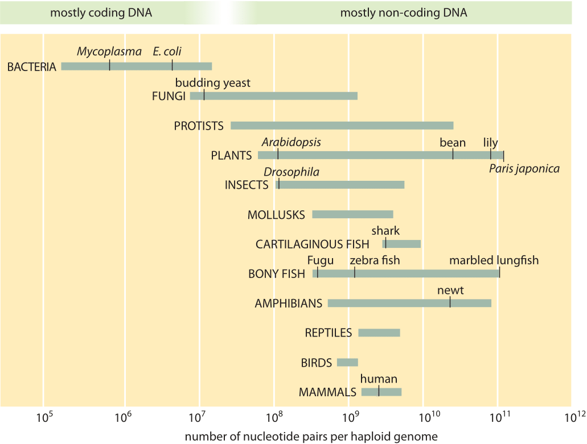
```

]

---

# Challenges of mapping short reads

*The second problem is strategic*

* Genomes contain a huge number of repeated sequences:

  * Patterns of nucleic acids that occur in multiple copies throughout the genome
  
  * In many organisms, a significant fraction of the genomic DNA is highly repetitive
  
  * Over two-thirds of the human genome consists of repetitive elements

* The aligner must pick which copy of a repeat the read belongs

* Sequencing errors or variation between the reads and genome exacerbate this problem

<br>

```{r, out.width = "80%", fig.cap = "Various named classes of repeat in the human genome"}
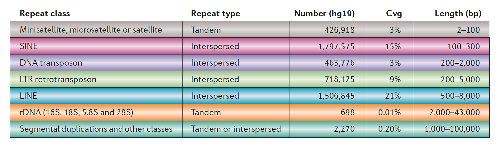
```

---

# Ambiguities in read mapping

* Ambiguities can arise from both the presence or repeat sequences and the scoring scheme for the alignment (e.g., penalty of mismatch versus penalty of deletion)

```{r, out.width = "65%", fig.cap = "Read-mapping confidence versus repeat-copy similarity"}
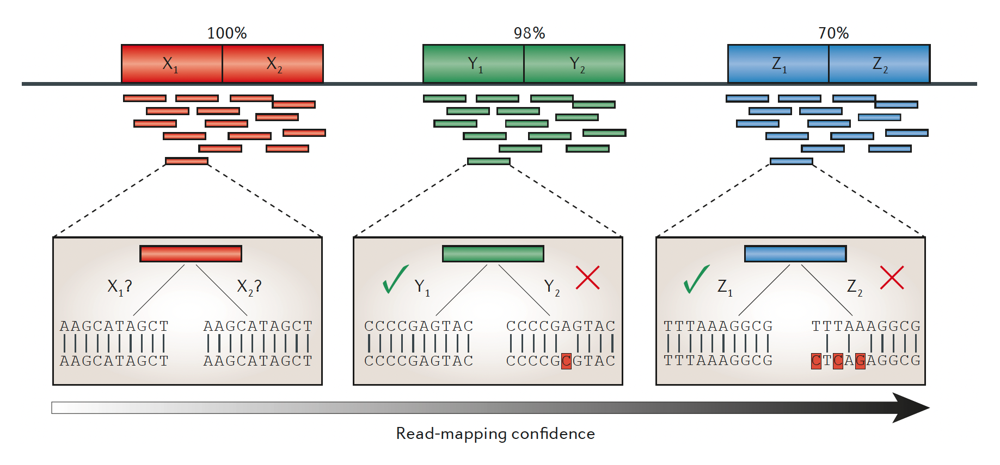
```

```{r, out.width = "60%", fig.cap = "Ambiguity in read mapping"}
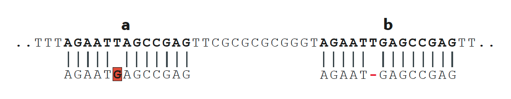
```

---

# Short-read mappers

.pull-left-50[

* A computer grid could be used to map reads using traditional algorithms (e.g., BLAST or BLAT)

* These grids are large and expensive and most people do not have access to them

* Researchers have created a new generation of alignment programs capable of mapping hundreds of millions of short reads on a single desktop computer

* Capable of mapping millions of reads per hour while minimizing both processing time and memory requirements

* THe figure on the right compares the time and memory required to map 10 WGS samples using a variety of short read aligners

]

.pull-right-50[

```{r, out.width = "100%"}
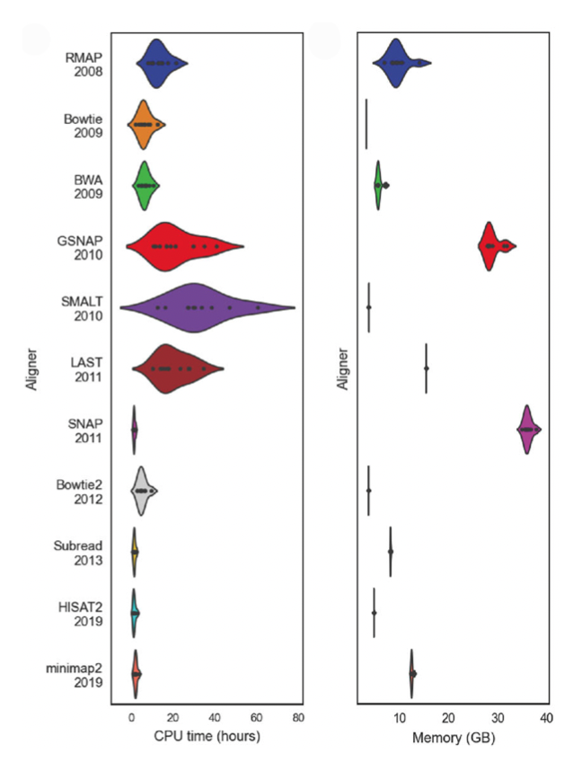
```

]


---

# Indexing

.pull-left-50[

* To speed up mapping, programs use a computational strategy known as ‘indexing’

* This is analogous to the index in the back of the book, helping you quickly find the page number for a particular topic

* An index of a DNA sequence allows one to rapidly find shorter sequences within it

* There are two popular strategies for building an index

  1. Spaced seeds (e.g., Maq)
  
  2. Burrows-Wheeler (e.g., Bowtie/BWA)

]

.pull-right-50[

```{r, out.width = "85%"}
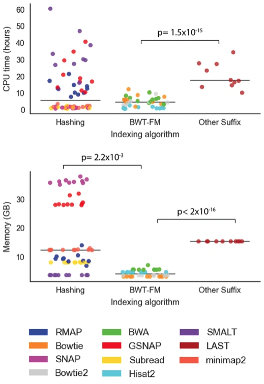
```

]

---

# Spaced seeds

.pull-left-50[

* Each position in the reference is cut into equal-sized pieces called ‘seeds’

* These seeds are paired and stored in a lookup table

* Each read is also cut up according to this sceheme

* Pairs of seeds are used as keys to look up matching positions in the reference

* If the pairs match, the position is confirmed by checking the other seeds

]

.pull-right-50[

```{r, out.width = "72%"}
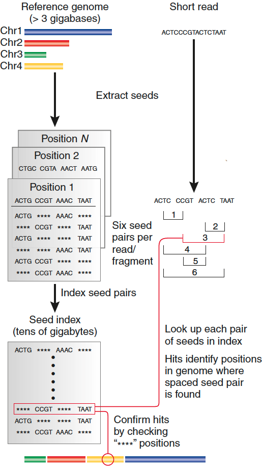
```

]


---

# Burrows-Wheeler

.pull-left-50[

* A memory-efficient representation of the genome is built (Burrows-Wheeler transform)

* Reads are aligned character by character from right to left against the transformed genome

* With each new character, the algorithm updates an interval (indicated
by blue ‘beams’) in the transformed string

* When all characters in the read have been processed, alignments are represented by any positions within the interval

]

.pull-right-50[

```{r, out.width = "72%"}
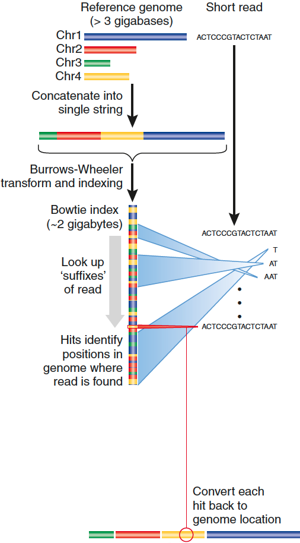
```

]

---

# Short-read mappers timeline

DNA mappers are plotted in blue, RNA mappers in red, miRNA mappers in green and bisulphite mappers in purple. Grey dotted lines connect related mappers (extensions or new versions).

```{r, out.width = "57%", fig.cap = "https://doi.org/10.1093/bioinformatics/bts605"}
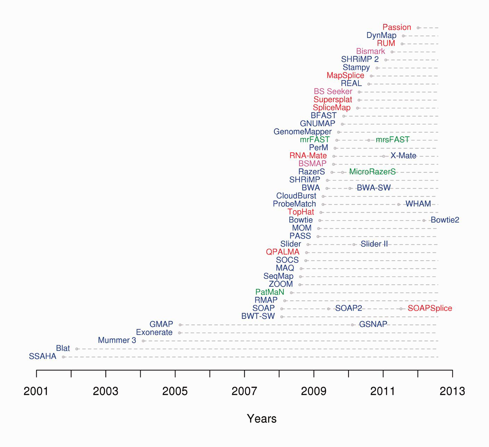
```

---

# Strategies for mapping multi-reads

* There are multiple strategies for mapping multi-reads:

  1. The ‘unique’ strategy reports only those reads that are uniquely mappable

  2. The ‘best match’ strategy reports the best possible alignment for each read

  3. The ‘all matches’ strategy reports all alignments for each multi-read

```{r, out.width = "85%", fig.cap = "Three strategies for mapping multi-reads"}
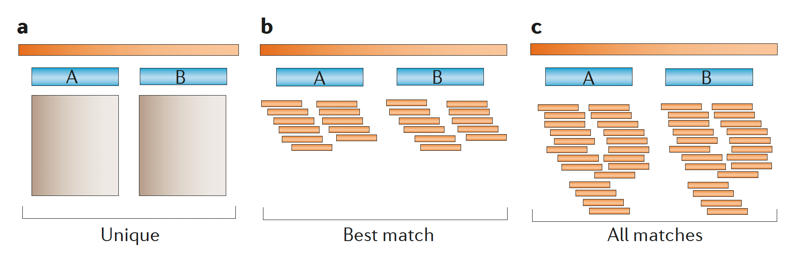
```

---

# Spliced-read mappers

* The spliced alignment problem, in which cDNA (from processed mRNA) sequences are aligned back to genomic DNA, requires more specialized algorithms

* Reads sampled from exon-exon junctions need to be mapped differently from reads that are contained entirely within exons

* To align cDNA reads from RNA-Seq experiments

  * Use the positions of exons and introns within known genes as a guide, and then construct the sequences spanning exon-exon junctions and include them as reference sequences
  
  * Initial alignment pass to identify exons that fully contain some of the reads, and then align the remaining reads to junctions between those exons

```{r, out.width = "45%", fig.cap = "Spliced-read mapping"}
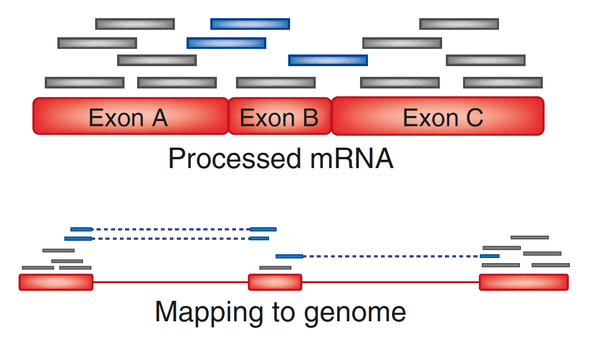
```

---

# Summary

* Read mapping is the process of aligning sequencing reads to a reference genome

* This is challenging because genomes can be very large, and there can be billions of reads

* Short-read mappers were designed to efficiently align billions of reads using comparatively low memory requirements

* Mappers use an index to speed up the process of finding the position of reads in the genome

* The most popular indexing strategy is based on the Burrows-Wheeler transformation

* Spliced-read mappers were designed to help align RNA-seq data

---

# Learning resources

## Papers

* [How to map billions of short reads onto genomes](https://doi.org/10.1038/nbt0509-455) by Cole Trapnell & Steven L Salzberg

* [Fast gapped-read alignment with Bowtie 2](https://doi.org/10.1038/nmeth.1923) by Ben Langmead & Steven L Salzberg

* [Repetitive DNA and next-generation sequencing](https://doi.org/10.1038/nrg3117) by Todd J Treangen & Steven L Salzberg

* [A survey of sequence alignment algorithms for next-generation sequencing](https://doi.org/10.1093/bib/bbq015) by Heng Li & Nils Homer

## Videos

* [Algorithms for DNA sequencing](https://www.youtube.com/playlist?list=PL2mpR0RYFQsBiCWVJSvVAO3OJ2t7DzoHA) by Ben Langmead

* [Indexing](https://www.youtube.com/playlist?list=PL2mpR0RYFQsADmYpW2YWBrXJZ_6EL_3nu) by Ben Langmead

## Manuals

* [Bowtie 2](http://bowtie-bio.sourceforge.net/bowtie2/manual.shtml) by Ben Langmead

* [BWA](http://bio-bwa.sourceforge.net/bwa.shtml) by Heng Li

## Tutorials

* [Read mapping or alignment](https://www.ebi.ac.uk/training/online/courses/functional-genomics-ii-common-technologies-and-data-analysis-methods/rna-sequencing/performing-a-rna-seq-experiment/data-analysis/read-mapping-or-alignment/) by EMBL-EBI Training


<!-- --------------------- Do not edit this and below --------------------- -->

---
name: end_slide
class: end-slide, middle
count: false

# Thank you. Questions?

```{r,echo=FALSE,child="assets/footer-slide.Rmd"}
```

```{r,include=FALSE,eval=FALSE}
# manually run this to render this document to HTML
rmarkdown::render("slide_sample.Rmd")
# manually run this to convert HTML to PDF
#pagedown::chrome_print("slide_sample.html",output="slide_sample.pdf")
```