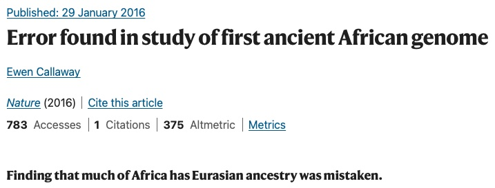
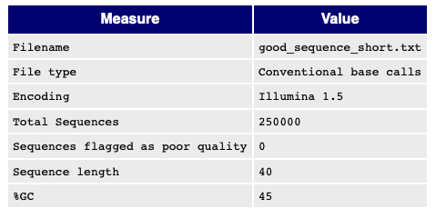
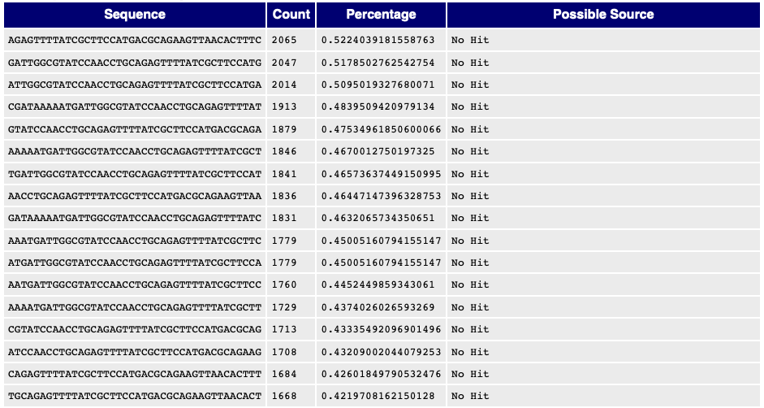
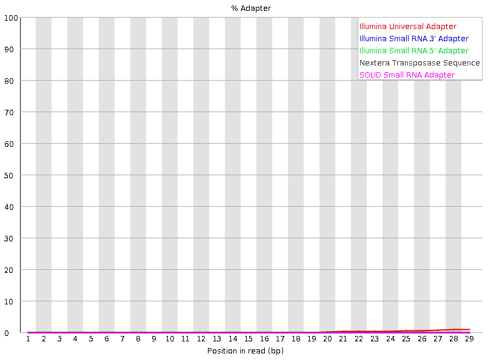
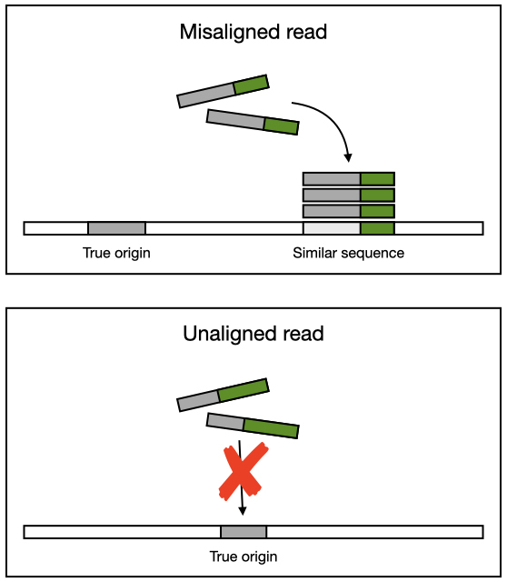
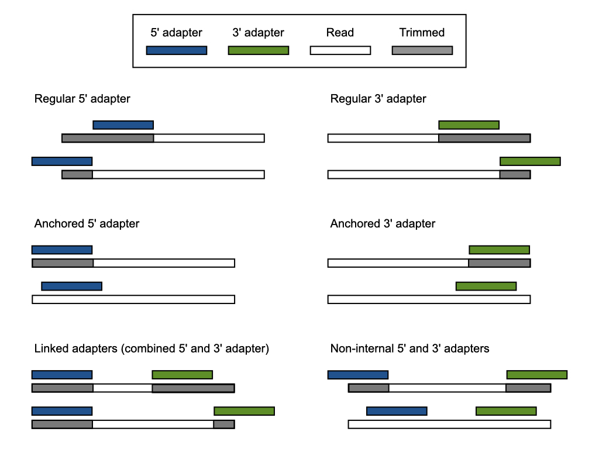
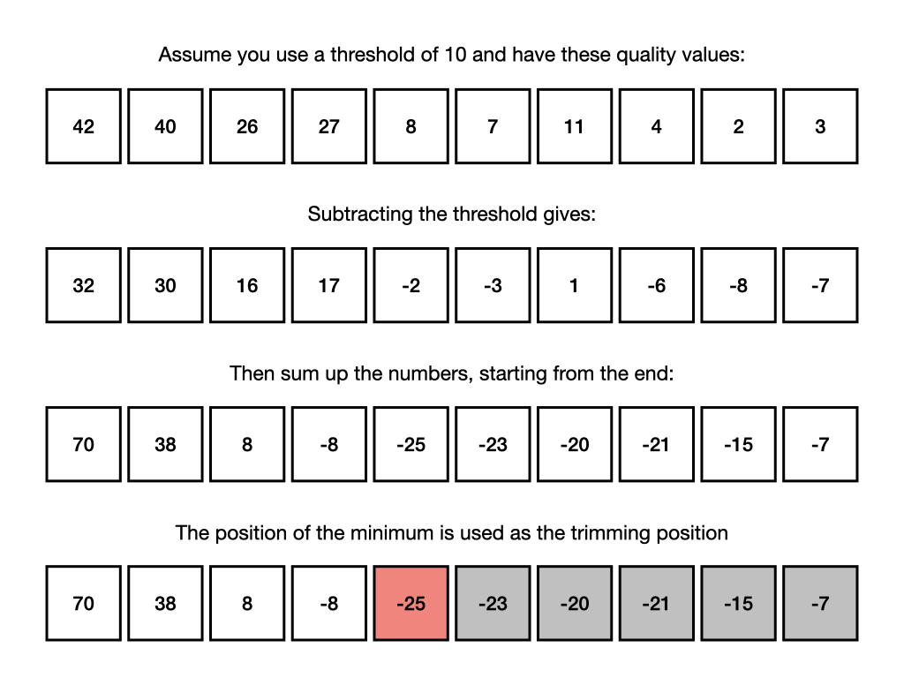

exclude: true
count: false

```{r,echo=FALSE,child="assets/header-slide.Rmd"}
```

<!--------------- Only edit title, subtitle & author above this --------------->

```{r}
knitr::opts_chunk$set(echo = FALSE, fig.align = "center")
```

---

## What is quality control?

* From Wikipedia, the free encyclopedia:

> Quality control, commonly shortened to QC, refers to all those processes and procedures designed to ensure that the results of laboratory analysis are consistent, comparable, accurate and within specified limits of precision.

* In bioinformatics, quality control is performed at several stages:

    1. Quality of the raw data
    2. Effect of processing on the data
    3. Correctness of the code and software
    4. Interpretation of the results

* For sequencing data, we often start by looking at the quality of the raw data

* There are two types of quality metrics we can measure:

    * Generated by the sequencing platform (eg. quality scores)
    
    * Calculated directly from the raw reads (eg. base composition)

---

## Why is quality control important?

* In bioinformatics, quality control is necessary to avoid drawing the **wrong** conclusions

* There are many stages at which an error could be introduced:

    * The **code** you wrote is wrong
    * The **software** you used had a bug
    * The **data** you analysed was contaminated
    
* Errors in code and software are subtle and require due care and attention

* Problems with data are often less subtle and software can detect issues like contamination

* What happens if we **don't** take care in our analysis?

<br>

```{r, out.width = "65%", fig.cap = "xkcd: Data Error"}
knitr::include_graphics("data/quality/xkcd_data_error.png")
```

---

## Retraction watch

*A tale of caution...*

.pull-left-50[

* The authors sequenced an ancient african genome from an individual they called "Mota"

* They compared "Mota" to other human genomes from across the globe (SNP analysis)

* Someone **forgot** to run a conversion script between one software and the next

* Data was inadvertently lost which made "Mota" appear less European than he actually was

* We don't penalize scientists for owning up to **mistakes**

* It is more important that we correct the scientific record!

]

.pull.right-50[

```{r, out.width = "32%"}

```

```{r, out.width = "32%", fig.cap = "Mota Cave"}

```

]

---

## Sequencing reads

*A quick refresher on Illumina sequencing...*

```{r, out.width = "100%", fig.cap = "https://youtu.be/fCd6B5HRaZ8"}
vembedr::embed_youtube("fCd6B5HRaZ8", height = 500)
```

---

## Sequencing reads

*A quick refresher on FASTQ files...*

.pull-left-55[

* An extension of FASTA format to handle base quality metrics from sequencing machines

* Each sequence is represented by 4 lines:

  1. Identifier of the sequence starting with `@`
  2. Actual sequence
  3. Optional identifier starting with `+`
  4. Quality scores for each base
  
* FASTQ files are created and compressed with extension `.fastq.gz`

* For each sample per flow cell lane:

  * Single-end: `.fastq.gz`
  * Paired-end: `_1.fastq.gz` `_2.fastq.gz`
  
]

.pull-right-45[

```{embed, echo = TRUE}
"data/quality/example.fastq"
```

]

---

## Quality control software

* There are multiple tools available to quality check sequencing reads

* In our *opinion* none of them are perfect, but there is a clear favorite which is [FastQC](https://www.bioinformatics.babraham.ac.uk/projects/fastqc/)

* Here's what Simon Andrews, the developer has to say:

> FastQC aims to provide a simple way to do some quality control checks on raw sequence data coming from high throughput sequencing pipelines. It provides a modular set of analyses which you can use to give a quick impression of whether your data has any problems of which you should be aware before doing any further analysis.

* FastQC can be run as a GUI application or on the command line - *we recommend the latter!*

* You will learn to use FastQC in the workshop afterwards!

---

## FastQC

```{r, out.width = "50%"}
knitr::include_graphics("data/quality/fastqc-preview.png")
```

.pull-left-50[

**So how does FastQC work?**

* A series of analysis modules are run on a small sample of the sequencing data

* The module results are collected into a HTML report for inspection by the user

* Each module measures some aspect of the data which might reveal problems with the sequencing

]

.pull-right-50[

* A summary evaluation for each module is displayed:

    * Normal
    * Slightly abnormal
    * Very unusual
    
* Do not take these evaluations too seriously - *they are there as a rough guide only!*

]

---

## FastQC

### Basic Statistics

<br>

```{r, out.width = "90%"}

```

<p style="text-align: center;"><i>Sorry for the low-quality image!</i></p>

---

## FastQC

### Per base sequence quality

```{r, out.width = "80%"}
knitr::include_graphics("data/quality/per_base_quality.png")
```

---

## FastQC

### Per tile sequence quality

```{r, out.width = "80%"}
knitr::include_graphics("data/quality/per_tile_quality.png")
```
---

## FastQC

### Per sequence quality scores

```{r, out.width = "80%"}
knitr::include_graphics("data/quality/per_sequence_quality.png")
```

---

## FastQC

### Per base sequence content

```{r, out.width = "80%"}
knitr::include_graphics("data/quality/per_base_sequence_content.png")
```

---

## FastQC

### Per sequence GC content

```{r, out.width = "80%"}
knitr::include_graphics("data/quality/per_sequence_gc_content.png")
```

---

## FastQC

### Per base N content

```{r, out.width = "80%"}
knitr::include_graphics("data/quality/per_base_n_content.png")
```

---

## FastQC

### Sequence length distribution

```{r, out.width = "80%"}
knitr::include_graphics("data/quality/sequence_length_distribution.png")
```

---

## FastQC

### Sequence duplicate levels

```{r, out.width = "80%"}
knitr::include_graphics("data/quality/duplication_levels.png")
```

---

## FastQC

### Overrepresented sequences

<br>

```{r, out.width = "95%"}

```

<p style="text-align: center;"><i>Again, sorry for the low-quality image!</i></p>

---

## FastQC

### Adapter content

```{r, out.width = "80%"}

```

---

## FastQC

*So what does 'good' data look like?*

```{r, out.width = "100%"}
knitr::include_url("data/quality/fastqc-good.html", height = 500)
```

---

## FastQC

*And what does 'bad' data look like?*

```{r, out.width = "100%"}
knitr::include_url("data/quality/fastqc-bad.html", height = 500)
```

---

## FastQC

*A demonstration by the one and only Simon Andrews...*

```{r, out.width = "100%", fig.cap = "https://youtu.be/bz93ReOv87Y"}
vembedr::embed_youtube("bz93ReOv87Y", height = 500)
```

---

## Sequencing adapter trimming

.pull-left-50[

**Why do adapter sequences appear in sequencing reads?**

* Sequencing usually starts at the 5' end just after the primer

* The number of cycles dictates the number of bases sequenced

* Adapter read-through happens when the length of the DNA insert is less than the number of cycles

* No adapter read-through:

    * Insert length: 250
    * Sequencing cyles: 200
    * Adapter read-through: 200 - 250 = -50
    
* Adapter read-through:
    
    * Insert length: 100
    * Sequencing cycles: 200
    * Adapter read-through: 200 - 100 = 100


]

.pull-right-50[

<br>

```{r, out.width = "90%", fig.cap = "Credit: ecSeq"}
knitr::include_graphics("data/quality/adapter-origin.png")
```

]

---

## Sequencing adapter trimming

.pull-left-50[

**Why do we need to trim adapters from sequencing reads?**

* The presence of **artificial** sequences can interfere with read alignment:
    
    * Reads may be **misaligned** due to artificial sequence similarity
    
    * Reads may be **unaligned** due to reduced sequence similarity

* Trimming is essential for certain types of genomics data:

    * Genotyping
    
    * Genome assembly
    
    * Small RNA

* Trimming may not have a huge effect on other types of data, but why take the chance?

]

.pull-right-40[

<br>

```{r, out.width = "100%"}

```

]

---

## Adapter trimming software

* There are multiple tools available to remove adapter sequences

* In our *opinion* there is not much difference between them

* They all have similar functionality and performance is comparable

* Some of the most popular tools include:

    * [cutadapt](https://cutadapt.readthedocs.io/en/stable/)
    
    * [trimmomatic](http://www.usadellab.org/cms/?page=trimmomatic)
    
    * [fastp](https://github.com/OpenGene/fastp)

* Good documentation is important, and for that reason we prefer **cutadapt**

* You will learn to use Cutadapt in the workshop afterwards!

---

## Adapter trimming software

* A quick look at the Cutadapt documentation

```{r, out.width = "90%", fig.cap = "https://cutadapt.readthedocs.io/en/stable/"}
knitr::include_url("https://cutadapt.readthedocs.io/en/stable/", height = 475)
```

---

## Adapter trimming software

* Cutadapt has a lot of convenient and intelligible features:

    * **Standard input and output**
    
        * Stream data without saving to disk
        * Save on storage and processing time

    * **Multi-core support**
    
        * Speed-up processing time of large files
        * Trimming less of a bottleneck in pipeline
    
    * **Multiple adapter types**
    
        * Remove 5' and 3' adapter sequences
        * Accommodates complex library preparation
    
    * **Quality trimming**
    
        * Remove low-quality base calls
        * Potentially improve alignment rate
    
    * **Read filtering**
    
        * Minimum read length
        * Discard both reads of a pair

---

## Adapter trimming software

* Cutadapt can detect multiple adapter types:

```{r, out.width = "85%"}

```

---

## Adapter trimming software

* A quick look at the Illumina adapter sequences document:

```{r, out.width = "90%", fig.cap = "https://support-docs.illumina.com/SHARE/adapter-sequences.htm"}
knitr::include_url("https://support-docs.illumina.com/SHARE/AdapterSeq/illumina-adapter-sequences.pdf", height = 475)
```

---

## Adapter trimming software

* Cutadapt performs adaptive quality trimming:

```{r, out.width = "80%"}

```

---

## Adapter trimming software

* Trim a single 3’ adapter sequence:

```{bash, echo = TRUE, eval = FALSE}
cutadapt -a ADAPTER -o output.fastq input.fastq
```

* Trim multiple 3' adapter sequences:

```{bash, echo = TRUE, eval = FALSE}
cutadapt -a ADAPTER1 -a ADAPTER2 -o output.fastq input.fastq
```

* Trim low-quality bases from the 3' end:

```{bash, echo = TRUE, eval = FALSE}
cutadapt -q QUALITY -o output.fastq input.fastq
```

* Trim paired-end reads:

```{bash, echo = TRUE, eval = FALSE}
cutadapt -a ADAPTER1 -A ADAPTER2 -o out.1.fastq -p out.2.fastq in.1.fastq in.2.fastq
```

* Discard reads shorter than LENGTH:

```{bash, echo = TRUE, eval = FALSE}
cutadapt -m LENGTH -o output.fastq input.fastq
```

* Trim poly-A tails:

```{bash, echo = TRUE, eval = FALSE}
cutadapt -a "A{100}" -o output.fastq input.fastq
```

---

## Summary

* Quality control is a necessary step in all bioinformatics analysis

* It is there to prevent us drawing the "wrong" conclusions from the data

* For sequencing data, we start by looking at the quality of the reads

* FastQC is one such program you can use to quality check sequencing reads

* FastQC modules should be evaluated in the context of the experimental design

* Adapter contamination can be removed using read trimming software

* Cutadapt is one such program you can use, but they all perform equally well

* *Do not become paralysed by quality control! Know when to say good enough!*

<!------------------------ Do not edit this and below ------------------------->

---
name: end_slide
class: end-slide, middle
count: false

# Thank you. Questions?

```{r,echo=FALSE,child="assets/footer-slide.Rmd"}
```

```{r,include=FALSE,eval=FALSE}
# manually run this to render this document to HTML
rmarkdown::render("slide_sample.Rmd")
# manually run this to convert HTML to PDF
#pagedown::chrome_print("slide_sample.html",output="slide_sample.pdf")
```

