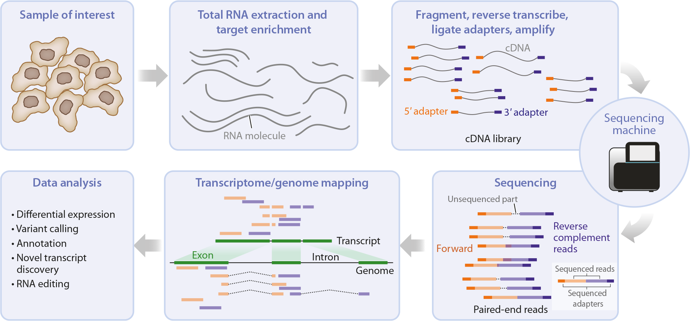
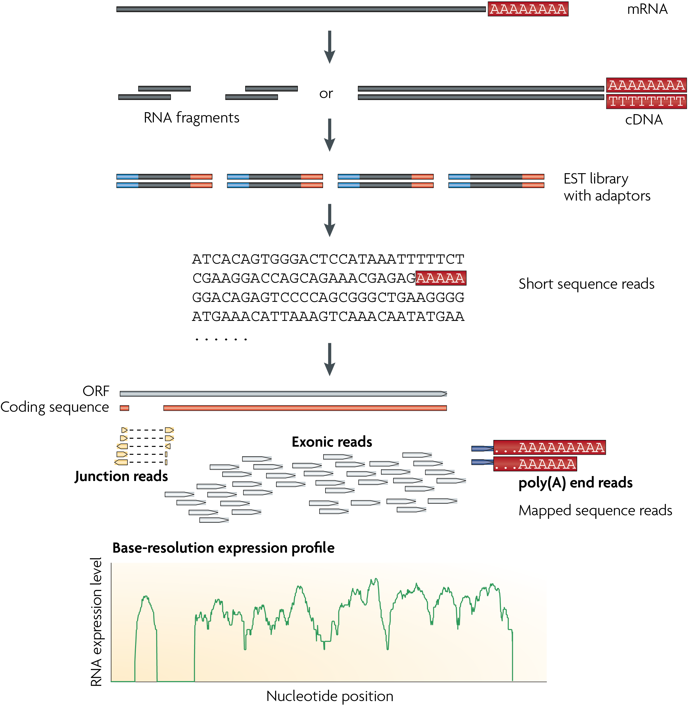
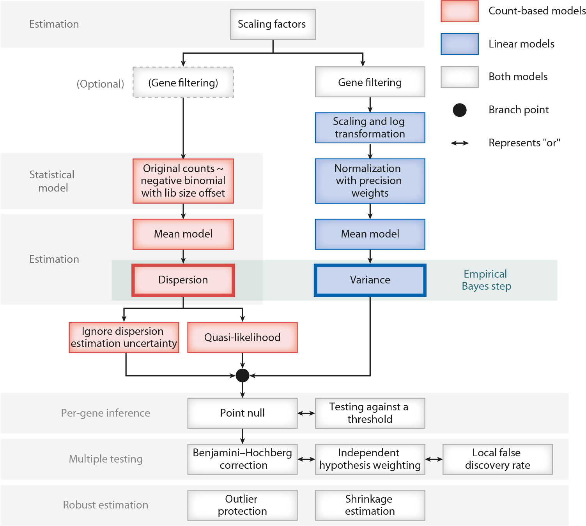
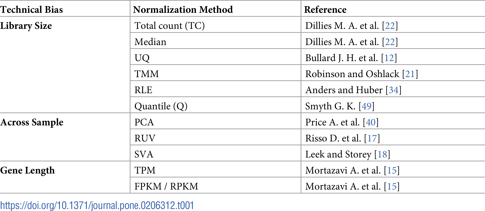
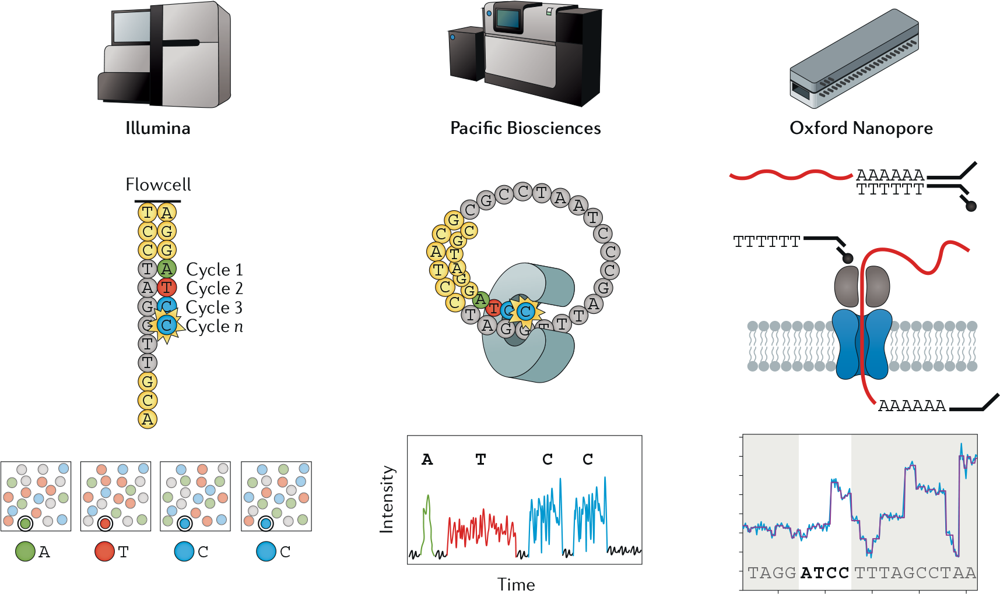
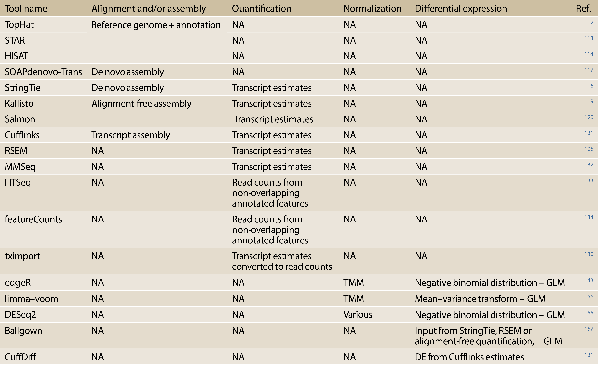
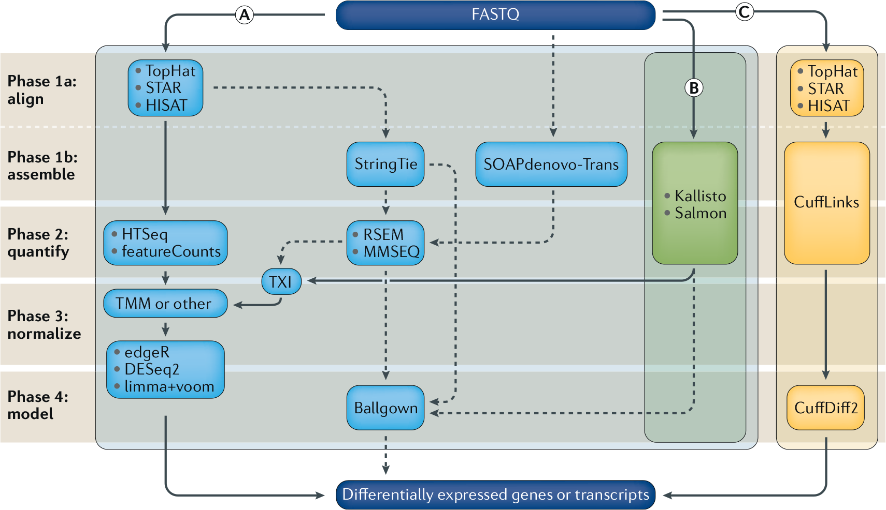

exclude: true
count: false

```{r,echo=FALSE,child="assets/header-slide.Rmd"}
```

<!-- ------------ Only edit title, subtitle & author above this ------------ -->

```{r,echo=FALSE,message=FALSE,warning=FALSE}
knitr::opts_chunk$set(echo = FALSE, fig.align = "center")
```

```{r,echo=FALSE,message=FALSE,warning=FALSE}
library(kableExtra)
```

---

# Introduction

## Overview of RNA-seq

* Gene expression studies get a snapshot of the RNA molecules present in a biological system

* Gene expression dictates what cells are doing or what cells are capable of doing

* A basic overview of the main steps in a standard RNA-seq experiment is given below

<br>

```{r, fig.cap = "A typical RNA-seq experiment", out.width = "75%"}

```


---

# RNA-seq Applications

* The popularity of RNA-seq is driven by its large number of applications

* One of the main application areas is gene regulation:

  * Comparison of gene expression between different tissues, cell types, genotypes, stimulation conditions, time points, disease states, growth condtions, and so on
  
  * The goal of such comparisons is to identify the genes that change in expression to understand the molecular pathways that are used or altered

---

# Design Aspects of RNA-seq

.pull-left-50[

* It is important to understand WHY are you sequencing? Answer to this question will affect how you design your experiment. 

* Main equation for a RNA-seq experiment is:

$X_dollars = #replicates x library_prep_cost + #replicates x sequencing_depth_per_replicate ~ sequencing_length


* Key factors that can play a significant role:
  
  * Read type (instrument) 
  * Number of replicates
  * Library type
    * Single vs paired end
    * Type of RNA extraction
  * The depth of sequencing
  * Library randomization (preparation and run)

]

.pull-right-50[

```{r, fig.cap = "A typical RNA-seq experiment", out.width = "100%"}
knitr::include_graphics("data/rnaseq/images/exp_design.jpg")
```

]


---

# Creating RNAseq libraries for sequencing

.pull-left-50[

* The first step is the extraction and purification of RNA from a sample, followed by an enrichment of target RNAs

* The selected RNAs are then chemically or enzymatically fragmented to molecules of approproiate size (e.g., 300 - 500 bp)

* Single-stranded target RNAs are reverse-transcribed to form double stranded cDNA

* Adapter sequences are either ligated to the 3' and 5' end of the double-stranded cDNA or used as primers in the reverse transcription reaction

* The final cDNA library consists of cDNA inserts flanked by an adapter sequence on each end

* In the last step, the cDNA library is amplified by polymerase chain reaction (PCR) using parts of the adapter sequences as primers

]

.pull-right-50[

```{r, fig.cap = "A typical RNA-seq experiment", out.width = "100%"}

```

]


---

# Alignment and Quantification

## Introduction

* After an experiment has been conducted, the analyst is presented with FASTQ files

* Following sufficient quality control, the next step will either be:

  1. Alignment to a reference genome
  
  2. Alignment to a reference transcriptome
  
```{r, fig.cap = "An illustration of spliced alignment of RNA-seq fragments", out.width = "60%"}
knitr::include_graphics("data/rnaseq/images/rnaseq-alignment.png")
```

---

# Alignment and Quantification

## Spliced alignment to a reference Genome

* A popular solution for handling RNA-seq alignments is to use a splice-aware aligner

* Popular splice-aware aligners include [STAR](https://github.com/alexdobin/STAR) and [HISAT](http://daehwankimlab.github.io/hisat2/)

```{r, fig.cap = "Spliced alignment of RNA-seq fragments to a genome", out.width = "80%"}
knitr::include_graphics("data/rnaseq/images/genome-alignment.png")
```

---

# Alignment and Quantification

## Unspliced alignment to a reference transcriptome

* An alternative to splice-aware genome alignment is direct transcriptome alignment

* Direct transcriptome alignment consists of aligning against a set of known transcripts

* Popular transcriptome aligners include [Kallisto](https://pachterlab.github.io/kallisto/) and  [Salmon](https://salmon.readthedocs.io/en/latest/salmon.html)

```{r, fig.cap = "Unspliced alignment of RNA-seq fragments to a transcriptome", out.width = "50%"}
knitr::include_graphics("data/rnaseq/images/transcriptome-alignment.png")
```

---

# Alignment and Quantification

## Gene- and Transcript-Level Quantification From RNA-seq Data

* One of the main uses of RNA-seq is to assess gene- and transcript-level abundances

* Most commonly, abundances are estimated at the level of genes

* Transcript-level abundances have become more widely used

```{r, fig.cap = "Mapping counts to transcripts", out.width = "50%"}
knitr::include_graphics("data/rnaseq/images/aggregatedcounts.png")
```

---

# Alignment and Quantification

## Gene- and Transcript-Level Quantification From RNA-seq Data

* Gene-level quantification consists of assigning reads to genes

* A gene consists of all transcripts produced from a specific strand at a specific locus

* The total expression of a gene is the sum of the expression of its isoforms

* Popular stand-alone read counting tools include [featureCounts](http://subread.sourceforge.net) and [HTSeq](https://htseq.readthedocs.io/en/master/)

---

# Differential expression

## Overview

* Following alignment and quantification, the next step is testing for differential expression (DE)

* The starting point for DE is often a count table:

  * Rows represent genomic features (e.g., genes)
  * Columns represent samples (i.e., experimental units)
  
* The goal of DE is to identify genes which are differentially expressed between conditions


---

# Differential expression

## Workflow

.pull-left-50[

* [DESeq2](http://bioconductor.org/packages/devel/bioc/vignettes/DESeq2/inst/doc/DESeq2.html): The package DESeq2 provides methods to test for differential expression by use of negative binomial generalized linear models.

* [EdgeR](https://www.bioconductor.org/packages/devel/bioc/vignettes/edgeR/inst/doc/edgeRUsersGuide.pdf): Also a commonly used workflow but differs from DESeq2 in normalisation strategy. EdgeR applies a weighted mean of log ratios-based method (Trimmed Mean of M-Values) where DESeq2 uses a geometric normalisation. 

* **Important Takeaway!** No statistical modelling can fully capture biological phenomena. Statistical methods rely on assumptions and requirements that are only partially satisfied. It is important to understand the basics of statistical models to know which one works best on your data!

]

.pull-right-50[

```{r, fig.cap = "Schematic of a DE analysis for RNA-seq data", out.width = "100%"}

```

]

---

# Differential expression

## Filtering

* Genes with very low counts across all libraries provide little evidence for DE

* From a biological point of view:

  * a gene must be expressed at some minimal level before it is likely to be translated into a protein or to be biologically important

* From a statistical point of view the more inferences are made, the more likely erroneous inferences become

* The expression level is indistinguishable from technical noise

* These genes should be filtered out prior to further analysis:

  * As a rule of thumb, genes are dropped if they can’t possibly be expressed in all the samples for any of the conditions

  * Users can set their own definition of genes being expressed

  * Usually a gene is required to have a count of 5-10 in a library to be considered expressed in that library

---

# Differential expression

## Normalization

* The observed counts of the genes cannot be directly compared across samples since there
may be variability in measurement across samples due to technical biases (sequencing depth, for example).

* Such unwanted noise can significantly reduce the accuracy of statistical inferences from the data. 

* Many methods / algorithms exist to correct for these technical variations.

```{r, fig.cap = "Sequencing depth is a technical bias to correct", out.width = "50%"}
knitr::include_graphics("data/rnaseq/images/normalization_methods_depth.png")
```

---

# Differential expression

## Normalization

* Several strategies have been developed to normalize counts to facilitate cross-sample comparisons:
  
  * **Library Size**: One source of variation between samples is the difference in library size, where library size is the total number of reads generated for a given sample.
  
  * **Gene Length**: Larger genes will have inevitably higher read counts compared to smaller genes due to the difference in their gene lengths or sizes.
  
  * **Across Sample**: Across sample normalization methods correct for other technical artifacts (batch effects, for example) to improve data quality and ability to detect biologically relevant genes.


```{r, fig.cap = "Sequencing depth is a technical bias to correct", out.width = "50%"}

```

---

# Differential expression

## Modeling and estimation

.pull-left-50[

* Even with extensive datasets availability, the quantitative understanding of gene regulation is far from comprehensive, since the available data usually gives only an average of many cell states or a few snapshots of dynamic systems.

* Obtaining a complete operational picture using solely experimental approaches is challenging. Mathematical modeling provides an alternative path for this key problem, offering new approaches that incorporate detailed dynamics of sets of biochemical interactions.

* Therefore, differential expression analysis tools apply different techniques to achieve this. DESeq2, for example, estimates **size factors** and **gene-wise dispersion** to create a linear model for each gene.  
]

.pull-right-50[

```{r, fig.cap = "Gene Expression modeling and estimation", out.width = "100%"}
knitr::include_graphics("data/rnaseq/images/de_theory.png")
```

]


---
# Summary - How does an end to end experiment look like?

## A generic roadmap for RNA-seq computational analyses

```{r, fig.cap = "A generic roadmap for RNA-seq computational analyses"}
knitr::include_graphics("data/rnaseq/images/rnaseq-analysis-roadmap.png")
```

---

# Technologies used for sequencing libraries


```{r, fig.cap = "An overview is shown of the three main sequencing technologies for RNA-seq", out.width = "100%"}

```

---

# Different technologies output different types of reads

```{r, fig.cap = "Comparison of short-read, long-read and direct RNA-seq analysis", out.width = "85%"}
knitr::include_graphics("data/rnaseq/images/rnaseq-analysis-technology.png")
```


---

# Commonly used algorithms for RNAseq analysis

```{r, fig.cap = "Common software tools in use for differential gene expression analysis using RNA-seq data"}

```

---

# RNAseq analysis workflows

```{r, fig.cap = "RNA-seq data analysis workflow for differential gene expression", out.width = "100%"}

```


---

# Recommended reading:

* [RNA Sequencing Data: Hitchhiker's Guide to Expression Analysis](https://www.annualreviews.org/doi/pdf/10.1146/annurev-biodatasci-072018-021255)
* [A survey of best practices for RNA-seq data analysis](https://genomebiology.biomedcentral.com/articles/10.1186/s13059-016-0881-8)
* [End to end guide on RNA-sequencing](https://www.youtube.com/watch?v=3hPyrQFTUuk)
* [How does Illumina sequencing work?](https://www.youtube.com/watch?v=fCd6B5HRaZ8)


<!-- --------------------- Do not edit this and below --------------------- -->

---
name: end_slide
class: end-slide, middle
count: false

# Thank you. Questions?

```{r,echo=FALSE,child="assets/footer-slide.Rmd"}
```

```{r,include=FALSE,eval=FALSE}
# manually run this to render this document to HTML
rmarkdown::render("slide_sample.Rmd")
# manually run this to convert HTML to PDF
#pagedown::chrome_print("slide_sample.html",output="slide_sample.pdf")
```
