exclude: true
count: false

```{r,echo=FALSE,child="assets/header-slide.Rmd"}
```

<!-- ------------ Only edit title, subtitle & author above this ------------ -->

```{r, include = FALSE}
knitr::opts_chunk$set(echo = FALSE, engine.opts = list(bash = "-l"), fig.align = "center")
```

```{r, include = FALSE}
library(kableExtra)
```

---

# The SAM format

## Overview

```{r, out.width = "100%", fig.cap = "Fig 1: Example of SAM file format"}
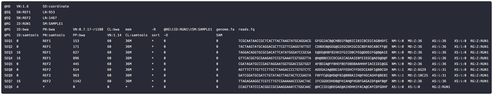
```

* SAM stands for **S**equence **A**lignment **M**ap format

* Store biological sequences aligned to a reference sequence

* TAB-delimited text format consisting of a **header** and **alignment** section

* Each alignment has **11** mandatory fields for essential alignment information

* The full SAM format specification is available [online](http://samtools.github.io/hts-specs/SAMv1.pdf)

* Developed by [Heng Li](https://www.broadinstitute.org/bios/heng-li) and [Bob Handsaker](https://www.broadinstitute.org/bios/bob-handsaker) et al. (2009)

---

# The SAM format

## Header

```{r, out.width = "100%", fig.cap = "Fig 2: Example of SAM header"}
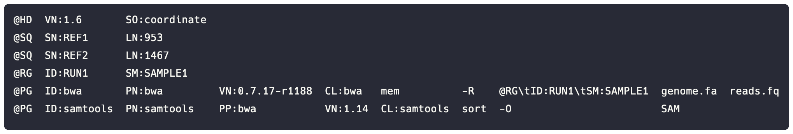
```

* Each line begins with an `@` character followed by a record type:

  * File-level metadata `HD`
  * Reference sequence dictionary `SQ`
  * Read group `RG`
  * Program `PG`
  * Comment `CO`

* Each record type contains different record tags:

  * For example, `SQ` contains reference sequence name `SN`, length `LN`, etc.

* The full list of record types and their tags is available [online](https://samtools.github.io/hts-specs/SAMv1.pdf#page=3)

---

# The SAM format

## Alignments

```{r, out.width = "100%", fig.cap = "Fig 3: Example of SAM alignments"}
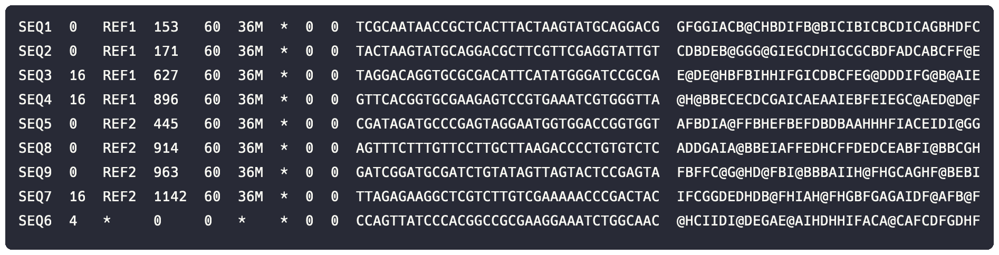
```

* Each line typically represents the linear alignment of a segment

* Each alignment consists of 11 or more TAB-separated fields:

  * `QNAME` `FLAG` `RNAME` `POS` `MAPQ` `CIGAR` `RNEXT` `PNEXT` `TLEN` `SEQ` `QUAL`

---

# The SAM format

## Alignments

```{r, echo = FALSE}
x <- read.delim("data/sam/fields.tsv", colClasses = "character")
x <- kable(x, format = "html")
x <- kable_styling(x, full_width = FALSE, font_size = 14)
x
```

<center>Tab 1: Alignment fields</center>

---

# The SAM fields

## QNAME (1)

.pull-left-60[

* Identical QNAME come from the same template

* `*` indicates the information is unavailable

* Reads may occupy multiple alignment lines when:

  * The alignment is chimeric
  * There are multiple mappings

]

.pull-right-40[

```{r, out.width = "35%", fig.cap = "Fig 4: Query template NAME"}
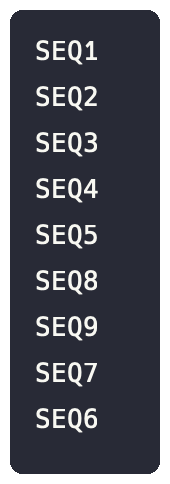
```

]

---

# The SAM fields

## FLAG (2)

.pull-left-60[

* The FLAG encodes attributes of a read alignment

* It is displayed as a single integer code:

  * READ MAPPED TO FORWARD STRAND = 0
  * READ UNMAPPED = 4
  * READ MAPPED TO REVERSE STRAND = 16
  * READ FAILED QUALITY CONTROl = 512

* Integers are the sum of **bitwise** flags

* A bitwise flag encodes a specific **attribute**

* The attributes are summed to get the final value

]

.pull-right-40[

```{r, out.width = "35%", fig.cap = "Fig 5: Combination of bitwise FLAGs"}
knitr::include_graphics("data/sam/wgsim/reads.alignment.FLAG.png")
```

]

---

# The SAM fields

## FLAG (2)

.pull-left-50[

```{r, echo = FALSE}
x <- read.delim("data/sam/flags.tsv", colClasses = "character")
x <- kable(x, format = "html")
x <- kable_styling(x, full_width = FALSE, font_size = 13)
x
```

<center>Tab 2: bitwise FLAGs</center>

]

.pull-right-50[


```{r, echo = FALSE}
x <- read.delim("data/sam/flags-example-1.tsv", colClasses = "character")
x <- kable(x, format = "html", caption = "Ex 1: An umapped read which failed quality control")
x <- kable_styling(x, full_width = FALSE, font_size = 13)
x
```

```{r, echo = FALSE}
x <- read.delim("data/sam/flags-example-2.tsv", colClasses = "character")
x <- kable(x, format = "html", caption = "Ex 2: A supplementary alignment from the first read in a pair where the mate is aligned to the reverse strand")
x <- kable_styling(x, full_width = FALSE, font_size = 13)
x
```

]

---

# The SAM fields

## RNAME (3)

.pull-left-60[

* Reference sequence name of the alignment

* An unmapped read has a `*` in this field

]

.pull-right-40[

```{r, out.width = "35%", fig.cap = "Fig 6: Reference sequence NAME"}
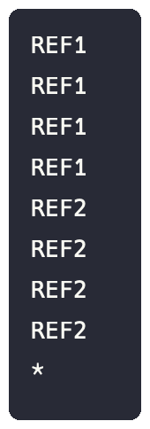
```

]

---

# The SAM fields

## POS (4)

.pull-left-60[

* 1-based leftmost mapping position of the read

* First base in a reference sequence has coordinate 1

* POS is set as 0 for an unmapped read without coordinate

]

.pull-right-40[

```{r, out.width = "35%", fig.cap = "Fig 7: 1-based leftmost mapping POSition"}
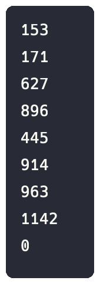
```

]

---

# The SAM fields

## MAPQ (5)

.pull-left-60[

* Integer mapping of the probability of an **incorrect** mapping position

* MAPQ calculation: $Q=-10\log_{{10}}P$

<br>

```{r}
x <- read.delim("data/sam/MAPQ.tsv", check.names = FALSE)

x <- kable(x, "html", align = "r") %>% kable_styling(font_size = 15)

x
```

<center>Tab 3: Mapping quality</center>

]

.pull-right-40[

```{r, out.width = "35%", fig.cap = "Fig 8: MAPping Quality"}
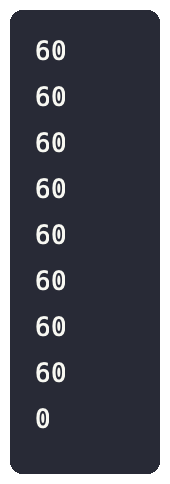
```

]

---

# The SAM fields

## CIGAR (6)

.pull-left-60[

* Represents **how** the read aligned to the reference

* Use characters to represent individual operations

```{verbatim, echo = TRUE}
# M Match
# N Gap
# D Deletion
# I Insertion
```

* An alignment with POS = `2` and  CIGAR = `6M`

```{verbatim, echo = TRUE}
# REF: AAGTCTAGAA
# SEQ:   GTCTAG
```

* An alignment with POS = `2` and CIGAR = `3M2I3M`

```{verbatim, echo = TRUE}
# REF: AAGT--TAGAA
# SEQ:  GTCGATAG
```

* An alignment with POS = `2` and CIGAR = `2M1D3M`

```{verbatim, echo = TRUE}
# REF: AAGTCTAGAA
# SEQ:   GT-TAG
```

]

.pull-right-40[

```{r, out.width = "35%", fig.cap = "Fig 9: CIGAR string"}
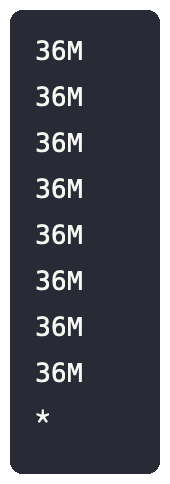
```

]

---

# The SAM fields

## RNEXT (7), PNEXT (8), TLEN (9)

.pull-left-60[

* Reference sequence name of the primary alignment of the mate from a paired-end read

* Mapping position of the mate from a paired-end read

* Template length calculated from the mapping position from both mates

]

.pull-right-40[

```{r, out.width = "45%", fig.cap = "Fig 10: RNEXT, PNEXT, TLEN"}

```

]

---

# The SAM fields

## SEQ (10), QUAL (11)

.pull-left-60[

* The sequence of the read

* The Phred quality scores of the read base calls

]

.pull-right-40[

```{r, out.width = "85%", fig.cap = "Fig 11: Read sequence"}
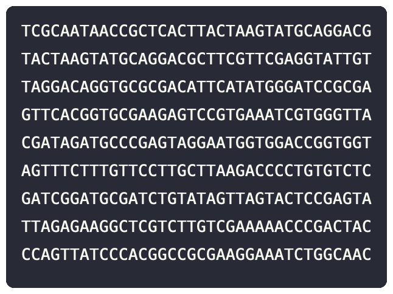
```

```{r, out.width = "85%", fig.cap = "Fig 12: Phred quality score"}
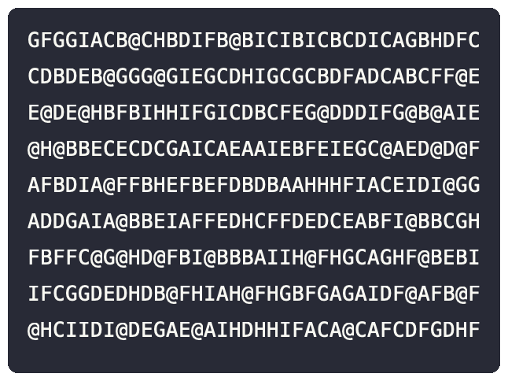
```

]

---

# The Samtools suite

## Overview

* Collection of programs for interacting with high-throughput sequencing data

* Contains three separate programs:

  1. Samtools
  
  2. BCFtools
  
  3. HTSlib

* Samtools is used to read and write SAM/BAM files

* The Samtools manual is available [online](https://www.htslib.org/doc/samtools.html)

* Developed by [Heng Li](https://www.broadinstitute.org/bios/heng-li) and [Bob Handsaker](https://www.broadinstitute.org/bios/bob-handsaker) et al. (2009)

* Alternative tools for SAM/BAM files include [BAMtools](https://github.com/pezmaster31/bamtools) and [Picard](https://github.com/broadinstitute/picard)

---

# The Samtools suite

.pull-left-50[

## Samtools commands

* Contains 36 different commands

* Grouped into different categories:

  * Indexing
  * Editing
  * File operations
  * Statistics
  * Viewing
  * Miscellaneous
  
* Convert SAM to compressed binary format called BAM

* Index SAM file to speed up retrieving alignments

]

.pull-right-50[

```{r, out.width = "80%"}
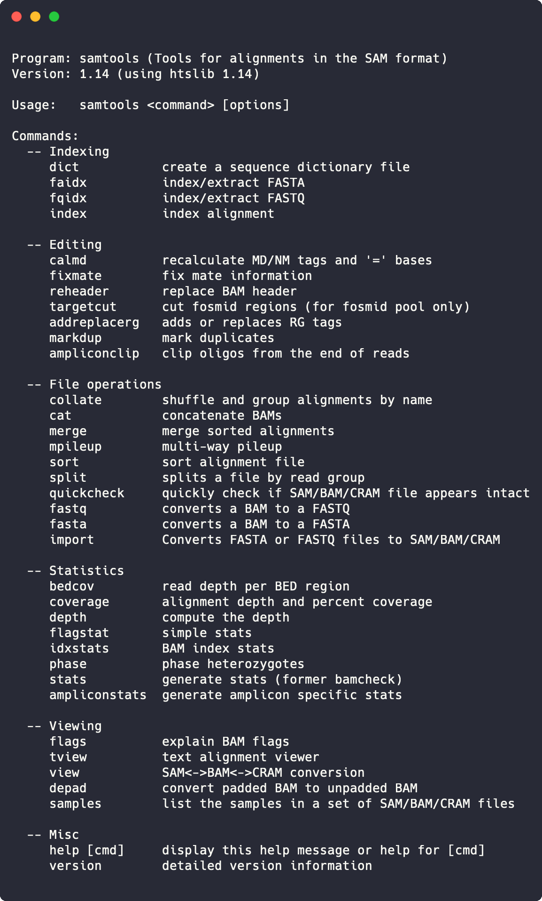
```

]

---

# Summary

- SAM stands for Sequence Alignment Map format

- Store biological sequences aligned to a reference sequence

- TAB-delimited text format consisting of a header and alignment section

- Each header has data fields for essential header information

- Each alignment has 11 mandatory fields for essential alignment information

- BAM is the compressed binary version of the SAM format

- Samtools is used to read, write, and execute SAM/BAM files

---

# Resources

## Specification

* [Sequence Alignment/Map Format](http://samtools.github.io/hts-specs/SAMv1.pdf)

## Manual

* [Samtools](https://www.htslib.org/doc/samtools.html)

## Papers

* [Twelve years of SAMtools and BCFtools](https://pubmed.ncbi.nlm.nih.gov/33590861) by Petr Danecek et al.

* [The Sequence Alignment/Map format and SAMtools](http://www.ncbi.nlm.nih.gov/pubmed/19505943) by Heng Li et al.

## Videos

* [Lockdown Learning: SAMtools](https://youtu.be/Llaxuzr6EkA) by Simon Cockell

* [Bioinformatics Coffee Hour: Samtools](https://youtu.be/Z4A2LCPyVU4) by Harvard FAS Informatics

* [SAM, BAM, CRAM format](https://youtu.be/XU8atPxM0VQ) by Aaron Quinlan

<!-- --------------------- Do not edit this and below --------------------- -->

---
name: end_slide
class: end-slide, middle
count: false

# Thank you. Questions?

```{r,echo=FALSE,child="assets/footer-slide.Rmd"}
```

```{r,include=FALSE,eval=FALSE}
# manually run this to render this document to HTML
rmarkdown::render("slide_sample.Rmd")
# manually run this to convert HTML to PDF
#pagedown::chrome_print("slide_sample.html",output="slide_sample.pdf")
```