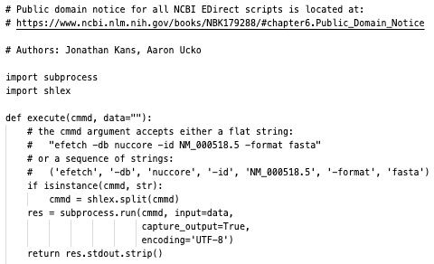
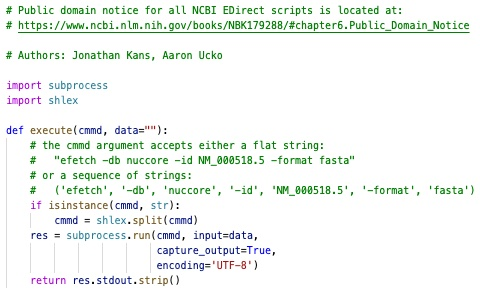
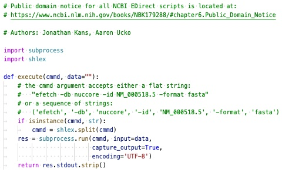
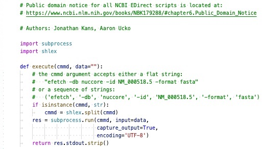
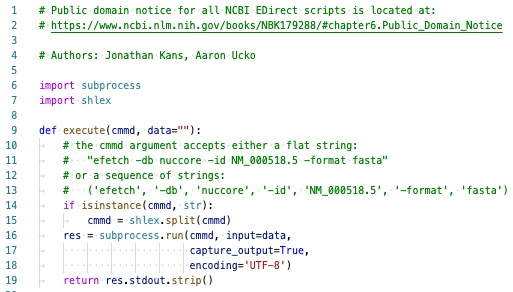
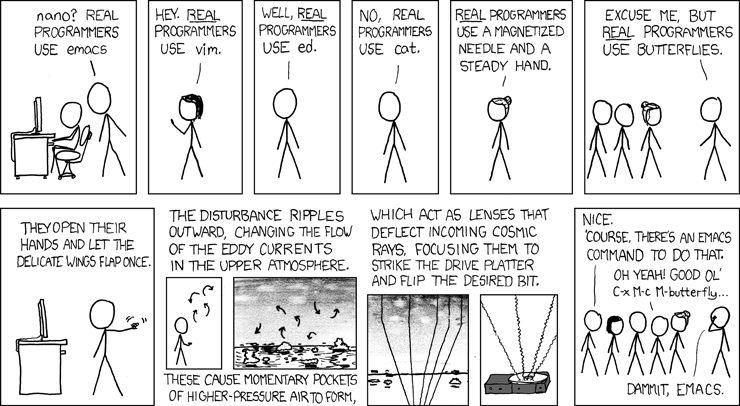
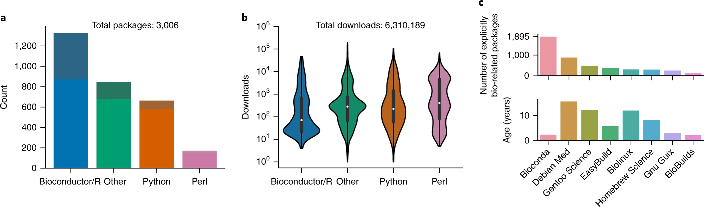

exclude: true
count: false

```{r,echo=FALSE,child="assets/header-slide.Rmd"}
```

<!-- ------------ Only edit title, subtitle & author above this ------------ -->

---

# Introduction

.pull-left-50[

* Most bioinformatics work is computational and can be resource intensive

* Computer setups are often very personal and require lots of customization

* You first need to think about the following options for setting up your computer:

  * Operating system
  
  * Text editor
  
  * Software
  
  * Reproducibility

* When you are comfortable with your setup, you will probably never want to change!

]

.pull-right-50[

```{r, echo = FALSE, fig.align = "center", out.width = "80%", fig.cap = "xkcd: Borrow Your Laptop"}
knitr::include_graphics("data/software/xkcd-borrow-your-laptop.png")
```

]

---

## Operating system

* Most bioinformatics work is performed on Unix machines (Linux or macOS)

* Why is this? Are we snobby about Windows machines? There are *plenty* of reasons

  1. Most bioinformatics tools are only available on Linux
  
  2. Linux has built-in programming languages (eg. Perl and Python)
  
  3. Linux has built-in text-handling utilities (eg. awk, sed, grep)
  
  2. Windows is very slow at processing large data (eg. Notepad size limitation of 58 Mb)
  
  5. Linux is free and open-source
  
* See this [article](https://towardsdatascience.com/why-do-bioinformaticians-avoid-using-windows-c5acb034f63c) for more details and this [ question](https://www.biostars.org/p/11085/) for a lot more reasons

* In short, Unix is the easiest way to run, develop, and analyse bioinformatics data

<br>

In 2021, Microsoft developed a [Windows Subsystem for Linux (WSL)](https://docs.microsoft.com/en-us/windows/wsl/) 

> The Windows Subsystem for Linux lets developers run a GNU/Linux environment - including most command-line tools, utilities, and applications -directly on Windows, unmodified, without the overhead of a traditional virtual machine or dualboot setup.

---

## Text editors

* There are a huge number of text editors you can use to read and write code

* Each have their own features and shortcuts which make coding more efficient

* So which out of these should you choose? There is no *right* answer

* We suggest they meet the following minimum requirements:

  1. Syntax highlighting
  
  2. White space characters
  
  3. Line number display
  
  4. Line-ending support (DOS vs Unix)

* Do you want a command-line versus graphical user interface? We suggest *both*

  * Servers usually only have command-line editors

  * Personal computers benefit from graphical user interfaces

---

## Syntax highlighting

* Syntax highlighting is a feature of text editors that used for programming

* This feature displays text in different colors and fonts according to the category of terms

* This feature facilities coding as both structures and syntax errors are visually distinct

* With syntax highlighting it is easier to see:

  * Code comments
  * Function definitions
  * Conditional statements
  * Parameters

.pull-left-50[

```{r, echo = FALSE, fig.align = "center", out.width = "100%", fig.cap = "Hide syntax"}

```

]

.pull-right-50[

```{r, echo = FALSE, fig.align = "center", out.width = "100%", fig.cap = "Show syntax"}

```

]

---

## Whitespace characters

* Whitespace is any character or series of characters that represent horizontal space

* A single character of horizontal whitespace can be written using the `SPACEBAR` key

* Horizontal whitespace can also be written using the `TAB` key, although the **length** may vary

* Why is it important to show whitespace characters?

  * Code is often indented using whitespace and some languages require you to be consistent
  
  * Some file formats require fields to be separated using the `TAB` whitespace character
  
  * Varying whitespace to allow your code to 'breath' on the screen

.pull-left-50[

```{r, echo = FALSE, fig.align = "center", out.width = "100%", fig.cap = "Hide whitespace"}
knitr::include_graphics("data/software/whitespace-hide.jpg")
```

]

.pull-right-50[

```{r, echo = FALSE, fig.align = "center", out.width = "100%", fig.cap = "Show whitespace"}

```

]

---

## Line number display

* Each line is numbered according to its order in the file

* The first line is numbered 1, the second is numbered 2, and so on

* Useful when you need to refer to specific lines in a program

* It would be impractical to count the lines of a file every time an error occurred

.pull-left-50[

```{r, echo = FALSE, fig.align = "center", out.width = "100%", fig.cap = "Hide number"}

```

]

.pull-right-50[

```{r, echo = FALSE, fig.align = "center", out.width = "100%", fig.cap = "Show number"}

```

]

---

## Line-ending support

* Line endings are control characters used to signify the end of a line:

  * DOS/Windows machines use CRLF - `\r\n`
  
  * Unix/macOS machines use LF - `\n`

* When transferring a file between DOS and Unix the line endings must be translated

* Check the line endings are correct if you encounter an unexpected error with a file

.pull-left-50[

```{r, echo = FALSE, fig.align = "center", out.width = "100%", fig.cap = "Hide ending"}

```

]

.pull-right-50[

```{r, echo = FALSE, fig.align = "center", out.width = "100%", fig.cap = "Show ending"}

```

]

---

## Text editor recommendations

* Remember, there is no *right* answer - anyone who tells you differently is just being snobby!

* You should experiment with the most popular ones and see which fits *your* workflow

* Here we suggest some text editors which meet our minimum requirements:

  * Command-line text editors: [Vim](https://www.vim.org), [GNU Emacs](https://www.gnu.org/software/emacs/), [Nano](https://www.nano-editor.org)

  * Text editors with a graphical user interface: [Atom](https://atom.io), [Sublime Text](https://www.sublimetext.com), [Visual Studio Code](https://code.visualstudio.com)
  
<br>

```{r, echo = FALSE, out.width = "60%", fig.align = "center", fig.cap = "xkcd: Real Programmers"}

```

---

## Software packages

.pull-left-60[

* Warning! The points below are relevant to Unix only

* The most common method of installing command line tools is through software **repositories**

* Repositories are storage locations accessible online that contain software **packages**

* Packages can be installed, upgraded, configured, and removed using a package **manager**

* Package managers differ by the Linux distribution:

  * Debian (DPKG)
  * Red Hat (RPM)
  * Pacman (Arch Linux)
  * Sypper (openSUSE)
  * Portage (Gentoo)
  
* Problem! Most bioinformatics software is not available from the default repositories

]

.pull-right-40[

```{r, echo = FALSE, fig.align = "center", out.width = "80%", fig.cap = "xkcd: Will it Work"}
knitr::include_graphics("data/software/xkcd-will-it-work.png")
```

]

---

## Conda package manager

```{r, echo = FALSE, fig.align = "right", out.width = "20%"}
knitr::include_graphics("data/software/conda-logo.svg")
```

* [Conda](https://docs.conda.io/en/latest/) is an open source package management system and environment management system that runs on Windows, macOS and Linux

* It is the recommended way for users to manage their own environments and supports a wide range of programming languages

* Conda packages are distributed as binaries (compiled code) so you should never have to use a compiler to build the software

<br>

```{r, echo = FALSE, fig.align = "right", out.width = "40%"}
knitr::include_graphics("data/software/anaconda-logo.svg")
```

* The default software repository conda uses is called [Anaconda](https://anaconda.org)

* Anaconda provides over 1,500 packages, including the most popular data science, machine learning, and AI frameworks.

* Browse packages in the Anaconda repository: [Package Index](https://anaconda.org/anaconda)

---

## Conda environments

* A conda environment is a directory that contains software packages that you have installed

* If you change one environment, your other environments are not affected

* You can easily activate or deactivate environments, which is how you switch between them

* The cartoon below shows how conda is used to manage packages and environments

<br>

```{r, echo = FALSE, fig.align = "center", out.width = "75%", fig.cap = "Credit: Imperial College London"}
knitr::include_graphics("data/software/conda-env-figure.jpeg")
```

---

## Environment reproducibility

* Conda allows you to reproduce a given environment on any machine

* Simply create and share a snapshot of the environment (environment.yaml)

* The environment file lists all software versions and their dependencies

* The cartoon below shows why environments are important for reproducibility

<br>

```{r, echo = FALSE, fig.align = "center", out.width = "70%", fig.cap = "Credit: NBIS Sweden"}
knitr::include_graphics("data/software/conda-env-repro.png")
```

---

## Bioconda repository

```{r, echo = FALSE, fig.align = "right", out.width = "30%"}
knitr::include_graphics("data/software/bioconda-logo.png")
```

* Bioconda is a repository for conda specializing in bioinformatics software

* Browse packages in the Bioconda repository: [Package Index](http://bioconda.github.io/conda-package_index.html)

* Over 850 contributors and 570 members who help maintain the repository

* Bioconda only supports 64-bit Linux and Mac OS (Windows using WSL)

<br>

```{r, echo = FALSE, fig.align = "center", out.width = "100%", fig.cap = "Package numbers and usage (2017)"}

```

---

## Anaconda example

Create a new environment (named env) and install software:

```{bash, eval = FALSE}
# Conda looks in the anaconda repository by default
conda create --name env python numpy scipy matplotlib
```

Activate the new environment to use it:

```{bash, eval = FALSE}
conda activate env
```

Run your analysis or script in the environment:

```{bash, eval = FALSE}
python analysis.py
```

Save environment to a text file:

```{bash, eval = FALSE}
conda list --explicit > environment.txt
```

Deactivate the environment:

```{bash, eval = FALSE}
conda deactivate install
```

---

## Bioconda example

Create a new environment (named env) and install software from bioconda repository:

```{bash, eval = FALSE}
# Instruct conda to look in the bioconda repository
conda create --name env --channel bioconda bowtie2 samtools
```

Activate the new environment to use it:

```{bash, eval = FALSE}
conda activate env
```

Decide you need to install some software from the anaconda repository as well:

```{bash, eval = FALSE}
conda install numpy scipy matplotlib
```

Run your analysis or script in the environment:

```{bash, eval = FALSE}
python analysis.py
```

Deactivate the environment:

```{bash, eval = FALSE}
conda deactivate install
```

---

## Debugging advice

* A large part of bioinformatics is debugging software and code you have written

* You may get annoyed and think about changing careers - a totally **normal** response!

* However, give the following advice a try first:

  1. Google the error message:
  
      * Enclose the message in quotes to search for the exact text
      
      * Prioritize results from popular technology forums (eg. StackOverflow)
  
  2. Put `print` statements in your code:
  
      * Determine where the error occurs (eg. print "Here!")
      
      * Print the value of important variables
  
  3. Bring in a colleague and talk them through the problem:
  
      * Classic technique called [rubber duck debugging](https://rubberduckdebugging.com)

  4. Report the problem on the software issue tracker:
    
      * Make sure you provide all the relevant information
    
      * Also try to provide a small reproducible example

---

## Summary

* Bioinformatics work is computational and resource intensive

* Generally suited to Unix machines (availability of software)

* Choose a text editor which meets the minimum requirements:

  1. Syntax highlighting
  2. White space characters
  3. Line number display
  4. Line-ending support

* Software on Unix machines is usually installed using package managers

* Conda is an open-source package manager for Windows, Unix, and macOS

* Conda allows you to define separate environments with different software collections

* Anaconda is the default conda repository for most software 

* Bioconda is a repository specializing in bioinformatics software

* Debugging is often painful, if in doubt ask a friend for help

<!-- --------------------- Do not edit this and below --------------------- -->

---
name: end_slide
class: end-slide, middle
count: false

# Thank you. Questions?

```{r,echo=FALSE,child="assets/footer-slide.Rmd"}
```

```{r,include=FALSE,eval=FALSE}
# manually run this to render this document to HTML
rmarkdown::render("slide_sample.Rmd")
# manually run this to convert HTML to PDF
#pagedown::chrome_print("slide_sample.html",output="slide_sample.pdf")
```
