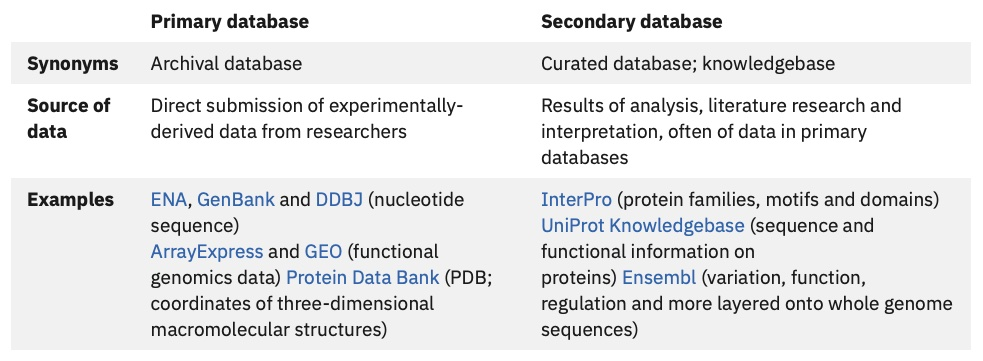
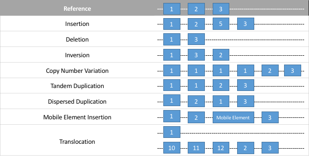

exclude: true
count: false

```{r,echo=FALSE,child="assets/header-slide.Rmd"}
```

<!-- ------------ Only edit title, subtitle & author above this ------------ -->

```{r, include = FALSE}
library(knitr)
library(kableExtra)
```

---

## What is biological data?

* Biological data is a very broad and un-specific term - *not helpful!*

* From Wikipedia, the free encyclopedia:

> Biological data refers to a compound or information derived from living organisms and their products. A medicinal compound made from living organisms, such as a serum or a vaccine, could be characterized as biological data. Biological data is highly complex when compared with other forms of data. There are many forms of biological data, including text, sequence data, protein structure, genomic data and amino acids, and links among others.

* It is easier to describe biological data by what it **represents**:

  * Gene sequences
  * Sequence variation
  * Genome assembly
  * Gene annotation

* In bioinformatics, you will need to know where to find such data and how to download it

* This is surprisingly difficult, especially when multiple sources provide similar looking data

* *Off we go down the rabbit hole!*

---

## Where are biological data stored?

* Almost all biological data are stored in **databases**

* From Wikipedia, the free encyclopedia:

> In computing, a database is an organized collection of data stored and accessed electronically. Small databases can be stored on a file system, while large databases are hosted on computer clusters or cloud storage.

* As of 2018, there were roughly **180** biological databases - *how do we classify them all?*

* Biological databases are often defined by what **type** of data they store:

  * Nucleic acid databases
  * Amino acid / protein databases
  * Signal transduction pathway databases
  * Metabolic pathway and protein function databases
  * Taxonomic databases
  * And many more!

* *We will not go through each type of database, don't worry!*

---

## Why are databases useful?

* The answer to this question should be obvious:

  * Store very large numbers of records efficiently
  * Very quick and easy to find **information**
  * Data can be searched easily
  * More than one person can access the same database as the same time
  
* However, what might not be so obvious:

  * Public data can be re-used for further analysis
  * Benefit from scientific expertise (manual annotation of genes)
  * Can be used as backup (store your own data once published)
  * Normally free to use
  * Avoid data redundancy - *in theory!*

* *Okay, enough! Show me some databases!*

---

## Primary and secondary databases

* **Primary databases** are populated with experimentally derived data:

  * Experimental results are submitted directly into the database by researchers

  * The data in primary databases are never changed: they form part of the scientific record

* **secondary databases** comprise data derived from the results of analysing primary data:

  * The data are often highly curated (processed before it is presented in the database)
  
  * Can be more useful than a primary database - *who wants to do their own data munging?*

```{r, echo = FALSE, out.width = "95%", fig.align = "center", fig.cap = "Credit: EMBL-EBI Training"}

```

---

## What databases will you most probably use?

* It is **difficult** to take you on a guided tour of most databases - *so many, but so little time!*

* The grand-daddy of them all is the [NCBI](https://www.ncbi.nlm.nih.gov) which is more of a meta-database:

  * Primary data (raw sequencing data, gene sequences, etc.)
  * Secondary data (analysis results, software tools, etc.)
  * Published literature (PubMed)

* However, when it comes solely to genomics there are two main contenders (Ensembl vs UCSC)

```{r, echo = FALSE, out.width = "75%", fig.align = "center"}

```

---

## What is Ensembl?

```{r, echo = FALSE, fig.align = "right", out.width = "20%"}
knitr::include_graphics("data/sources/ensembl-logo.png")
```

* [Ensembl](http://www.ensembl.org/) provides a genome browser that acts as a single point of access to annotated genomes for mainly vertebrate species

* Information about genes, transcripts and other annotations can be retrieved at the genome, gene and protein level.

* This includes information on protein domains, genetic variation, homology, syntenic regions and regulatory elements.

* Ensembl even provide a free online training [course](https://www.ebi.ac.uk/training/online/courses/ensembl-browsing-genomes/) - *lucky you!*

* Here's what Ensembl themselves have to say:

> Ensembl is a genome browser for vertebrate genomes that supports research in comparative genomics, evolution, sequence variation and transcriptional regulation. Ensembl annotate genes, computes multiple alignments, predicts regulatory function and collects disease data. Ensembl tools include BLAST, BLAT, BioMart and the Variant Effect Predictor (VEP) for all supported species.

---

## Ensembl Tour

```{r, echo = FALSE, out.width = "100%"}
knitr::include_url("https://www.ensembl.org/index.html", height = "550px")
```

---

## What is UCSC?

```{r, echo = FALSE, fig.align = "right", out.width = "30%"}

```

* [UCSC](https://genome.ucsc.edu) provides a genome browser that acts as a single point of access to annotated genomes for mainly vertebrate species - *sound familiar?*

* Offers access to genome sequence data from a variety of vertebrate and invertebrate species and major model organisms, integrated with a large collection of aligned annotations

* UCSC also provide free online training [videos](https://genome.ucsc.edu/training/) - *you really are spoiled!*

* Here's what UCSC themselves have to say:

> On June 22, 2000, UCSC and the other members of the International Human Genome Project consortium completed the first working draft of the human genome assembly, forever ensuring free public access to the genome and the information it contains. A few weeks later, on July 7, 2000, the newly assembled genome was released on the web at http://genome.ucsc.edu, along with the initial prototype of a graphical viewing tool, the UCSC Genome Browser. In the ensuing years, the website has grown to include a broad collection of vertebrate and model organism assemblies and annotations, along with a large suite of tools for viewing, analyzing and downloading data.

---

## UCSC Tour

```{r, echo = FALSE, out.width = "100%"}
knitr::include_url("https://genome.ucsc.edu", height = "550px")
```

---

## What data will you most likely want?

* Both Ensembl and UCSC provide a **HUGE** breadth and variety of data

* At some point in your bioinformatics journey, you will need the following:

  * Genome assembly:
      * Nucleotide sequences from an organism's genome
      * FASTA/Q format

  * Genomic features
      * Location of genomic elements (e.g., genes, transcripts)
      * BED, GTF, GFF3 formats

  * Genome variation:
      * Gene sequence variation (e.g, SNPs, indels)
      * VCF format

* Both Ensembl and UCSC provide access to this data through their websites:

  * [Ensembl FTP Download](https://www.ensembl.org/info/data/sources/ftp/index.html)
  
  * [UCSC Downloads Page](https://hgdownload.soe.ucsc.edu/downloads.html)


---

## Genome assembly

* The **genome assembly** is simply the **genome sequence** produced after chromosomes have been fragmented, those fragments have been sequenced, and the resulting sequences have been put back together. 

* Each species a **reference genome assembly** that is produced by an international genome consortium

* The reference assembly can be compiled from the DNA of one individual, a collection of individuals, a breed or a strain (depends on the species)

* Ensembl and UCSC do **not** generate genome assemblies - that job is left to the [Genomc Research Consortium](https://www.ncbi.nlm.nih.gov/grc) and other specialized institutions

---

## FASTA format

* Text-based format for representing either nucleotide or amino acid sequences

* Nucleotides or amino acids are represented using single-letter codes:

  * IUPAC ambiguous DNA: `GATCRYWSMKHBVDN`
  * IUPAC protein alphabet of the **20** standard amino acids: `ACDEFGHIKLMNPQRSTVWY`

* A FASTA file uses two or more lines per sequence:

  * The header line begins with '**>**' and gives a unique identifier for the sequence
  * The sequence line(s) contain the actual sequence and are wrapped every **80** characters

* Filename extensions: `.fasta` `.fna` `.ffn` `.faa` `.frn` `.fa`

```{embed, file = "data/sources/example.fasta"}
```

---

## FASTQ format

* Text-based format for storing a nucleotide sequence and its quality scores

* A FASTQ file uses four lines per sequence:

  1. Begins with a '**@**' character followed by a sequence identifier
  2. Nucleotide sequence
  3. Begins with a '**+**' character and is optionally followed by the same sequence identifier
  4. Encodes the quality scores for the nucleotide sequence

* Filename extensions: `.fastq` `.fq`

```{embed, file = "data/sources/example.fastq"}
```

---

## Genomic features

* Genomic features are defined regions of a genome

* Most often features will represent *interesting* genomic elements

* Examples of genomic elements may include:

  * Genes 
  * CDS
  * rRNA
  * tRNA
  * Pseudogene

* You can define **any** region as an *interesting* element

* Represented using a minimal genomic coordinate system:

  1. Chromosome name
  2. Feature start position
  3. Feature end position

* Three standard `TAB` separated formats: **BED**, **GFF**, **GTF**

---

## BED format

.pull-left-60[

* Text-based format for storing the location of arbitrary genomic features

* Each genomic feature is listed on a separate **data line**

* Each line has fields separated by the `TAB` character

* Each line contains between 3 and 12 fields:

  * The first **3** fields are mandatory
  
  * The last **9** fields are optional
  
  * The order of fields is binding

* Filename extension: `.bed`

```{embed, file = "data/sources/example.bed"}
```

]

.pull-right-40[

```{r, echo = FALSE}
df <- read.csv("data/sources/BED.csv")
kable(df, "html", align = "l") %>% 
  kable_styling(font_size = 13) %>%
  row_spec(1:3, background = "#edf8e9") %>% 
  row_spec(4:12, background = "#f7f7f7")
```

]

---

## GFF format

.pull-left-60[

* Text-based format for storing the location of genes and other features

* Each feature is listed on a separate **data line**

* Each line has fields separated by the `TAB` character

* Each line must contain all 9 fields:

  * The first **8** fields contain a single value
  
  * The last field contains multiple values
  
  * The order of fields is binding
  
* Multiple versions (latest is version 3)

* Filename extension: `.gff` `.gff3`


```{embed, file = "data/sources/example.gff"}
```

]

.pull-right-40[

```{r, echo = FALSE}
df <- read.csv("data/sources/GFF.csv")
kable(df, "html", align = "l") %>% 
  kable_styling(font_size = 13) %>%
  row_spec(1:9, background = "#edf8e9")
```

]

---

## GTF format

.pull-left-60[

* Same as version 2.2 of the GFF format

* Text-based format for storing the location of genes and other features

* Each feature is listed on a separate **data line**

* Each line has fields separated by the `TAB` character

* Each line must contain all 9 fields:

  * The first **8** fields contain a single value
  
  * The last field contains multiple values
  
  * The order of fields is binding

* Filename extension: `.gtf`

```{embed, file = "data/sources/example.gtf"}
```

]

.pull-right-40[

```{r, echo = FALSE}
df <- read.csv("data/sources/GTF.csv")
kable(df, "html", align = "l") %>% 
  kable_styling(font_size = 13) %>%
  row_spec(1:9, background = "#edf8e9")
```

]

---

## Genome variation

* Areas of the genome that differ between individual genomes ("variants")

* Variants can be associated with particular diseases and phenotypes

* There are different types of variants for several species:

    * Single nucleotide polymorphisms (SNPs)
    
    * Short nucleotide insertions and/or deletions
    
    * Longer variants classified as structural variants (including CNVs)

```{r, echo = FALSE, out.width = "70%", fig.align = "center", fig.cap = "Credit: Wikipedia"}

```

---

## VCF format

.pull-left-60[

* Text-based format for representing sequence variation:

  * SNPs (`G` to `A`)
  * Indels (`GTC` to `G`)

* The standard format includes groups of lines:

  * Meta-information lines (prefixed with `##`)

  * Header line (prefixed with `#`)

  * Data lines containing information about a position in the reference genome
  
* Data lines contain **8** mandatory fields

* Example of a VCF file is shown overleaf
  
* Filename extension: `.vcf`

]

.pull-right-40[

```{r, echo = FALSE}
df <- read.csv("data/sources/VCF.csv")
kable(df, "html", align = "l") %>% 
  kable_styling(font_size = 13) %>%
  row_spec(1:8, background = "#edf8e9")
```

]

---

## VCF format

### Meta-information

* File meta-information is included after the `##` and must be `key=value` pairs

* Meta-information lines are optional, but it is recommended to include them

```{embed, file = "data/sources/example.meta.vcf"}
```

---

## VCF format

### Header line

* The header line names the 8 fixed, mandatory columns

* If genotype data is present, these are followed by a FORMAT column then sample IDs

```{embed, file = "data/sources/example.header.vcf"}
```

### Data lines

* All data lines are `TAB` delimited and missing values are specified with a `.`

* The example below shows (in order):

  1. SNP
  2. SNP filtered out because its quality is below 10
  3. Site with two alternate alleles (G, T)
  4. Site with no alternate alleles
  5. Microsatellite with two alternate alleles

```{embed, file = "data/sources/example.data.vcf"}
```

---

## What is the difference between Ensembl and UCSC?

* Both use the *same* genome assembly but with different names:

  * Human genome assembly: GRCh38 (Ensmebl) vs hg38 (UCSC)
  * Mouse genome assembly: GRCm38 (Ensembl) vs mm10 (UCSC)

* Use *different* pipelines to annotate the genome assembly:

  * Ensembl gene annotation: Ensembl/GENCODE
  * UCSC gene annotation: UCSC/RefSeq

* The difference between annotations is sensitivity versus specificity:

  * Ensembl is more **sensitive** (more transcripts, weaker evidence)
  * UCSC is more **specific** (less transcripts, stronger evidence)

* Use different conventions for naming chromosomes:

  * Ensembl uses numbers and letters: 1, 2, 3
  * UCSC prefixes each chromosome name with 'chr': chr1, chr2, chr3

* Which should you pick? Any significant differences are yet to be understood

* *Practically, it comes down to how you feel about the naming scheme... seriously!*

---

## Summary

* Biological data is best described by what it **represents**

* Almost all biological data is stored in databases which can be accessed online

* Ensembl and UCSC provider genomics data for a wide variety of organisms

* You will most often want need to download the following:

  * Genome assembly data in FASTA format
  
  * Genomic feature data in BED, GFF, or GTF formats
  
  * Genome variation data in VCF format

<!-- --------------------- Do not edit this and below --------------------- -->

---
name: end_slide
class: end-slide, middle
count: false

# Thank you. Questions?

```{r,echo=FALSE,child="assets/footer-slide.Rmd"}
```

```{r,include=FALSE,eval=FALSE}
# manually run this to render this document to HTML
rmarkdown::render("slide_sample.Rmd")
# manually run this to convert HTML to PDF
#pagedown::chrome_print("slide_sample.html",output="slide_sample.pdf")
```
