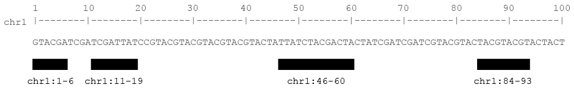
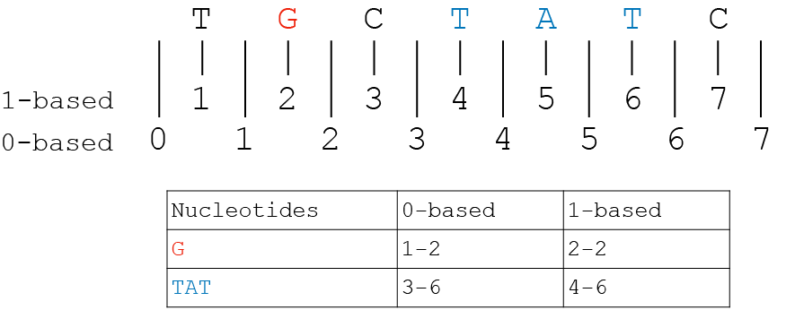
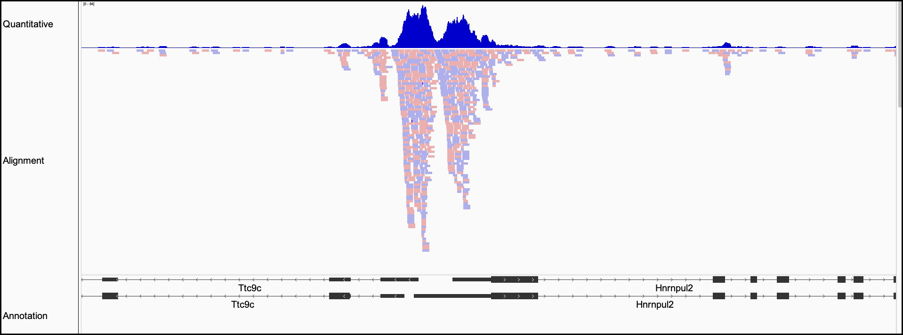
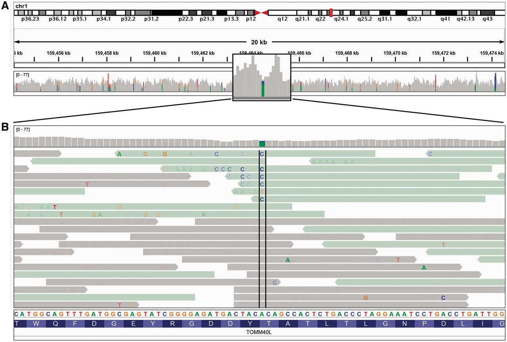
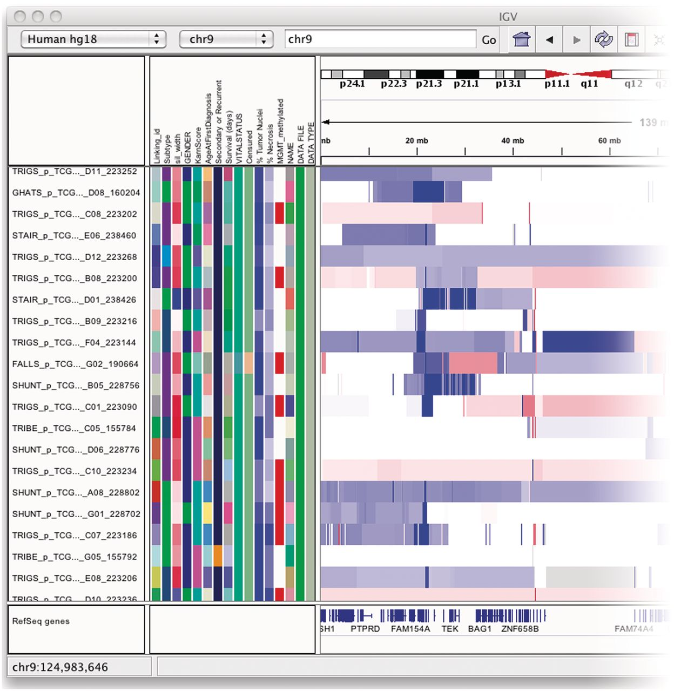
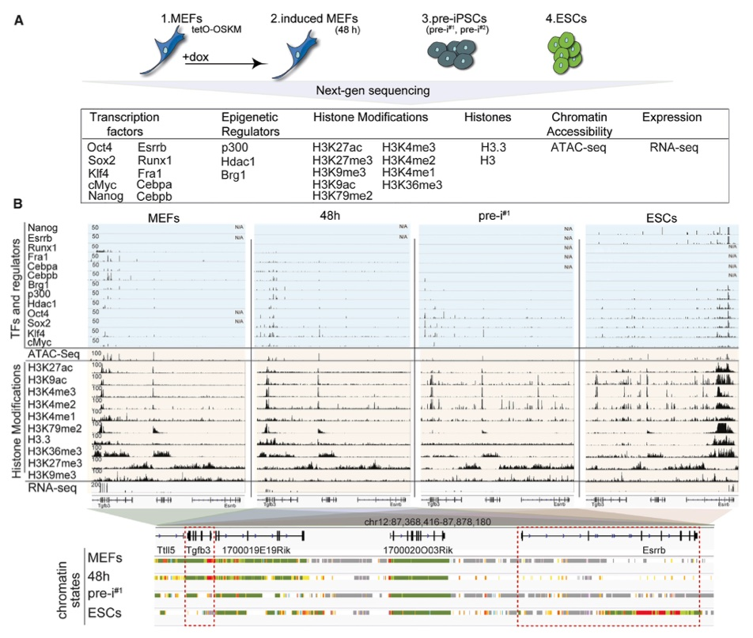
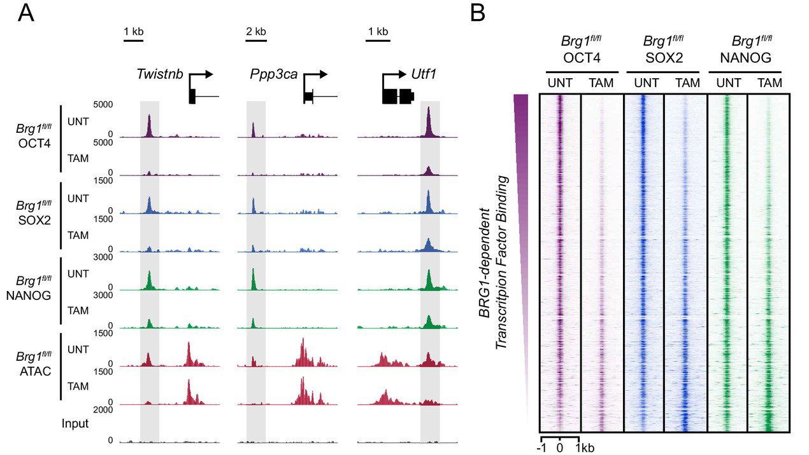

exclude: true
count: false

```{r,echo=FALSE,child="assets/header-slide.Rmd"}
```

<!-- ------------ Only edit title, subtitle & author above this ------------ -->

```{r}
knitr::opts_chunk$set(echo = FALSE, fig.align = "center")
```

```{r}
library(knitr)
library(kableExtra)
```

---

## What is data visualization?

* This might seem a *trivial* question, but what would you answer?

* Technical writer Kate Brush gives a great one-line definition:

> Data visualization is the practice of translating information into a visual context, such as a map or graph, to make data easier for the human brain to understand and pull insights from

<br>

.pull-left-50[

* The important point here is that data visualization is for **humans**

* The human brain is still better than any computer at identifying patterns or outliers

* The advent of genomics resulted in many new types of data and file formats

* New data types meant researchers had to come up with new visualization methods

]

.pull-right-50[

```{r, out.width = "75%", fig.cap = "xkcd: Self Driving"}
knitr::include_graphics("data/visualization/xkcd-self-driving.png")
```

]

---

## Why is data visualization important?

.pull-left-50[

* Data visualization is useful for a variety of reasons:

  * Data cleaning
  * Exploring data structure
  * Detecting outliers and unusual groups
  * Identify trends and clusters
  * Presenting results

* By its very nature genomic data is often very **large** and **complex**

* There is also a huge variety of different genomic data **types**

* How can we *effectively* visualize all of this data?

**Genome browsers to the rescue!**

]

.pull-right-50[

```{r, out.width = "100%", fig.cap = "Common data types"}
knitr::include_graphics("data/visualization/genomic-data.png")
```

]


---

## What is a genome browser?

* In bioinformatics, a **genome browser** is a graphical interface for displaying genomes

* Genome browsers enable researchers to browse genomes alongside **genomic data**

* The types of genomic data usually displayed:

  * Genotyping
  * Gene expression
  * Epigenetics

* A large number of genome browsers are available, many of them **free**

* The best known genome browsers:

  * Online genome browsers:
  
      * [UCSC Genome Browser](https://genome.ucsc.edu)
      * [Ensembl Genome Browser](https://www.ensembl.org/index.html)
      * [NCBI Genome Data Viewer](https://www.ncbi.nlm.nih.gov/genome/gdv/)
  
  * Desktop genome browsers:
  
      * [Integrative Genomics Viewer](https://software.broadinstitute.org/software/igv/)
      * [Integrated Genome Browser](https://www.bioviz.org)

---

## How do genome browsers work?

<br>

```{r, out.width = "100%"}

```

<br>

* Genome browsers use a **coordinate system** to display genomic data

  * Data is displayed on tracks using **glyphs**
  
  * Coordinates determine the **position** of glyphs
  
      * Chromosome name
      * Start position
      * End position
      
  * Glyphs can accommodate additional information
  
      * Score (e.g., read coverage)
      * Relationship (e.g., exons within a transcript)
      * Variation (e.g., SNPs and indels)

---

## Genome coordinate systems

<br>

```{r, out.width = "60%"}

```

<br>


* Confusingly, there are actually *two* coordinates systems:

.pull-left-50[

* 0-based
  * Reference starts at zero
  * Numbers *between* nucleotides
  * Ensembl Genome Browser
  * File formats: `BED` `BAM`

]

.pull-right-50[
  
* 1-based
  * Reference starts at one
  * Numbers nucleotides *directly*
  * UCSC Genome Browser
  * File formats: `GFF` `SAM` `VCF`
      
]

---

## Genomic file formats

* When loading a data file, genome browsers use the file extension to determine the file format

* The file format sets the data type and glyph display options:

  * Segmented copy number: `seg`

  * Sequence alignments: `bed` `cram`

  * Genome annotations: `bed` `gtf` `gff3` `psl` `bigbed`

  * Quantitative data: `wig` `bedgraph` `bigwig` `tdf`
  
<br>

```{r, out.width = "70%%", fig.cap = "Common glyph display options"}

```

---

## Online genome browsers

### UCSC

```{r, out.width = "100%"}
knitr::include_url("https://genome.ucsc.edu", height = "500px")
```

---

## Online genome browsers

### Ensembl

```{r, out.width = "100%"}
knitr::include_url("https://www.ensembl.org/index.html", height = "500px")
```

---

## Desktop genome browsers

### IGV

```{r, out.width = "100%"}
knitr::include_url("https://software.broadinstitute.org/software/igv/", height = "500px")
```

---

## Desktop genome browsers

### IGB

```{r, out.width = "100%"}
knitr::include_url("https://www.bioviz.org", height = "500px")
```

---

## Integrative Genomics Viewer

### Overview

.pull-left-70[

* Enables intuitive real-time exploration of diverse, large-scale genomic data

* Supports flexible integration of a wide range of genomic data types including:

  * Aligned sequence reads
  * Mutations
  * Copy number
  * RNA interference screens
  * Gene expression
  * Methylation
  * Genomic annotations 

* Navigation allows the user to zoom and pan seamlessly across the genome

* Data can be loaded from local or remote sources, including cloud-based resources

]

.pull-right-30[

```{r, fig.align = "center", out.width = "50%"}
knitr::include_graphics("data/visualization/igv-logo.png")
```

]

---

## Integrative Genomics Viewer

<br>

```{r, fig.align = "center", out.width = "80%%", fig.cap = "The IGV application window"}
knitr::include_graphics("data/visualization/igv-layout.jpeg")
```

---

## Integrative Genomics Viewer

<br>

```{r, fig.align = "center", out.width = "90%", fig.cap = "Coverage plot and alignments from paired-end reads for a matched tumor/normal pair"}
knitr::include_graphics("data/visualization/igv-coverage.webp")
```

---

## Integrative Genomics Viewer

<br>

```{r, fig.align = "center", out.width = "80%", fig.cap = "Read alignment views at 20 kb and base pair resolution"}

```

---

## Integrative Genomics Viewer

<br>

```{r, fig.align = "center", out.width = "52%", fig.cap = "The attribute panel displays a color-coded matrix of phenotypic and clinical data"}

```

---

## Public data examples

### https://doi.org/10.1016/j.cell.2016.12.016

<br>

```{r, out.width = "61%", fig.cap= "Snapshot of genomic data at a candidate genomic locus"}

```

---

## Public data examples

### https://doi.org/10.7554/eLife.22631

<br>

```{r, out.width = "65%", fig.cap= "Genomic snapshots illustrating ChIP-seq signal before and after treatment"}

```

---

## Summary

* Data visualization is the process of transforming data into a visual context, like a map or graph

* Data visualization makes it easier for the human brain to understand and identify patterns

* The advent of genomics meant new data types were created which had to be visualized

* Genome browsers allow you to display genomic data from multiple technologies

* There are lots of genome browsers, some available online and others as desktop applications

* Ultimately, the best way to understand genome browsers is to explore them hands-on

---

## Resources

* [Data File Formats](https://genome.ucsc.edu/FAQ/FAQformat.html)

* [IGV User Guide](https://software.broadinstitute.org/software/igv/UserGuide)

* [Ensembl Tutorials](https://www.ensembl.org/info/website/tutorials/index.html)

* [UCSC Training](https://genome.ucsc.edu/training/)

<!-- --------------------- Do not edit this and below --------------------- -->

---
name: end_slide
class: end-slide, middle
count: false

# Thank you. Questions?

```{r,echo=FALSE,child="assets/footer-slide.Rmd"}
```

```{r,include=FALSE,eval=FALSE}
# manually run this to render this document to HTML
rmarkdown::render("slide_sample.Rmd")
# manually run this to convert HTML to PDF
#pagedown::chrome_print("slide_sample.html",output="slide_sample.pdf")
```
